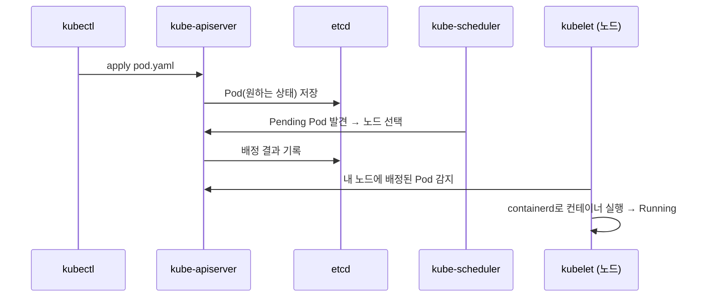

# 클러스터 구조 (Cluster Architecture)

> k8s 클러스터는 **Control Plane(두뇌)** 과 **Worker Node(일꾼)** 로 나뉜다. 입문 개요이며, kubeadm/etcd 운영 심화는 [`06_cluster-ops`](../06_cluster-ops/)에서 다룬다.

> *출처: [Kubernetes Docs — Cluster Architecture](https://kubernetes.io/docs/concepts/architecture/) — "Figure 1. Kubernetes cluster components"*

그림처럼 **하나의 Control Plane**이 클러스터를 관리하고, **여러 Node**가 워크로드(Pod)를 실행한다. 각 노드는 kubelet·kube-proxy·컨테이너 런타임을 갖고, Control Plane과 통신한다.

## Control Plane 컴포넌트

| 컴포넌트 | 역할 |
|---|---|
| **kube-apiserver** | 클러스터의 **유일한 관문**. `kubectl`·컨트롤러·kubelet 모두 이걸 통해 통신. 인증/인가/검증 후 etcd에 기록. |
| **etcd** | 모든 클러스터 상태(오브젝트)를 저장하는 **분산 key-value 저장소**. 백업 대상 1순위(→ 06). |
| **kube-scheduler** | 아직 노드가 안 정해진(`Pending`) Pod를 보고, 리소스·제약(affinity/taint 등)을 따져 **적절한 노드를 선택**. 실제 실행은 안 함. |
| **kube-controller-manager** | 여러 컨트롤러(Node, ReplicaSet, Deployment, Job…)를 돌리며 **"원하는 상태 = 현재 상태"** 가 되도록 조정(reconcile). |
| **cloud-controller-manager** | 클라우드(LB, 라우트, 볼륨) 연동. 관리형(EKS 등)에서 중요. |

## Worker Node 컴포넌트

| 컴포넌트 | 역할 |
|---|---|
| **kubelet** | 노드의 에이전트. apiserver로부터 "이 Pod 띄워라"를 받아 **런타임에게 컨테이너 실행을 지시**하고 상태를 보고. |
| **kube-proxy** | Service의 가상 IP(ClusterIP)로 온 트래픽을 실제 Pod로 **라우팅**(iptables/IPVS 규칙 관리). |
| **container runtime** | 컨테이너를 실제로 실행하는 엔진. 요즘 표준은 **containerd**(CRI 통해 kubelet과 연동). Docker는 dockershim 제거로 직접 사용 안 함. |

## 요청 흐름 예시 — `kubectl apply -f pod.yaml`

- 핵심: **모든 통신은 apiserver를 거치고, 상태의 단일 출처는 etcd.** 각 컴포넌트는 apiserver를 보며 자기 일을 한다(느슨한 결합).

## 시험·실무 팁

- kubeadm로 만든 클러스터에서 control plane 컴포넌트는 **static Pod**로 뜬다 → 매니페스트 위치: `/etc/kubernetes/manifests/`. (상세 → [`06_cluster-ops`](../06_cluster-ops/))
- 컴포넌트 상태 확인: `kubectl get pods -n kube-system`, `kubectl get componentstatuses`(deprecated), 노드: `kubectl get nodes`.
- **관리형(EKS)** 은 control plane을 AWS가 운영 → 사용자는 etcd/apiserver를 직접 못 만짐. 그래서 CKA 학습엔 부적합(→ [`09_aws-eks`](../09_aws-eks/) 참고).

## 참고

- [Cluster Architecture](https://kubernetes.io/docs/concepts/architecture/) (위 다이어그램 출처)
- [Kubernetes Components](https://kubernetes.io/docs/concepts/overview/components/)
- [KodeKloud 강의 노트 — Core Concepts](https://notes.kodekloud.com/docs/Certified-Kubernetes-Administrator-CKA/Core-Concepts/Cluster-Architecture)
