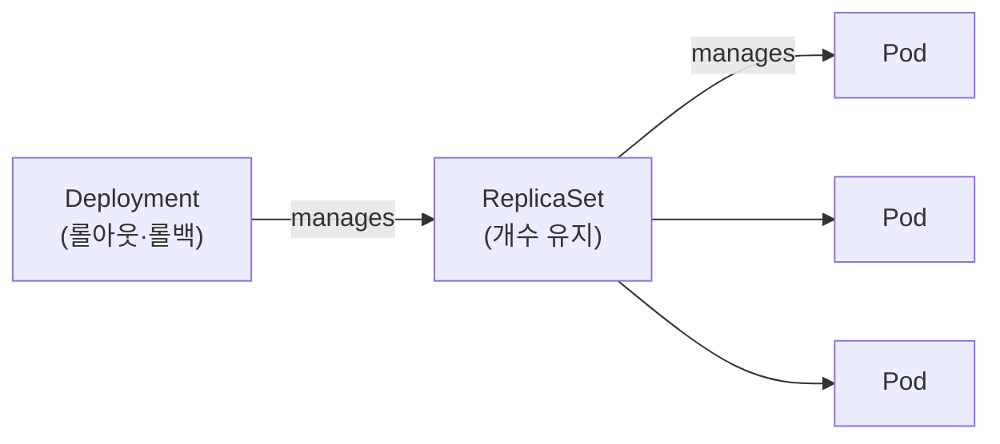

# ReplicaSet & Deployment

> Pod를 직접 만들면 죽었을 때 끝이다. **ReplicaSet**이 개수를 지켜주고, **Deployment**가 그 위에서 버전 롤아웃까지 관리한다.

## 계층 구조


- Deployment는 Pod를 **직접** 만들지 않고 **ReplicaSet을 통해** 만든다.

## ReplicaSet

지정한 **replicas 개수만큼 Pod를 항상 유지**(자기복구)하는 컨트롤러.

```yaml
apiVersion: apps/v1
kind: ReplicaSet
metadata:
  name: nginx-rs
spec:
  replicas: 3
  selector:               # 어떤 Pod를 "내 것"으로 볼지
    matchLabels:
      app: nginx
  template:               # 부족하면 이 틀로 새 Pod 생성
    metadata:
      labels:
        app: nginx        # selector와 일치해야 함
    spec:
      containers:
        - name: nginx
          image: nginx:1.27
```

- **자기복구**: Pod가 삭제/장애로 줄면 RS가 즉시 새 Pod를 만들어 replicas를 맞춘다.
- **ownerReferences**: RS가 만든 Pod에는 소유자(`ReplicaSet/...`)가 박힌다. 독립 Pod(소유자 없음)는 지우면 안 살아난다 — 이게 "컨트롤러로 관리하라"는 이유.
  - `kubectl describe pod`의 **`Controlled By: ReplicaSet/...`** 줄이 바로 이 값의 읽기 쉬운 표현(`controller: true`인 소유자). 독립 Pod엔 이 줄이 없다.
- **selector ↔ template.labels는 반드시 일치**해야 한다(안 맞으면 생성 거부/오작동).

## Deployment

ReplicaSet 위의 추상화. 보통 **항상 Deployment를 쓴다.** ReplicaSet을 직접 만들 일은 드물다.

```yaml
apiVersion: apps/v1
kind: Deployment
metadata:
  name: nginx
spec:
  replicas: 3
  selector:
    matchLabels: { app: nginx }
  template:
    metadata:
      labels: { app: nginx }
    spec:
      containers:
        - name: nginx
          image: nginx:1.27
```

### pod-template-hash

Deployment는 ReplicaSet/Pod에 `pod-template-hash` 라벨을 자동으로 붙인다(예: `nginx-775786f995`). 그래서:
- 같은 `app: nginx` 라벨이어도 **해시가 다른 독립 Pod는 RS가 입양하지 않는다.**
- 템플릿(이미지 등)을 바꾸면 **새 해시의 ReplicaSet**이 생기고, 그쪽으로 롤아웃된다.

## 롤아웃 / 롤백

RollingUpdate는 옛 Pod를 한꺼번에 죽이지 않고 **새 버전을 조금씩 늘리며 무중단 교체**한다.

| ① 기존 버전 동작 | ② 새 버전 Pod 투입 |
|:---:|:---:|
|  |  |
| **③ 옛 버전 Pod 제거** | **④ 교체 완료** |
|  |  |

> *출처: [Kubernetes Basics — Rolling Updates](https://kubernetes.io/docs/tutorials/kubernetes-basics/update/update-intro/)*

```bash
# 이미지 변경 → 새 ReplicaSet으로 점진 교체(롤아웃)
kubectl set image deployment/nginx nginx=nginx:1.28

kubectl rollout status   deployment/nginx     # 진행 상황
kubectl rollout history  deployment/nginx     # 리비전 이력
kubectl rollout undo     deployment/nginx     # 직전 리비전으로 롤백
kubectl rollout undo     deployment/nginx --to-revision=2
```
- Deployment는 리비전을 보관(`revisionHistoryLimit`, 기본 10)해서 롤백이 가능하다.
- 롤백 = 이전 ReplicaSet으로 다시 스케일 전환. `undo`는 그 RS를 **재승격**하며 리비전 번호를 최신으로 새로 받으므로, 이력에서 **중간 번호가 비어 보일 수 있다**(예: 1, 3, 4) — 정상.

### CHANGE-CAUSE — 변경 이유 기록

`rollout history`의 **CHANGE-CAUSE 열**은 Deployment의 `kubernetes.io/change-cause` 어노테이션 값에서 온다. 안 남기면 `<none>`이라, **변경 직후** 이유를 적어둔다:

```bash
kubectl set image deployment/nginx nginx=nginx:1.28
kubectl annotate deployment/nginx kubernetes.io/change-cause="bump nginx to 1.28" --overwrite
```
- 예전 `kubectl ... --record`로 자동 기록하던 방식은 **deprecated** → 위처럼 annotation으로 직접 남긴다.
- `--overwrite`: 롤아웃마다 갱신하니 보통 키가 이미 있어, 덮어쓰기를 명시해야 한다(없으면 에러).
- 어노테이션만 다는 건 `spec.template` 변경이 아니라 **새 리비전을 만들지 않는다**(이유 메모일 뿐). → annotation 개념은 [labels-namespaces.md](./labels-namespaces.md).

> ⚠️ **함정**: change-cause는 새 리비전이 생길 때 **"그 시점 Deployment에 박힌 값"을 그 RS에 복사**한다. 변경마다 갱신하지 않으면 이후 리비전들이 **옛 값을 그대로 물려받아** 전부 똑같이 보인다(예: 깨진 이미지로 롤아웃했는데 라벨은 직전 그대로). 롤백을 포함해 **변경마다 새로 적어야** 의미가 있다.
>
> 💡 그래서 change-cause 텍스트만으론 못 믿을 때가 많다. **그 리비전이 실제로 뭐였는지**(이미지 등)는 템플릿을 직접 본다:
> ```bash
> kubectl rollout history deployment/web --revision=3   # 그 리비전의 Pod 템플릿(이미지 포함)
> ```

## 업데이트 전략 (`spec.strategy`)

| 전략 | 동작 | 특징 |
|---|---|---|
| **RollingUpdate**(기본) | 새 Pod 조금 띄우고 옛 Pod 조금 줄이며 **무중단 교체** | `maxSurge`(초과 허용, 기본 25%) / `maxUnavailable`(중단 허용, 기본 25%) |
| **Recreate** | 옛 Pod **전부 종료 후** 새 Pod 생성 | 잠깐 다운타임, 버전 동시 실행 불가할 때 |

```yaml
spec:
  strategy:
    type: RollingUpdate
    rollingUpdate:
      maxSurge: 1
      maxUnavailable: 0
```

## 스케일링

`replicas` 수를 바꿔 **같은 Pod를 여러 개로** 늘리거나 줄인다. 앞단 Service가 이들에게 부하를 분산한다.

| ① replicas 1 | ② replicas 4 (스케일 아웃) |
|:---:|:---:|
|  |  |

> *출처: [Kubernetes Basics — Scaling](https://kubernetes.io/docs/tutorials/kubernetes-basics/scale/scale-intro/)*

```bash
kubectl scale deployment/nginx --replicas=5
```
- `replicas`만 바꾸면 ReplicaSet이 차이만큼 Pod를 늘리거나 줄인다.
- 부하 기반 자동 확장(HPA)은 [`03_workloads-scheduling`](../03_workloads-scheduling/)에서.

## 시험·실무 팁

- 빠른 생성: `kubectl create deployment nginx --image=nginx --replicas=3`.
- 롤아웃이 멈췄으면(`rollout status`가 안 끝남) 새 Pod가 왜 안 뜨는지 `describe`/`logs`로 확인(→ [`07_troubleshooting`](../07_troubleshooting/)).
- `kubectl get deploy,rs,pod -l app=nginx`로 계층을 한눈에 보는 습관.

## 참고

- [Deployments](https://kubernetes.io/docs/concepts/workloads/controllers/deployment/)
- [ReplicaSet](https://kubernetes.io/docs/concepts/workloads/controllers/replicaset/)
