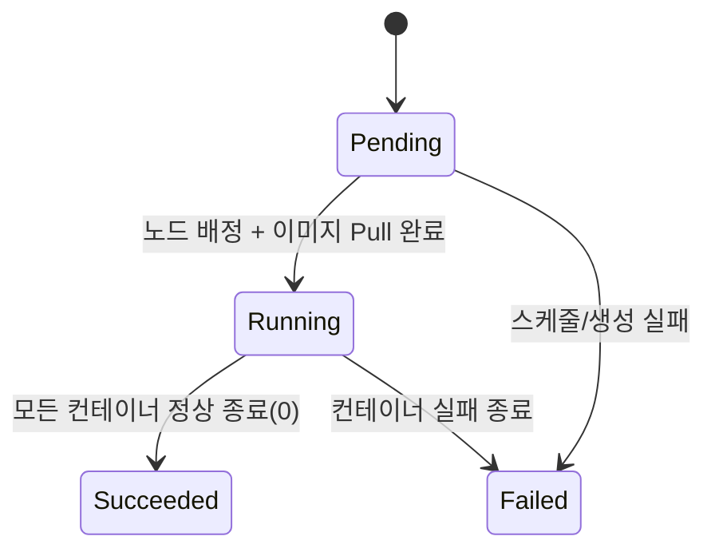

# Pod

> **Pod = k8s에서 배포하는 최소 단위.** 컨테이너를 직접 띄우지 않고 항상 Pod로 감싼다.

## 개념

- Pod는 **하나 이상의 컨테이너** + 공유 자원의 묶음. 보통 컨테이너 1개지만, 보조 컨테이너를 함께 둘 수 있다.
- 같은 Pod 안의 컨테이너들은 **공유**한다:
  - **네트워크**: 같은 IP/포트 공간 → 서로 `localhost`로 통신
  - **스토리지**: 같은 볼륨을 마운트 가능
- Pod는 **일회용(ephemeral)**. 죽으면 같은 Pod가 되살아나는 게 아니라 **새 Pod로 교체**된다(이름·IP 바뀜). → 그래서 직접 만들지 않고 Deployment로 관리(→ [deployments.md](./deployments.md)).


> *출처: [Kubernetes Basics](https://kubernetes.io/docs/tutorials/kubernetes-basics/explore/explore-intro/) — 한 Pod 안의 컨테이너들이 공유 IP와 볼륨을 함께 쓰는 모습.*

## 최소 YAML

```yaml
apiVersion: v1
kind: Pod
metadata:
  name: nginx
  labels:
    app: nginx
spec:
  containers:
    - name: nginx
      image: nginx:1.27
      ports:
        - containerPort: 80
```
```bash
kubectl run nginx --image=nginx:1.27      # imperative로 동일
```

## 라이프사이클

### Pod phase (`kubectl get pod`의 STATUS 큰 흐름)

| phase | 의미 |
|---|---|
| `Pending` | 생성됨, 아직 노드 배정 안 됨 or 이미지 받는 중(`ContainerCreating`) |
| `Running` | 노드에 배정되고 컨테이너가 떠서 동작 중 |
| `Succeeded` | 모든 컨테이너가 정상 종료(0) — Job 류 |
| `Failed` | 컨테이너가 실패 종료 |
| `Unknown` | 노드와 통신 불가 |



### 생성 시 Events 순서 (`kubectl describe pod`)

```
Scheduled → Pulling → Pulled → Created → Started
(스케줄)   (이미지)   (받음)   (생성)    (시작=Running)
```
- 처음 `ContainerCreating`은 보통 **이미지 받는 중**이라 그렇다. 받고 나면 `Running` + Pod IP 할당.
- 문제 진단의 출발점은 항상 **`kubectl describe`의 Events + `kubectl logs`** (→ [`07_troubleshooting`](../07_troubleshooting/)).

### restartPolicy

컨테이너가 죽었을 때 동작. `Always`(기본, Deployment Pod) / `OnFailure` / `Never`.

## Probe (헬스 체크)

kubelet이 컨테이너 건강을 주기적으로 점검.

| probe | 질문 | 실패 시 |
|---|---|---|
| **liveness** | "살아있나?" | 컨테이너 **재시작** |
| **readiness** | "트래픽 받을 준비됐나?" | Service 엔드포인트에서 **제외**(재시작 안 함) |
| **startup** | "느린 초기화 끝났나?" | 끝날 때까지 liveness/readiness 보류 |

```yaml
    livenessProbe:
      httpGet: { path: /healthz, port: 80 }
      initialDelaySeconds: 5
      periodSeconds: 10
    readinessProbe:
      httpGet: { path: /ready, port: 80 }
```

## 멀티 컨테이너 패턴

| 패턴 | 설명 |
|---|---|
| **sidecar** | 메인 컨테이너를 보조(로그 수집, 프록시 등). 같은 Pod에서 함께 동작. |
| **init container** | 메인 컨테이너 **전에** 순서대로 실행되고 끝나야 메인 시작(준비 작업). `spec.initContainers`. |

> 멀티 컨테이너/스케일·자가치유 등 워크로드 심화는 [`03_workloads-scheduling`](../03_workloads-scheduling/)와도 연결된다.

## 시험·실무 팁

- 빠른 생성: `kubectl run nginx --image=nginx`. YAML 필요하면 `... --dry-run=client -o yaml`.
- 디버깅: `kubectl describe pod <p>`(Events) → `kubectl logs <p> [-c 컨테이너] [--previous]` → `kubectl exec -it <p> -- sh`.
- `CrashLoopBackOff`/`ImagePullBackOff` 등 상태별 원인은 [`07_troubleshooting`](../07_troubleshooting/)에 정리.

## 참고

- [Pods](https://kubernetes.io/docs/concepts/workloads/pods/)
- [Pod Lifecycle](https://kubernetes.io/docs/concepts/workloads/pods/pod-lifecycle/)
- [Liveness/Readiness/Startup Probes](https://kubernetes.io/docs/tasks/configure-pod-container/configure-liveness-readiness-startup-probes/)
