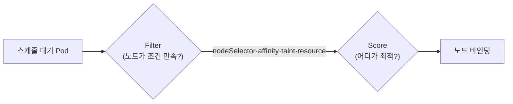

# 03. 워크로드와 스케줄링

> CKA 도메인: **Workloads & Scheduling (~15%)**

워크로드 컨트롤러와, 파드가 어느 노드에 어떻게 배치되는지(스케줄링).

## 다루는 내용
- Deployment 심화 — 스케일링, 롤아웃 히스토리/롤백
- DaemonSet, StatefulSet 개요
- Job / CronJob
- ConfigMap & Secret — env/volume 주입
- 리소스 관리 — requests/limits, QoS class
- 스케줄링 — nodeSelector, affinity/anti-affinity
- Taint & Toleration
- 수동 스케줄링, `nodeName`
- **워크로드 오토스케일링** — HPA(metrics-server 기반), (개념) VPA / Cluster Autoscaler

## 정리

> CKA Workloads & Scheduling(~15%)은 **워크로드 컨트롤러를 다루고, 파드를 원하는 노드에 배치**하는 게 핵심. 실기라 `kubectl create/scale/set/rollout` 같은 **imperative 명령**과 `--dry-run=client -o yaml`로 매니페스트 뽑는 손놀림이 점수다.

### 1. 워크로드 컨트롤러 한눈에

파드를 직접 만들지 않고 **컨트롤러**가 원하는 상태(replicas 등)를 유지하게 한다.

| 컨트롤러 | 언제 | 파드 특징 |
|---|---|---|
| **Deployment** | 무상태(stateless) 앱 — 웹·API | ReplicaSet을 통해 관리, 이름 랜덤(`web-7d9f-x8k2p`), 롤링업데이트 |
| **DaemonSet** | **노드마다 1개** — 로그수집·모니터링·CNI | 노드 추가되면 자동 배치 |
| **StatefulSet** | 상태 보유 — **DB·큐** | 고정 이름(`db-0`), 파드별 PVC, 순차 기동 |
| **Job** | 1회성 배치 작업 | 완료(Completed)되면 끝 |
| **CronJob** | 스케줄 배치 | cron 식으로 Job 생성 |

### 2. Deployment — 스케일·롤아웃·롤백 (CKA 최빈출)

```bash
kubectl create deployment web --image=nginx:1.27 --replicas=3
kubectl scale deployment web --replicas=5            # 스케일
kubectl set image deployment/web nginx=nginx:1.28    # 롤링업데이트 트리거
kubectl rollout status deployment/web                # 진행 확인
kubectl rollout history deployment/web               # 리비전 이력
kubectl rollout undo deployment/web                  # 직전 리비전으로 롤백
kubectl rollout undo deployment/web --to-revision=2  # 특정 리비전으로
```

- **전략**: `RollingUpdate`(기본, 무중단 — `maxSurge`/`maxUnavailable`로 속도 조절) vs `Recreate`(전부 죽이고 새로).
- 롤아웃 이력에 메모 남기려면 `kubectl annotate ... kubernetes.io/change-cause=...` 또는 `--record`(deprecated).

> 💡 **매니페스트 빨리 뽑기**: `kubectl create deployment web --image=nginx:1.27 --dry-run=client -o yaml > web.yaml` → 편집 → `apply`. 시험에서 YAML을 처음부터 타이핑하지 말 것.

### 3. DaemonSet / Job / CronJob

```bash
# Job: 완료 목표·병렬·재시도
kubectl create job pi --image=perl:5.34 -- perl -Mbignum=bpi -wle 'print bpi(2000)'
# CronJob: 매분 실행
kubectl create cronjob hello --image=busybox:1.36 --schedule="*/1 * * * *" -- echo hi
```

- **Job**: `completions`(몇 번 성공해야 끝), `parallelism`(동시 몇 개), `backoffLimit`(재시도 횟수), `activeDeadlineSeconds`(시간 제한).
- **CronJob**: `schedule`(cron), `concurrencyPolicy`(Allow/Forbid/Replace), `startingDeadlineSeconds`.
- **DaemonSet**은 보통 매니페스트로(imperative 생성 명령 없음). 컨트롤플레인/로그 에이전트가 모든 노드에 떠야 할 때.

### 4. StatefulSet → 12장에서 실전

**상태를 가진 워크로드**(DB)는 ① 안정적 식별자 ② 전용 디스크 ③ 순차 기동이 필요해 Deployment로는 부족하다. StatefulSet은 이를 보장:

- 파드 이름 **고정 순번**(`clickhouse-0`, `-1`…), 삭제는 역순
- `volumeClaimTemplates`로 **파드마다 전용 PVC** 자동 생성 → 재생성돼도 같은 디스크 재결합
- **Headless Service**(`clusterIP: None`)와 짝지어 파드별 DNS(`pod-0.svc...`) 부여 → 개념은 [`04_services-networking`](../04_services-networking/#headless-service--파드를-콕-집어-부른다)

| | Deployment | StatefulSet |
|---|---|---|
| 파드 이름 | 랜덤 해시 | 고정 순번 |
| `replicas`의 의미 | **똑같은 복사본**(구분 X, 로드밸런싱) | **구분되는 멤버**(각자 다른 디스크·역할) |
| 디스크 | 공유/임시 | 파드별 전용 PVC |
| 기동 순서 | 무관 | 0→1→2 순차 |
| 쓰임 | 웹·무상태 | DB·상태 보유 |

> ⚠️ **`replicas`를 늘려도 자동으로 복제 DB 클러스터가 되진 않는다.** StatefulSet은 "구분되는 멤버 N개 + 각자 PVC + 파드별 DNS"까지만 보장한다. 멤버끼리 데이터를 **복제(HA)·분담(샤딩)**하는 건 **DB 소프트웨어 설정 또는 오퍼레이터**(예: [Altinity clickhouse-operator](../12_data-stores/clickhouse.md)) 몫이다. 그래서 설정 없이 `replicas: 2`만 두면 **서로 모르는 독립 DB 2개**가 된다. 단일 노드 학습엔 `replicas: 1`로 충분.

- 스토리지 측면(PV/PVC/StorageClass) → [`05_storage`](../05_storage/)
- 🧪 **StatefulSet+PVC 집중 실습**(busybox, CKA용) → [`05_storage/practice-pvc.md`](../05_storage/practice-pvc.md) 5절
- **실전(ClickHouse·PostgreSQL을 StatefulSet으로, 왜 StatefulSet인지)** → [`12_data-stores/clickhouse.md`](../12_data-stores/clickhouse.md) 3절

### 5. ConfigMap & Secret 주입

설정·민감정보를 이미지에서 분리해 주입한다(두 방식: **env** 또는 **volume**).

```bash
kubectl create configmap app-config --from-literal=LOG_LEVEL=debug --from-file=app.conf
kubectl create secret generic db-secret --from-literal=password=clickhouse123
```

- **env로**: `envFrom.configMapRef`/`secretRef` 또는 개별 `valueFrom`. ⚠️ env 주입은 **파드 재시작해야** 반영.
- **volume으로**: 파일로 마운트. ConfigMap 변경 시 마운트 파일은 **자동 갱신**(env와 대비). DB 설정파일 주입에 적합 → [12장 ClickHouse 과제 2번](../12_data-stores/practice-clickhouse.md).
- Secret은 기본 base64(암호화 아님). etcd 암호화·RBAC은 [`06_cluster-ops`](../06_cluster-ops/).

### 6. 리소스 관리 — requests / limits / QoS

- **requests**: 스케줄러가 노드 고를 때 쓰는 "최소 보장"량. **limits**: 초과 못 하는 상한(CPU는 throttle, **메모리 초과는 OOMKill**).
- **QoS class**(노드 자원 부족 시 축출 우선순위):

| QoS | 조건 | 축출 순서 |
|---|---|---|
| **Guaranteed** | 모든 컨테이너 requests==limits | 마지막(가장 보호) |
| **Burstable** | requests<limits 일부 설정 | 중간 |
| **BestEffort** | requests·limits 없음 | **제일 먼저 축출** |

```bash
kubectl describe pod <pod> | grep -i qos      # QoS Class 확인
```

### 7. 스케줄링 — 파드를 원하는 노드에



| 메커니즘 | 방향 | 설명 |
|---|---|---|
| **nodeSelector** | 파드→노드 | 가장 단순. 노드 라벨과 정확히 일치하는 곳에만 |
| **nodeAffinity** | 파드→노드 | 유연한 규칙(`required`=필수, `preferred`=선호) |
| **pod(anti)Affinity** | 파드→파드 | "같은/다른 노드에 모아라/흩어라"(`topologyKey`) |
| **taint & toleration** | 노드→파드 | 노드가 파드를 **밀어냄**, toleration 있는 파드만 허용 |
| **nodeName** | 수동 | 스케줄러 무시하고 직접 지정(디버깅용) |

```bash
kubectl label node <node> disktype=ssd                       # 노드 라벨 (nodeSelector용)
kubectl taint node <node> key=value:NoSchedule               # taint 추가
kubectl taint node <node> key=value:NoSchedule-              # taint 제거(끝에 -)
kubectl describe node <node> | grep -i taint
```

> 💡 control-plane 노드엔 기본 taint(`node-role.kubernetes.io/control-plane:NoSchedule`)가 있어 일반 파드가 안 뜬다. **`NoSchedule`**(신규 배치 금지) vs **`NoExecute`**(기존 파드도 축출) 구분이 시험 포인트.

### 8. 오토스케일링

- **HPA(Horizontal Pod Autoscaler)**: 부하에 따라 **파드 수**를 늘림·줄임. **metrics-server** 필요.
  ```bash
  kubectl autoscale deployment web --min=2 --max=10 --cpu-percent=50
  kubectl get hpa
  ```
- **VPA**(파드의 requests/limits 자동 조정)·**Cluster Autoscaler**(노드 수 조정)는 개념만 — 별도 설치 필요, CKA 비중 낮음. EKS 실무는 Karpenter → [`09_aws-eks`](../09_aws-eks/).

## 참고

- [Workloads](https://kubernetes.io/docs/concepts/workloads/)
- [Deployments](https://kubernetes.io/docs/concepts/workloads/controllers/deployment/)
- [StatefulSets](https://kubernetes.io/docs/concepts/workloads/controllers/statefulset/)
- [Assigning Pods to Nodes](https://kubernetes.io/docs/concepts/scheduling-eviction/assign-pod-node/)
- [Taints and Tolerations](https://kubernetes.io/docs/concepts/scheduling-eviction/taint-and-toleration/)
- [HorizontalPodAutoscaler](https://kubernetes.io/docs/tasks/run-application/horizontal-pod-autoscale/)
