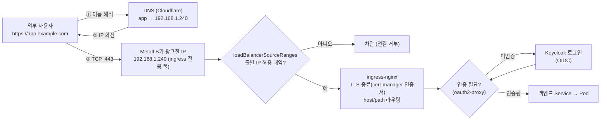
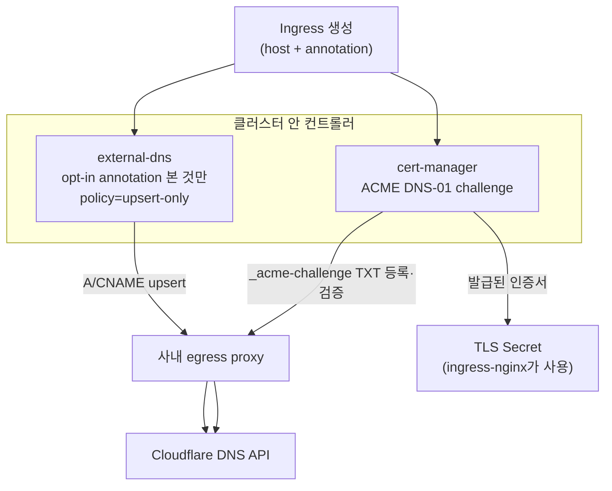

# 사내 on-prem 외부 노출 스택 — 전체 그림

> 클라우드 LB가 없는 **bare-metal 클러스터에서 서비스를 안전하게 외부로 여는** 한 가지 실전 구성을 한 장에 정리한다.
> 각 조각의 깊은 내용은 전용 문서로 링크 → [metallb.md](./metallb.md) · [ingress.md](./ingress.md) · [oauth2-proxy.md](./oauth2-proxy.md) · [cert-manager.md](./cert-manager.md)(준비 중) · [external-dns.md](./external-dns.md)(준비 중)

## 한눈에 — 누가 무엇을 책임지나

`type: LoadBalancer` 서비스 하나를 "진짜로 외부에서 HTTPS로" 쓰려면 **IP·라우팅·DNS·인증서·인증·접근통제**가 전부 채워져야 한다. 클라우드는 이걸 컨트롤러 한둘이 자동으로 해주지만, on-prem에선 **각 조각을 도구로 직접 메운다.**

| 계층 | 책임 | 이 스택의 도구 | 비고 |
|---|---|---|---|
| ① Pod 네트워크 + 정책 | 파드 간 통신, NetworkPolicy 적용 | **Calico** (CNI) | 정책 미적용 CNI면 화이트리스트가 무의미 |
| ② 외부 IP 할당·광고 | LB IP를 사내망에 노출 | **MetalLB** (L2, ingress 전용 풀) | 클라우드 ELB/NLB 자리 |
| ③ HTTP(S) 라우팅 + 1차 방화벽 | host/path 라우팅, 소스 IP 제한 | **ingress-nginx** (`type: LoadBalancer` + `loadBalancerSourceRanges`) | 화이트리스트가 여기서 1차 차단 |
| ④ TLS 인증서 | 발급·자동 갱신 | **cert-manager** (ACME **DNS-01** via Cloudflare, 사내 **egress proxy** 경유) | 내부망이라 HTTP-01 불가 → DNS-01 |
| ⑤ DNS 레코드 | 도메인 → LB IP 자동 등록 | **external-dns** (opt-in annotation, **upsert-only**, Cloudflare) | 실수로 레코드 삭제 안 되게 upsert-only |
| ⑥ 인증(AuthN) | 로그인 강제, SSO | **Keycloak**(OIDC IdP) + **oauth2-proxy** | 앱 수정 없이 앞단에서 인증 게이트 |
| ⑦ 관리자 접근통제 | admin UI는 특정 대역만 | **source-range 화이트리스트** (Ingress annotation / Service) | ⑥ 위에 한 겹 더 |

> 💡 핵심 통찰: **두 가지 흐름이 따로 돈다.** 사용자의 요청이 흐르는 **런타임 경로(data plane)** 와, DNS·인증서를 *미리 채워두는* **프로비저닝 경로(control plane)** 는 별개다. 아래 두 다이어그램으로 나눠 본다.

## 흐름 1 — 런타임 요청 경로 (사용자가 접속할 때)



- **방화벽은 두 겹.** ③→④ 경계의 `loadBalancerSourceRanges`(네트워크 레벨, IP 대역)와, ⑥의 oauth2-proxy/Keycloak(애플리케이션 레벨, 사용자 신원). admin UI는 여기에 source-range를 **한 겹 더** 얹는다.
- MetalLB·Service는 경로상의 "홉"이 아니라 길을 깔아주는 장치다 — 자세한 패킷 경로는 [metallb.md](./metallb.md)의 "트래픽 경로" 절 참고.

## 흐름 2 — 프로비저닝 경로 (배포 시 자동으로 채워지는 것)

새 Ingress를 만들면, 사람이 손대지 않아도 **DNS 레코드와 TLS 인증서가 자동으로** 준비된다. 이 둘 다 **Cloudflare API를 사내 egress proxy 통해** 호출한다(클러스터가 외부로 직접 못 나가므로).



- **왜 DNS-01인가** — 내부망 서비스라 외부에서 `:80`으로 들어와 검증하는 **HTTP-01이 불가능**하다. DNS-01은 `_acme-challenge` TXT 레코드만 올리면 되니 외부 인입이 필요 없다. 와일드카드 인증서(`*.example.com`)도 DNS-01만 가능.
- **왜 egress proxy 경유** — 클러스터 노드는 인터넷으로 직접 못 나가는 경우가 많다. cert-manager·external-dns 둘 다 `HTTPS_PROXY`로 사내 프록시를 거쳐 Cloudflare에 닿는다.
- **왜 upsert-only** — external-dns 기본값(`sync`)은 클러스터에서 사라진 Ingress의 DNS 레코드를 **삭제**한다. 공용 DNS에 수동 관리 레코드가 섞여 있으면 위험 → `upsert-only`는 **추가·갱신만 하고 삭제는 안 한다.** opt-in annotation까지 더해 "명시적으로 표시한 것만 건드린다".

## 각 조각의 정체 (요약 + 깊은 문서)

| 도구 | 한 줄 정체 | 전용 문서 |
|---|---|---|
| **Calico** | Pod 네트워크 + NetworkPolicy 적용 CNI. 정책을 강제할 수 있는 CNI라야 화이트리스트가 의미를 가짐 | [01_lab-environment/kind.md](../01_lab-environment/kind.md) (설치) · 본 폴더 README NetworkPolicy |
| **MetalLB** | on-prem에서 `type: LoadBalancer`를 성립시키는 구현체. 여기선 L2 + ingress 전용 IP 풀 | [metallb.md](./metallb.md) |
| **ingress-nginx** | HTTP(S) 라우팅 + TLS 종료. `loadBalancerSourceRanges`로 1차 방화벽 | [ingress.md](./ingress.md) |
| **cert-manager** | 인증서 자동 발급·갱신. ACME DNS-01 via Cloudflare(egress proxy) | [cert-manager.md](./cert-manager.md) *(준비 중)* |
| **external-dns** | Ingress/Service를 보고 DNS 레코드 자동 관리. opt-in·upsert-only | [external-dns.md](./external-dns.md) *(준비 중)* |
| **Keycloak + oauth2-proxy** | OIDC IdP + 인증 게이트. 앱 수정 없이 SSO 강제 | [oauth2-proxy.md](./oauth2-proxy.md) |

## 화이트리스트는 어디에 거나 — 두 위치

| 위치 | 설정 | 막는 대상 | 메모 |
|---|---|---|---|
| **Service(LoadBalancer)** | `spec.loadBalancerSourceRanges: [CIDR…]` | LB IP 자체에 닿는 출발 IP | MetalLB/클라우드 LB가 이 필드를 존중해야 적용됨. 클러스터 전체 입구에 거는 굵은 차단 |
| **Ingress(ingress-nginx)** | annotation `nginx.ingress.kubernetes.io/whitelist-source-range` | 특정 host/path(예: admin UI)로 오는 출발 IP | 서비스별로 다르게 적용 가능. admin UI만 사내 대역으로 좁힐 때 |

> ⚠️ `loadBalancerSourceRanges`가 실제로 먹히려면 **LB 구현이 이 필드를 지원**해야 한다(MetalLB는 지원). 또한 `externalTrafficPolicy`/소스 IP 보존 설정에 따라 ingress-nginx가 보는 출발 IP가 **노드 IP로 SNAT**될 수 있어, Ingress annotation 쪽 화이트리스트가 오작동할 수 있다 → 소스 IP 보존(`externalTrafficPolicy: Local` 등)을 함께 확인.

## 점검 체크리스트

```bash
# ② LB IP가 ingress 전용 풀에서 잘 붙었나
kubectl -n ingress-nginx get svc            # EXTERNAL-IP가 <pending> 아니어야

# ③ 소스레인지 화이트리스트가 걸려 있나
kubectl -n ingress-nginx get svc ingress-nginx-controller -o jsonpath='{.spec.loadBalancerSourceRanges}'

# ④ 인증서가 발급·갱신됐나 (Ready=True)
kubectl get certificate -A
kubectl describe certificate <name>          # DNS-01 challenge 진행/에러 확인

# ⑤ DNS 레코드가 자동 등록됐나
kubectl -n external-dns logs deploy/external-dns | tail   # upsert 로그/에러
kubectl get ingress -A -o jsonpath='{range .items[*]}{.metadata.annotations}{"\n"}{end}' | grep -i external-dns  # opt-in 표시 확인

# ⑥ oauth2-proxy / Keycloak 게이트
kubectl get ingress -A -o yaml | grep -i auth-url   # auth 위임 annotation
```

| 증상 | 흔한 원인 | 확인 |
|---|---|---|
| 인증서가 Ready 안 됨 | egress proxy 미설정 → Cloudflare API 못 닿음 / TXT 전파 지연 | `describe certificate`·`challenge`, cert-manager 로그의 프록시·DNS 에러 |
| DNS 레코드가 안 생김 | opt-in annotation 누락 / external-dns가 그 도메인 미관리 | external-dns 로그, `--domain-filter`·annotation |
| 허용 대역인데 차단됨 | 소스 IP가 노드로 SNAT돼 화이트리스트와 안 맞음 | `externalTrafficPolicy`, 실제 도착 소스 IP |
| 외부 IP는 받았는데 접속 불가 | MetalLB L2 광고 문제 / 다른 세그먼트 | [metallb.md](./metallb.md) 트러블슈팅 절 |

## 시험·실무 팁

- **CKA 직접 출제는 아니다**(cert-manager·external-dns·MetalLB 모두 클러스터 부가 도구). 하지만 "on-prem에서 `type: LoadBalancer`가 왜 `<pending>`이고, HTTPS·DNS·인증을 각각 무엇이 채우나"는 실무 단골이라 그림으로 잡아두면 좋다.
- **EKS에선 이 스택 대부분이 다른 것으로 치환된다**: MetalLB→AWS LB Controller, cert-manager(DNS-01)는 유사하게 쓰되 ACM으로 대체 가능, external-dns는 Route53 provider. → [09_aws-eks](../09_aws-eks/).
- **계층을 분리해 생각하라** — IP(MetalLB) / 라우팅·TLS(ingress-nginx+cert-manager) / DNS(external-dns) / 인증(Keycloak+oauth2-proxy) / 접근통제(화이트리스트). 장애가 나면 "어느 계층인지"부터 가른다.

## 참고

- [Services — LoadBalancer & loadBalancerSourceRanges](https://kubernetes.io/docs/concepts/services-networking/service/#aws-nlb-support) · [Service spec](https://kubernetes.io/docs/reference/kubernetes-api/service-resources/service-v1/)
- [cert-manager — ACME DNS-01](https://cert-manager.io/docs/configuration/acme/dns01/) · [Cloudflare DNS-01](https://cert-manager.io/docs/configuration/acme/dns01/cloudflare/)
- [external-dns — Cloudflare](https://kubernetes-sigs.github.io/external-dns/latest/docs/tutorials/cloudflare/) · [정책(upsert-only 등)](https://kubernetes-sigs.github.io/external-dns/latest/docs/flags/)
- [ingress-nginx — whitelist-source-range](https://kubernetes.github.io/ingress-nginx/user-guide/nginx-configuration/annotations/#whitelist-source-range)
- 같은 폴더: [metallb.md](./metallb.md) · [ingress.md](./ingress.md) · [oauth2-proxy.md](./oauth2-proxy.md)
