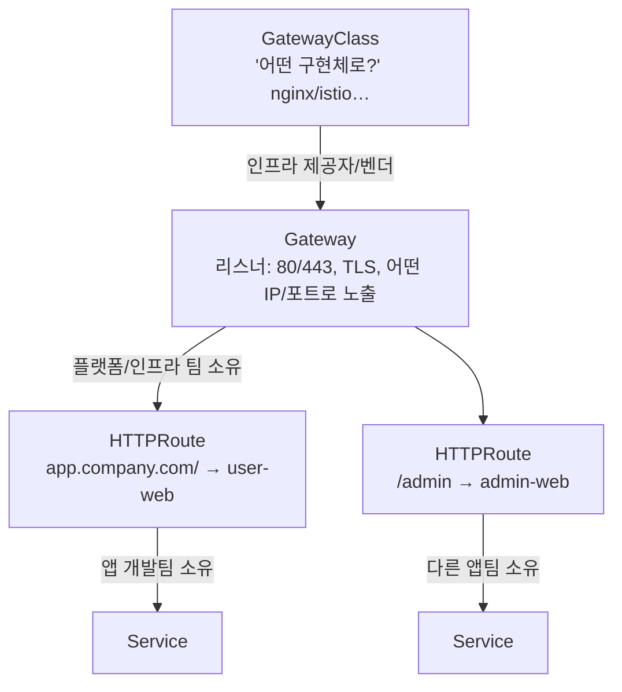

# Gateway API — Ingress의 후속 표준 (역할 분리 · 고급 라우팅)

> CKA 도메인: **Services & Networking (~20%)**. 2025 개정에서 신규 추가. 선행 개념은 [ingress.md](./ingress.md).

## 한 줄 요약

> **Gateway API = Ingress가 부족했던 점(역할 분리·고급 라우팅·HTTP 외 프로토콜)을 처음부터 다시 설계한 공식 후속 표준.**

Ingress는 폐기된 게 아니다. 단순 HTTP 라우팅엔 여전히 충분하다. 다만 **새 투자·기능은 Gateway API로** 모이고 있고, 멀티팀·고급 트래픽 제어·non-HTTP가 필요하면 Gateway API가 답이다.

## 왜 Ingress를 두고 새로 만들었나

[ingress.md](./ingress.md)에 적은 Ingress의 한계들이 그대로 Gateway API의 설계 동기다:

| Ingress의 한계 | Gateway API의 해법 |
|---|---|
| 사실상 **HTTP(S) 전용** (TCP/UDP/gRPC 어려움) | `HTTPRoute`·`TCPRoute`·`GRPCRoute`·`TLSRoute` 등 **프로토콜별 리소스** |
| 고급 라우팅(헤더·메서드·가중치 분배)이 **표준에 없어 annotation 떡칠** | 헤더/메서드/쿼리 매칭, **트래픽 분배(가중치)** 가 **스펙 자체에** 들어감 |
| 리소스 1장을 **모두가 같이 수정** (역할 구분 없음) | **역할별로 리소스가 쪼개짐**(아래) — 큰 조직의 핵심 동기 |
| Controller마다 annotation이 달라 **이식성 ↓** | 동작이 **표준 스펙으로 정의** → 구현체 갈아타기 쉬움 |

## 가장 큰 차이 — 역할(role)로 리소스를 나눈다

Ingress는 한 리소스에 "인프라 노출 + 라우팅 규칙"이 섞여 있다. Gateway API는 이걸 **누가 소유하는가**로 3층으로 쪼갰다.



| 리소스 | 누가 소유 | 무엇을 정의 | Ingress로 치면 |
|---|---|---|---|
| **GatewayClass** | 인프라 제공자/벤더 | 어떤 구현체(nginx, istio, …)로 처리할지 | `IngressClass`와 유사 |
| **Gateway** | 플랫폼/인프라 팀 | 리스너(포트·프로토콜·TLS), 외부 노출 지점 | (Ingress엔 분리된 개념 없음) |
| **HTTPRoute** (등) | **앱 개발팀** | 호스트/경로 → 어느 Service로 | Ingress의 `rules` 부분 |

이 분리가 핵심이다. **인프라 팀이 Gateway(노출·TLS)를 한 번 만들어두면, 각 앱팀은 자기 `HTTPRoute`만 붙인다.** Ingress에서 "팀별로 쪼개기"를 annotation·host merge로 억지로 하던 걸, Gateway API는 **모델 차원에서** 지원한다. `HTTPRoute`는 다른 네임스페이스의 Gateway에도 attach 가능하며(cross-namespace), Gateway 쪽에서 `allowedRoutes`로 **어떤 네임스페이스/라벨의 Route를 받을지 권한 통제**한다.

## 라우팅 예시 — 헤더 매칭 + 가중치 분배

```yaml
apiVersion: gateway.networking.k8s.io/v1
kind: HTTPRoute
metadata:
  name: user-web
spec:
  parentRefs:
  - name: company-gateway          # 인프라팀이 만든 Gateway에 붙음
  hostnames: ["app.company.com"]
  rules:
  - matches:
    - path: { type: PathPrefix, value: / }
      headers:                       # ← Ingress 표준엔 없던 헤더 매칭
      - name: x-canary
        value: "true"
    backendRefs:
    - { name: user-web-canary, port: 80, weight: 10 }   # ← 가중치 트래픽 분배(카나리)
    - { name: user-web,        port: 80, weight: 90 }
```

카나리(canary)·블루그린·헤더 기반 분기를 **annotation 없이 표준 필드로** 한다는 게 큰 장점이다.

대응되는 Gateway(인프라팀이 한 번 만들어 둠):

```yaml
apiVersion: gateway.networking.k8s.io/v1
kind: Gateway
metadata:
  name: company-gateway
spec:
  gatewayClassName: nginx           # 어떤 구현체가 처리할지 (GatewayClass 이름)
  listeners:
  - name: web
    protocol: HTTP
    port: 80
    allowedRoutes:                  # 어떤 네임스페이스의 Route를 받을지 통제
      namespaces: { from: All }
```

## Ingress ↔ Gateway API 빠른 매핑

| Ingress | Gateway API |
|---|---|
| `IngressClass` | `GatewayClass` |
| (없음 — Ingress에 섞임) | `Gateway` (리스너·TLS·노출) |
| `Ingress`의 `rules` | `HTTPRoute` (그리고 TCP/GRPC/TLS Route) |
| Ingress Controller | Gateway 구현체(NGINX Gateway Fabric, Istio, Envoy Gateway …) |

## on-prem / 실무 관점

- **구현체(Controller)가 필요한 건 Ingress와 똑같다.** Ingress Controller 자리에 "Gateway 구현체"가 들어간다고 보면 된다: NGINX Gateway Fabric, Istio, Envoy Gateway, Cilium 등.
- **외부 노출 방식도 동일** — on-prem이면 MetalLB / NodePort / 사내 LB로 Gateway를 노출한다([ingress.md](./ingress.md)의 노출 표와 같음).
- **CRD 설치가 선행**되어야 한다. Gateway API는 코어가 아니라 별도 CRD 묶음으로 배포된다(`kubectl apply` for standard channel CRDs) + 구현체.
- 확인 명령은 Ingress와 평행하다:
  ```bash
  kubectl get gatewayclass            # 설치된 Gateway 구현체
  kubectl get gateway -A              # 인프라팀이 만든 노출 지점(리스너/주소)
  kubectl get httproute -A            # 앱들의 라우팅
  kubectl describe httproute <name>   # 특정 Route의 매칭/백엔드/상태
  ```

## 시험·실무 팁

- CKA 2025 신규 항목. **개념(GatewayClass→Gateway→HTTPRoute 3층 구조)과 HTTPRoute 기본 작성**을 기대. Ingress와의 매핑으로 외우면 빠르다.
- **버전 채널**: `standard`(GA, HTTPRoute 등)와 `experimental`(TCPRoute 등 일부)로 나뉜다. 클러스터에 깔린 CRD가 어느 채널인지 확인.
- **API 그룹은 `gateway.networking.k8s.io`** (Ingress는 `networking.k8s.io`). 헷갈리기 쉬움.
- Route의 **status 조건(Accepted/ResolvedRefs)** 으로 "Gateway에 잘 붙었나/백엔드를 찾았나"를 진단한다 — Ingress보다 상태 피드백이 풍부.

## 참고

- [Gateway API (공식)](https://gateway-api.sigs.k8s.io/)
- [Ingress에서 Gateway API로 마이그레이션](https://gateway-api.sigs.k8s.io/guides/migrating-from-ingress/)
- [Gateway API Implementations(구현체 목록)](https://gateway-api.sigs.k8s.io/implementations/)
- 선행 개념 → [ingress.md](./ingress.md)
