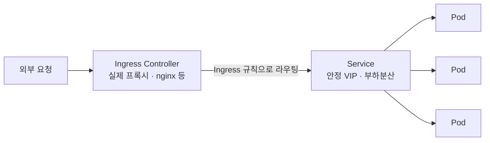
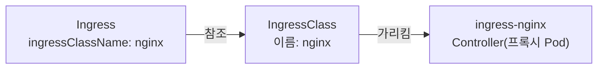
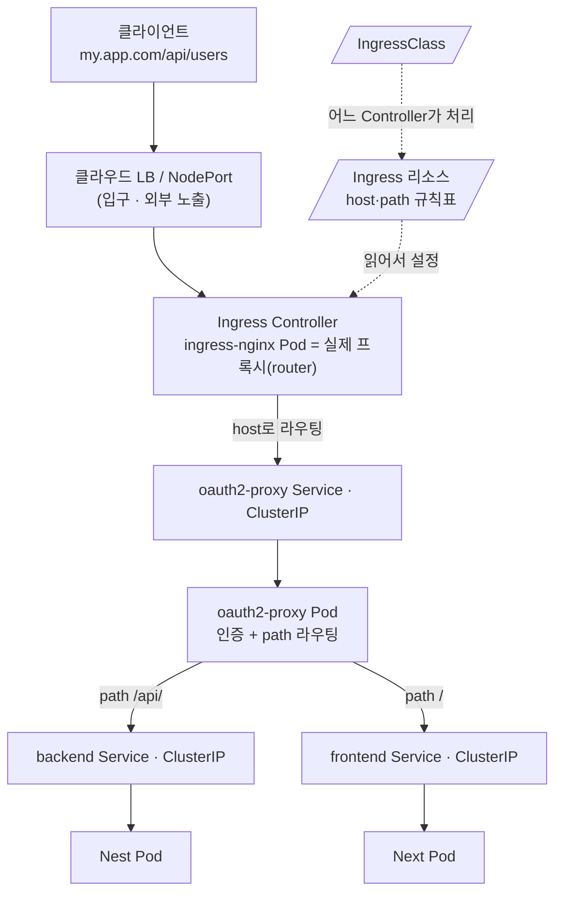

# Ingress — HTTP(S) 라우팅으로 여러 앱을 외부에 노출

> CKA 도메인: **Services & Networking (~20%)**. 관련: [README](./README.md) · 환경의 Controller/노출은 [`01_lab-environment/kind.md`](../01_lab-environment/kind.md).

## 개념 — Ingress는 Pod이 아니라 Service를 가리킨다

요청이 외부에서 Pod까지 닿는 길은 **여러 계층**을 거친다. 이걸 먼저 보면 "Ingress를 몇 개 만들어야 하나" 같은 질문이 자연스럽게 풀린다.



| 계층 | 하는 일 | 개수 기준 |
|---|---|---|
| **Pod** | 실제 앱 컨테이너. 일회용(IP가 계속 바뀜) | `replicas` |
| **Service** | Pod 앞의 **안정적 주소** + 부하분산 | **앱(Deployment)마다 거의 1:1** |
| **Ingress** | "이 호스트/경로 → 이 Service" **L7 라우팅 규칙 표** | **자유 (운영 결정)** |
| **Ingress Controller** | 그 규칙대로 실제 트래픽을 받는 **프록시** | 클러스터에 보통 1종 설치 |

핵심 두 가지:
1. **Ingress는 Pod이 아니라 Service를 가리킨다.** Pod은 죽고 새로 뜨며 IP가 바뀌니까, 안정적인 Service를 경유한다. → **Pod 개수와 Ingress 개수는 무관.**
2. **Ingress 리소스 ≠ Ingress Controller.** Ingress는 그냥 규칙이 적힌 표일 뿐, 실제 트래픽을 받는 건 Controller(ingress-nginx 등). **Controller가 없으면 Ingress를 만들어도 아무 일도 안 일어난다.**

## Ingress 1개 ↔ Service N개

Service마다 Ingress를 하나씩 만들 필요는 **없다.** 하나의 Ingress가 호스트/경로로 갈래쳐서(fan-out) **여러 Service를 동시에 라우팅**할 수 있다.

```yaml
apiVersion: networking.k8s.io/v1
kind: Ingress
metadata:
  name: company-apps           # Ingress 하나로 여러 앱을 라우팅
spec:
  ingressClassName: nginx      # 어떤 Controller가 처리할지 (필수에 가까움)
  rules:
  - host: app.company.com
    http:
      paths:
      - path: /                # 경로 기반 갈래치기
        pathType: Prefix
        backend: { service: { name: user-web,  port: { number: 80 } } }
      - path: /admin
        pathType: Prefix
        backend: { service: { name: admin-web, port: { number: 80 } } }
      - path: /api
        pathType: Prefix
        backend: { service: { name: backend,   port: { number: 8080 } } }
  - host: shop.company.com      # 호스트 기반 갈래치기도 가능
    http:
      paths:
      - path: /
        pathType: Prefix
        backend: { service: { name: shop-web,  port: { number: 80 } } }
```

위 한 장으로 **4개 앱(Service)** 을 다 처리한다. 각 Service는 자기 Deployment의 Pod들로 부하분산한다.

### 묶을까 쪼갤까 — 트레이드오프

| | 하나의 Ingress로 묶기 | 앱(팀)별로 Ingress 쪼개기 |
|---|---|---|
| **장점** | 라우팅이 한눈에 보임. 단순 구성에 좋음 | 팀별 독립 수정/배포(충돌·리뷰 병목 ↓), TLS·annotation을 앱별로 다르게, GitOps에서 앱이 자기 라우팅을 소유 |
| **어울리는 곳** | 작은 조직 / 단순 서비스 | 큰 조직 / 멀티팀 (실무에서 더 흔함) |

> 같은 host를 **여러 Ingress 리소스에 나눠 적어도** ingress-nginx 같은 Controller가 내부적으로 **합쳐서(merge)** 한 서버 블록으로 처리한다. 그래서 "app.company.com을 user팀·admin팀 Ingress로 각각 소유"하는 게 가능하다. 즉 Ingress는 **앱마다 1:1일 필요도, 1장으로 몰 필요도 없고 — 운영 편의로 정하는 것.**

정리하면: **Service는 앱마다 거의 1:1**, **Ingress는 그것들을 몇 장으로 관리할지가 선택**이다.

## `ingressClassName` — 이 규칙을 *누가* 처리할지

개념의 핵심 2번(규칙 ≠ Controller)에서 자연스럽게 따라오는 질문: 클러스터에 Controller가 **여러 개**(예: 외부망용 `nginx` + 내부망용 `nginx-internal`) 깔려 있으면, 내가 만든 Ingress는 **누가** 집어서 처리하나? 이걸 정해주는 게 `ingressClassName`이다 — 택배 송장의 "담당 지점" 칸.

`ingressClassName: nginx`의 `nginx`는 아무 문자열이 아니라 클러스터에 실재하는 **`IngressClass` 리소스의 이름**이다. Controller를 설치하면 보통 함께 생성된다.



```bash
kubectl get ingressclass            # NAME 컬럼이 곧 ingressClassName 값
```

**안 주면?** 쿠버네티스가 **기본(default) IngressClass**를 찾는다. IngressClass에 `ingressclass.kubernetes.io/is-default-class: "true"` annotation이 붙어 있으면 그게 기본이 된다.

| 기본 IngressClass | 생략 시 |
|---|---|
| **있음** | 그 Controller가 처리 |
| **없음** | 아무도 안 집어감 → **Ingress를 만들어도 라우팅이 조용히 안 잡힌다** (디버깅 까다로움) |

→ 그래서 **명시하는 습관**이 안전하다.

> 옛날엔 필드 대신 `kubernetes.io/ingress.class: "nginx"` **annotation**으로 했다(deprecated). 구버전 매니페스트·블로그에서 이 형태를 보면 "아 옛날 방식이구나" 하면 된다. 지금 표준은 `spec.ingressClassName` 필드.

## 어디까지가 spec이고 어디부터 annotation인가 (이식성 경계)

Ingress 설정은 **표준 `spec` 필드**(Controller 무관, 이식 가능)와 **Controller별 annotation**(종속, 이식 안 됨)으로 나뉜다. 이 경계를 알면 "이건 왜 annotation이지?"가 한 번에 풀린다.

| 항목 | 위치 | 이식성 |
|---|---|---|
| host / path / backend / `pathType` | **`spec`** (구조 필드) | ✅ Controller 무관 |
| TLS (`spec.tls`) | **`spec`** | ✅ |
| class 선택 | 옛 annotation → **지금 `spec.ingressClassName`** | ✅ (이사 완료) |
| rewrite·timeout·body-size·정규식·세션·**외부 인증(auth-*)** | **annotation** (지금도) | ❌ Controller 종속 |

규칙은 한 줄: **"이 host/path → 이 Service"라는 표준 의미(무엇)는 `spec`, 그걸 처리하는 방법(어떻게)은 annotation.**

> 참고: host/path로 가르는 **라우팅 뼈대는 처음부터 `spec.rules[]`** 였다(annotation이었던 적 없음). annotation→필드로 이사한 건 **class 선택뿐**. 단 `pathType`은 `networking.k8s.io/v1`(GA k8s 1.19)에서 **필수 필드로 표준화**됐다 — 그전 `extensions/v1beta1`엔 없어서 path 매칭이 Controller마다 달랐다.

### 대표 annotation — `rewrite-target`

가장 자주 마주치는 annotation. **클라이언트가 요청한 경로**와 **백엔드가 기대하는 경로**가 다를 때 중간에서 경로를 갈아끼운다.

```yaml
metadata:
  annotations:
    nginx.ingress.kubernetes.io/rewrite-target: /$2   # 캡처한 $2만 백엔드로
spec:
  ingressClassName: nginx
  rules:
  - http:
      paths:
      - path: /api(/|$)(.*)        # ()로 두 덩어리 캡처
        pathType: ImplementationSpecific
        backend: { service: { name: backend, port: { number: 8080 } } }
# 요청 /api/users → 백엔드는 /users 받음 (/api 접두사 strip)
```

#### 왜 이런 strip 기능이 존재하나 — 그리고 언제 피하나

strip/rewrite는 **"좋은 기능"이라서가 아니라, 피할 수 없는 현실 때문에 있는 탈출구**다. 복잡하게 느껴지는 게 정상이고, 그 복잡함은 "이 걱정을 앞단이 아니라 앱 안으로 밀어넣어라"는 신호다.

- **근본 원인**: 대부분의 앱은 **자기가 루트(`/`)에 있는 줄 안다.** `/users`·`/login`·`/static`으로 받을 거라 가정하지, 운영자가 자기를 `/api` 밑에 끼워 넣을 줄 모른다. 그런데 운영자는 **한 도메인·한 인증서 아래 여러 앱을 path로 모으고** 싶다 → 여기서 "공개 URL 경로 ↔ 앱이 기대하는 경로"가 어긋나고, strip이 그 간극을 메운다.
- **새는(leaky) 기능**: rewrite는 **요청 경로만** 고친다. 응답 본문의 링크(`<a href="/login">`)·리다이렉트(`302 Location: /x`)·path 쿠키는 **안 고쳐서** 브라우저에서 깨지는 2차 문제가 따라온다.

그래서 판단은 단순하다:

| 앱을 고칠 수 있나? | 권장 |
|---|---|
| **있다** (내가 만든 앱) | 앱에 **base-path 설정** → Spring `context-path`, NestJS `setGlobalPrefix`, `--path-prefix` 등. **strip 불필요** ✅ |
| **없다** (서드파티·레거시·공용 이미지) | 어쩔 수 없이 **strip** (유일한 카드) |

→ **strip은 "못 고치는 앱을 prefix 밑에 끼워 맞추는" 현실용 escape hatch.** 고칠 수 있는 앱이면 base-path를 앱에 주는 게 정석이고, rewrite는 차선책이다.

이런 annotation은 Controller마다 키가 제각각(ingress-nginx ↔ traefik ↔ HAProxy)이라 이식성이 떨어진다 → 이 문제를 표준 필드로 푼 게 [Gateway API](./gateway-api.md)의 `URLRewrite` 필터. 외부 인증(`auth-*`)·oauth2-proxy 연동·`--upstream` 경로 동작은 → [oauth2-proxy.md](./oauth2-proxy.md).

## Controller는 외부와 어떻게 연결되나 — 노출 방식 (특히 on-prem)

ingress-nginx **Controller 자신도 그냥 Pod**라, 자기만의 **Service로 외부 트래픽을 받는다.** 그 **Controller Service의 타입**이 곧 "외부와 어떻게 연결되나"를 정한다.

```
외부 → (DNS) → [노출 지점] → ingress-nginx Service → ingress-nginx Pod → (Ingress 규칙 읽고) → 백엔드 ClusterIP Service → Pod
                  ↑ 여기가 핵심
```

### 노출 방법

| 방법 | 어떻게 | 외부가 닿는 포트 | 흔한 환경 |
|---|---|---|---|
| **LoadBalancer** | 클라우드가 LB 자동 / on-prem은 **[MetalLB](./metallb.md)**가 IP 할당 | **:80 / :443** (정상 포트) | ⭐ 클라우드·실무 기본 |
| **NodePort** | 모든 노드에 고정 포트 오픈 | **:30000~32767** (높은 포트) | bare-metal, 앞에 LB 또 둘 때 |
| **hostNetwork / hostPort** | Controller Pod가 노드의 **:80/:443에 직접** 바인드(보통 DaemonSet) | **:80 / :443** | bare-metal에서 높은포트 회피 |
| **하드웨어 LB(F5 등)** | 노드들 앞에 이미 사내 LB가 있고, 그 뒤에 NodePort로 붙임 | LB가 :443 종단 | 사내 L4/L7 장비 보유 시 |

> 💡 **LoadBalancer는 NodePort 위에 얹힌 것** — `type: LoadBalancer`를 만들면 k8s가 내부적으로 NodePort를 하나 까고, 클라우드/MetalLB LB가 그 NodePort로 트래픽을 흘린다. "NodePort냐 LoadBalancer냐"는 기계적으론 배타적이지 않다.
>
> ⚠️ **NodePort 단독은 보통 최종 답이 아니다** — 범위가 30000~32767뿐이라 사용자가 오는 `:443`을 직접 못 받는다. 그래서 앞에 또 LB/방화벽 DNAT로 `:443→:3xxxx`를 넘기거나, MetalLB·hostNetwork로 `:443`을 직접 연다.

### 환경별로 뭘 쓰나

| 환경 | 가장 흔한 노출 방식 |
|---|---|
| **EKS / 클라우드** | **LoadBalancer** → 클라우드가 ELB/**NLB**를 자동 생성 (서비스 annotation으로 NLB·internal 등 지정). EKS의 AWS LB Controller·**TargetGroupBinding** → [09 aws-lb-controller.md](../09_aws-eks/aws-lb-controller.md) |
| **on-prem bare-metal** | **MetalLB**(LoadBalancer를 :443으로) 또는 **hostNetwork**(Pod가 :443 직접) |
| **사내 L4/L7 장비(F5 등) 보유** | NodePort + 그 앞단 하드웨어 LB |
| **로컬 kind** | extraPortMappings + hostPort로 노드 :80/443을 호스트에 연결 → [01_lab-environment](../01_lab-environment/) |

→ 사내 클러스터엔 십중팔구 **이미 ingress-nginx + (MetalLB / hostNetwork / NodePort+사내 LB)** 가 깔려 있다. 새 frontend를 올릴 땐 그 Controller의 `ingressClassName`만 맞춰 쓰면 된다.

### 내 클러스터는 뭘 쓰나 — 확인

```bash
# ① Controller Service 타입이 출발점
kubectl -n ingress-nginx get svc
#   TYPE 열로 판별:
#     LoadBalancer + EXTERNAL-IP 있음  → LB(클라우드 ELB/NLB 또는 MetalLB)로 :80/:443 노출
#     NodePort                         → nodeIP:3xxxx. 앞단 LB/방화벽이 :443을 넘기는지 확인
#     ClusterIP 인데도 동작             → Controller Pod가 hostNetwork로 노드 :80/443 직접 바인드 의심

# ② hostNetwork 여부 직접 확인
kubectl -n ingress-nginx get deploy,ds -o jsonpath=\
'{range .items[*]}{.metadata.name}  hostNetwork={.spec.template.spec.hostNetwork}{"\n"}{end}'

# ③ LoadBalancer면 클라우드가 뭘 붙였나 (EKS: NLB/ELB·internal 여부) — 서비스 annotation에서
kubectl -n ingress-nginx get svc -o jsonpath=\
'{range .items[*]}{.metadata.name}: {.metadata.annotations}{"\n"}{end}' | grep -i aws-load-balancer || true

# ④ 사내 컨벤션 컨닝 (제일 좋은 참고)
kubectl get ingressclass            # 어떤 Controller가 있나 (이름 = ingressClassName 값)
kubectl get ingress -A              # 기존 앱들은 어떻게 라우팅하나
kubectl describe ingress <name>     # 특정 Ingress의 호스트/경로/백엔드/annotation
```

> ⚠️ 네임스페이스가 `ingress-nginx`가 아닐 수 있다(설치 방식에 따라 `kube-system` 등). 못 찾으면 `kubectl get pods -A | grep -i ingress`로 먼저 어디 있는지 확인.

## 전체 그림 — 요청이 거치는 계층

한 요청이 외부에서 Pod까지 가며 거치는 계층과, 각 조각의 **관계**를 한 장으로. (oauth2-proxy를 `--upstream`으로 끼운 구성 기준)



**실선 = 트래픽 / 점선 = 참조(설정).** 이 구분이 핵심이다 — **Ingress 리소스는 트래픽이 거치는 "홉"이 아니다.** Controller가 **읽어서** 자기 라우팅을 구성하는 규칙표일 뿐. (그래서 "ingress가 라우팅한다"기보다 **"Controller가 Ingress를 보고 라우팅한다"**.)

### 각 조각의 정체

| 조각 | 정체 | 실행되나 |
|---|---|---|
| **Ingress Controller** | 실제 프록시(= router). 트래픽을 받아 라우팅 | ✅ Pod로 실행 |
| **Ingress (리소스)** | host/path 규칙표. Controller가 읽는 **설정** | ❌ 데이터일 뿐 |
| **IngressClass** | Ingress ↔ Controller **연결** | ❌ 연결용 리소스 |
| **oauth2-proxy** | ingress **뒤에 선 별도 프록시**(인증 + path 분기) | ✅ Pod로 실행 |
| **Service** | Pod 앞 **안정 주소**. 거의 다 ClusterIP | VIP/엔드포인트 |

### Service 타입 — 어디만 노출하나

| 계층 | Service 타입 | 왜 |
|---|---|---|
| **Ingress Controller** (입구) | **LoadBalancer**(클라우드) / **NodePort**(on-prem) | 외부 진입점 → 노출 필요 (상세 ↑ on-prem 섹션) |
| **그 뒤 전부** (oauth2-proxy·frontend·backend) | **ClusterIP** (기본) | Controller·proxy가 **클러스터 내부에서 닿음** → 노출 불필요 |

→ 한 줄: **입구(Controller) 하나만 외부 노출, 나머지 백엔드 Service는 전부 ClusterIP.** Ingress의 `backend`도, oauth2-proxy의 `--upstream` 목적지도 전부 ClusterIP Service를 가리킨다.

> oauth2-proxy를 **(A) auth annotation** 방식으로 끼우면 그림이 조금 다르다 — oauth2-proxy가 트래픽 경로가 아니라 **옆에서 인증만 판정**하고 백엔드로는 Controller가 직접 보낸다. → [oauth2-proxy.md](./oauth2-proxy.md)

> 🔎 **돌아가는 클러스터에서 이 그림을 거꾸로 추적하려면**(Ingress → oauth2-proxy → Service → Pod를 kubectl로 따라가기) → [oauth2-proxy.md "연결 추적"](./oauth2-proxy.md#연결-추적--ingressoauth2-proxy가-내부-service에-어떻게-붙어-있나).

## 시험·실무 팁

- **`pathType`은 거의 항상 명시.** `Prefix`(경로 접두사) / `Exact`(정확히 일치). 빠뜨리면 Controller마다 동작이 달라질 수 있다.
- **`ingressClassName`을 안 주면** 라우팅이 안 잡힐 수 있다(기본 IngressClass가 없으면). 어떤 Controller가 처리할지 명시하는 습관.
- **Ingress는 HTTP(S) L7 전용.** TCP/UDP(예: DB, gRPC raw)는 Ingress로 못 한다 → `Service type: LoadBalancer`/NodePort, 또는 [Gateway API](https://gateway-api.sigs.k8s.io/)·Controller별 TCP 노출 기능.
- **TLS**는 `spec.tls`에 `secretName`(타입 `kubernetes.io/tls`)으로 인증서를 붙인다. cert-manager로 자동 발급/갱신이 실무 표준.
- 타임아웃·바디 크기·리라이트 등 세부는 **Controller별 annotation**으로 준다(예: `nginx.ingress.kubernetes.io/...`). 이식성이 떨어지는 부분 → 그래서 차세대 표준 **Gateway API**가 나옴.
- **외부 인증(`auth-url`/`auth-signin`)·경로 rewrite(`rewrite-target`)** 도 같은 annotation 계열이다. oauth2-proxy 연동·`--upstream` 경로 동작은 → [oauth2-proxy.md](./oauth2-proxy.md).
- CKA 단골: `kubectl create ingress <name> --rule="host/path=svc:port"` 로 빠르게 생성 후 `-o yaml`로 다듬기.

## 참고

- [Ingress (공식)](https://kubernetes.io/docs/concepts/services-networking/ingress/)
- [Ingress Controllers](https://kubernetes.io/docs/concepts/services-networking/ingress-controllers/)
- [ingress-nginx 문서](https://kubernetes.github.io/ingress-nginx/)
- [MetalLB (on-prem LoadBalancer)](https://metallb.universe.tf/)
- 차세대 표준 → [gateway-api.md](./gateway-api.md) (역할 분리·고급 라우팅·non-HTTP를 푸는 Ingress 후속)
