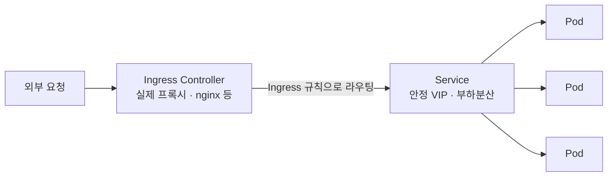

# Ingress — HTTP(S) 라우팅으로 여러 앱을 외부에 노출

> CKA 도메인: **Services & Networking (~20%)**. 관련: [README](./README.md) · 환경의 Controller/노출은 [`01_lab-environment/kind.md`](../01_lab-environment/kind.md).

## 개념 — Ingress는 Pod이 아니라 Service를 가리킨다

요청이 외부에서 Pod까지 닿는 길은 **여러 계층**을 거친다. 이걸 먼저 보면 "Ingress를 몇 개 만들어야 하나" 같은 질문이 자연스럽게 풀린다.



| 계층 | 하는 일 | 개수 기준 |
|---|---|---|
| **Pod** | 실제 앱 컨테이너. 일회용(IP가 계속 바뀜) | `replicas` |
| **Service** | Pod 앞의 **안정적 주소** + 부하분산 | **앱(Deployment)마다 거의 1:1** |
| **Ingress** | "이 호스트/경로 → 이 Service" **L7 라우팅 규칙 표** | **자유 (운영 결정)** |
| **Ingress Controller** | 그 규칙대로 실제 트래픽을 받는 **프록시** | 클러스터에 보통 1종 설치 |

핵심 두 가지:
1. **Ingress는 Pod이 아니라 Service를 가리킨다.** Pod은 죽고 새로 뜨며 IP가 바뀌니까, 안정적인 Service를 경유한다. → **Pod 개수와 Ingress 개수는 무관.**
2. **Ingress 리소스 ≠ Ingress Controller.** Ingress는 그냥 규칙이 적힌 표일 뿐, 실제 트래픽을 받는 건 Controller(ingress-nginx 등). **Controller가 없으면 Ingress를 만들어도 아무 일도 안 일어난다.**

## Ingress 1개 ↔ Service N개

Service마다 Ingress를 하나씩 만들 필요는 **없다.** 하나의 Ingress가 호스트/경로로 갈래쳐서(fan-out) **여러 Service를 동시에 라우팅**할 수 있다.

```yaml
apiVersion: networking.k8s.io/v1
kind: Ingress
metadata:
  name: company-apps           # Ingress 하나로 여러 앱을 라우팅
spec:
  ingressClassName: nginx      # 어떤 Controller가 처리할지 (필수에 가까움)
  rules:
  - host: app.company.com
    http:
      paths:
      - path: /                # 경로 기반 갈래치기
        pathType: Prefix
        backend: { service: { name: user-web,  port: { number: 80 } } }
      - path: /admin
        pathType: Prefix
        backend: { service: { name: admin-web, port: { number: 80 } } }
      - path: /api
        pathType: Prefix
        backend: { service: { name: backend,   port: { number: 8080 } } }
  - host: shop.company.com      # 호스트 기반 갈래치기도 가능
    http:
      paths:
      - path: /
        pathType: Prefix
        backend: { service: { name: shop-web,  port: { number: 80 } } }
```

위 한 장으로 **4개 앱(Service)** 을 다 처리한다. 각 Service는 자기 Deployment의 Pod들로 부하분산한다.

### 묶을까 쪼갤까 — 트레이드오프

| | 하나의 Ingress로 묶기 | 앱(팀)별로 Ingress 쪼개기 |
|---|---|---|
| **장점** | 라우팅이 한눈에 보임. 단순 구성에 좋음 | 팀별 독립 수정/배포(충돌·리뷰 병목 ↓), TLS·annotation을 앱별로 다르게, GitOps에서 앱이 자기 라우팅을 소유 |
| **어울리는 곳** | 작은 조직 / 단순 서비스 | 큰 조직 / 멀티팀 (실무에서 더 흔함) |

> 같은 host를 **여러 Ingress 리소스에 나눠 적어도** ingress-nginx 같은 Controller가 내부적으로 **합쳐서(merge)** 한 서버 블록으로 처리한다. 그래서 "app.company.com을 user팀·admin팀 Ingress로 각각 소유"하는 게 가능하다. 즉 Ingress는 **앱마다 1:1일 필요도, 1장으로 몰 필요도 없고 — 운영 편의로 정하는 것.**

정리하면: **Service는 앱마다 거의 1:1**, **Ingress는 그것들을 몇 장으로 관리할지가 선택**이다.

## ⚠️ on-prem에서 특히 챙길 것 — Controller 노출

클라우드(EKS 등)는 Ingress(또는 `Service type: LoadBalancer`)를 만들면 클라우드가 알아서 LB(ELB)를 붙여 준다. **on-prem엔 그게 없다.** 그래서 Ingress Controller를 외부에 어떻게 노출하느냐가 추가 과제다:

| 방법 | 내용 |
|---|---|
| **MetalLB** | on-prem용 LoadBalancer 구현. `Service type: LoadBalancer`에 사내 IP를 할당. 가장 깔끔 |
| **NodePort** | 노드의 고정 포트로 노출. 간단하지만 포트·앞단 LB를 직접 관리 |
| **하드웨어 LB(F5 등)** | 노드들 앞에 이미 사내 LB가 있는 경우도 흔함 |

그래서 사내 클러스터엔 십중팔구 **이미 ingress-nginx + (MetalLB 또는 NodePort+사내 LB)** 가 깔려 있다. 새 frontend를 올릴 땐 그 Controller의 `ingressClassName`만 맞춰 쓰면 된다.

### 기존 패턴 컨닝하기 (사내 컨벤션 맞추는 가장 빠른 길)

```bash
kubectl get ingressclass            # 어떤 Ingress Controller가 있나 (이름 = ingressClassName 값)
kubectl -n ingress-nginx get svc    # Controller가 어떻게 노출됐나 (LoadBalancer? NodePort?)
kubectl get ingress -A              # 기존 앱들은 어떻게 라우팅하나 ← 제일 좋은 컨닝
kubectl describe ingress <name>     # 특정 Ingress의 호스트/경로/백엔드/annotation 확인
```

## 시험·실무 팁

- **`pathType`은 거의 항상 명시.** `Prefix`(경로 접두사) / `Exact`(정확히 일치). 빠뜨리면 Controller마다 동작이 달라질 수 있다.
- **`ingressClassName`을 안 주면** 라우팅이 안 잡힐 수 있다(기본 IngressClass가 없으면). 어떤 Controller가 처리할지 명시하는 습관.
- **Ingress는 HTTP(S) L7 전용.** TCP/UDP(예: DB, gRPC raw)는 Ingress로 못 한다 → `Service type: LoadBalancer`/NodePort, 또는 [Gateway API](https://gateway-api.sigs.k8s.io/)·Controller별 TCP 노출 기능.
- **TLS**는 `spec.tls`에 `secretName`(타입 `kubernetes.io/tls`)으로 인증서를 붙인다. cert-manager로 자동 발급/갱신이 실무 표준.
- 타임아웃·바디 크기·리라이트 등 세부는 **Controller별 annotation**으로 준다(예: `nginx.ingress.kubernetes.io/...`). 이식성이 떨어지는 부분 → 그래서 차세대 표준 **Gateway API**가 나옴.
- CKA 단골: `kubectl create ingress <name> --rule="host/path=svc:port"` 로 빠르게 생성 후 `-o yaml`로 다듬기.

## 참고

- [Ingress (공식)](https://kubernetes.io/docs/concepts/services-networking/ingress/)
- [Ingress Controllers](https://kubernetes.io/docs/concepts/services-networking/ingress-controllers/)
- [ingress-nginx 문서](https://kubernetes.github.io/ingress-nginx/)
- [MetalLB (on-prem LoadBalancer)](https://metallb.universe.tf/)
- 차세대 표준 → [gateway-api.md](./gateway-api.md) (역할 분리·고급 라우팅·non-HTTP를 푸는 Ingress 후속)
