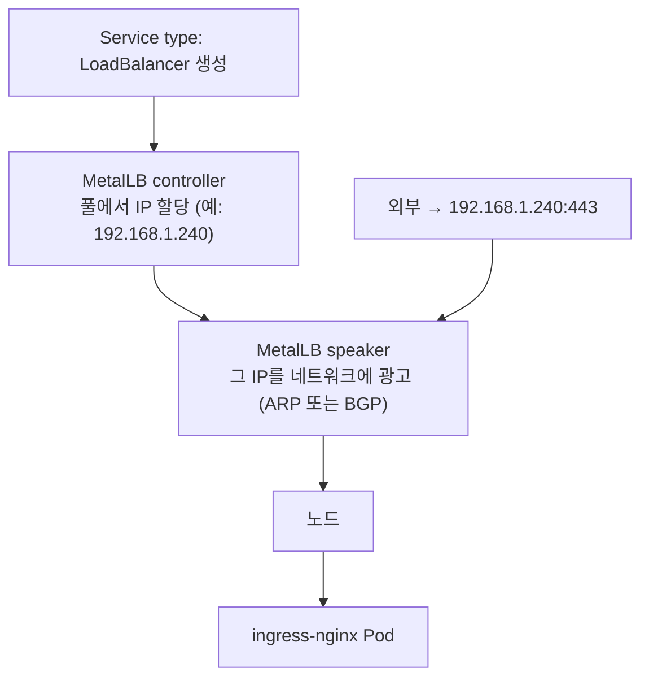

# MetalLB — bare-metal 클러스터의 LoadBalancer 구현체

> CKA 직접 출제 범위는 아니지만, **on-prem에서 `Service type: LoadBalancer`를 성립시키는 핵심 도구**라 여기 둔다.
> 관련: [ingress.md](./ingress.md)(Controller 노출 방식) · [gateway-api.md](./gateway-api.md)(Gateway도 LoadBalancer로 노출) · [README](./README.md)

## 개념 — 클라우드엔 있고 on-prem엔 없는 것

`Service type: LoadBalancer`가 동작하려면 **누군가 ① 외부 IP를 할당하고 ② 그 IP로 온 트래픽을 노드로 흘려줘야** 한다.

| 환경 | 그 "누군가" | 결과 |
|---|---|---|
| **클라우드(EKS 등)** | 클라우드 컨트롤러가 ELB/NLB 자동 생성 | `EXTERNAL-IP`에 IP가 박힘 ✅ |
| **on-prem bare-metal** | **없다** | `EXTERNAL-IP`가 영원히 **`<pending>`** ❌ |

**MetalLB가 이 빈자리를 채운다.** LoadBalancer 서비스를 감시하다가 미리 정해준 **IP 풀에서 IP를 할당**하고, 그 IP를 **사내 네트워크에 광고**해 트래픽이 노드까지 오게 한다.



> 💡 MetalLB는 트래픽을 **직접 프록시하지 않는다.** "이 IP는 이 노드들로 보내라"고 **광고만** 하고, 실제 패킷 전달은 노드의 kube-proxy(iptables/IPVS)가 한다. 즉 **IP 할당 + 광고**가 MetalLB의 일.

### ⚠️ 트래픽 경로 — MetalLB·Service는 "홉"이 아니다

흔한 오해: "트래픽이 MetalLB Pod 들렀다 → ingress-nginx 들렀다 → Service 들렀다 간다". **아니다.** 패킷이 **실제로 통과하는 Pod는 `ingress-nginx` → `백엔드` 둘뿐**이고, MetalLB와 Service는 그 경로를 *성립시키는 장치*일 뿐 경로상의 홉이 아니다.

| 요소 | 패킷이 통과? | 하는 일 |
|---|---|---|
| **MetalLB speaker** | ❌ | "이 IP는 이 노드로" **ARP/BGP 광고만** (길 안내) |
| 노드 NIC + kube-proxy | ✅(규칙) | 광고 덕에 패킷 도착 → ingress-nginx Pod로 **DNAT** |
| **ingress-nginx Pod** | ✅ | 여기서 처음 '진짜' Pod 통과. Ingress 규칙 보고 프록시 |
| **Service(ClusterIP)** | ❌ | Pod 아님 — iptables 가상 IP → 백엔드 Pod로 **DNAT** |
| **백엔드 Pod** | ✅ | 최종 도착 |

```
외부 → 192.168.1.240:443
   │  (MetalLB가 'this IP는 node-2'라고 미리 광고 — 패킷은 speaker를 안 거침)
   ▼
node-2 NIC → kube-proxy iptables(DNAT) ──▶ ingress-nginx Pod ──▶ backend Service(가상IP·DNAT) ──▶ 백엔드 Pod
```

- **MetalLB는 "길을 깔아줄" 뿐** 패킷 전달은 kube-proxy가 → MetalLB가 병목이 되거나 트래픽을 못 따라가는 일은 없다.
- **Service(ClusterIP)도 실체 있는 프로세스가 아니라** iptables/IPVS 가상 IP → 닿는 순간 백엔드 Pod로 DNAT될 뿐.

## 두 가지 동작 모드 — L2 vs BGP

| 모드 | 어떻게 광고하나 | 트래픽 분산 | 라우터 요구 | 언제 |
|---|---|---|---|---|
| **L2 (ARP/NDP)** | 한 노드가 그 IP를 "내 거"라고 ARP 응답(leader) | 한 IP는 **노드 1대로 몰림** → 장애 시 다른 노드로 페일오버(진짜 분산 아님) | **없음** (같은 L2 세그먼트면 끝) | 대부분의 시작점 |
| **BGP** | 노드들이 라우터와 BGP 피어링해 IP 광고 | **여러 노드로 진짜 분산**(ECMP) | **BGP 가능한 라우터** 필요 | 규모·고가용·진짜 LB 필요 시 |

> 처음엔 **L2 모드가 압도적으로 흔하다**(라우터 설정 없이 됨). 규모가 커지거나 단일 노드 병목/페일오버 한계가 걸리면 BGP로 간다.
>
> ⚠️ **L2는 로드밸런싱이 아니라 페일오버에 가깝다** — 한 LoadBalancer IP로 들어오는 트래픽은 항상 leader 노드 1대가 받는다(그 노드가 죽으면 다른 노드가 승계). 노드별 진짜 분산이 필요하면 BGP.

## 구성 요소

| 구성 | 형태 | 역할 |
|---|---|---|
| **controller** | Deployment (1개) | LoadBalancer 서비스에 풀에서 IP **할당** |
| **speaker** | DaemonSet (노드마다) | 할당된 IP를 그 노드에서 **광고**(ARP/BGP) |

### 어디에 깔리나 — systemd 아님, 클러스터 내부 Pod

> ⚠️ MetalLB는 **노드에 systemd 서비스/패키지로 까는 게 아니다.** `metallb-system` 네임스페이스에 **일반 k8s 워크로드(Pod)** 로 배포된다 — nginx 앱 깔듯이 k8s가 관리하고, `kubectl -n metallb-system get pods`로 보인다(`systemctl`로는 안 보임).

```
                metallb-system 네임스페이스
node-1   [speaker]  [controller]   ← controller는 여기 우연히 떴을 뿐
node-2   [speaker]
node-3   [speaker]
         (speaker는 모든 노드)
```

- **controller** = Deployment(replica 1) → 노드 **아무 데나 1대**. API 서버와 통신해 IP만 할당하면 되니 위치는 안 중요. 평범한 Pod.
- **speaker** = DaemonSet → **모든 노드에 1개씩.** 어느 노드가 그 IP의 leader가 될지 모르고(L2) 장애 시 다른 노드가 승계해야 하므로 전 노드가 대기한다. 노드 네트워크로 직접 ARP/BGP를 쏴야 해서 **`hostNetwork: true`** 로 동작 — "Pod이긴 한데 노드의 네트워크 네임스페이스에 붙은" 형태.

```bash
kubectl -n metallb-system get pods -o wide
#  controller-xxx → 노드 1곳 / speaker-xxx → 노드마다 하나씩 (NODE 열로 확인)
```

설정은 CRD로 준다:

| CRD | 역할 |
|---|---|
| `IPAddressPool` | **어떤 IP 대역**을 LoadBalancer에 나눠줄지 |
| `L2Advertisement` | 그 풀을 **L2(ARP)** 로 광고 |
| `BGPAdvertisement` + `BGPPeer` | 그 풀을 **BGP**로 광고 / 피어 라우터 정의 |

### 설정 예시 (L2 모드)

```yaml
# 📖 MetalLB: https://metallb.universe.tf/configuration/
apiVersion: metallb.io/v1beta1
kind: IPAddressPool
metadata:
  name: first-pool
  namespace: metallb-system
spec:
  addresses:
    - 192.168.1.240-192.168.1.250   # LoadBalancer에 나눠줄 사내 IP 대역
---
apiVersion: metallb.io/v1beta1
kind: L2Advertisement
metadata:
  name: l2
  namespace: metallb-system
spec:
  ipAddressPools:
    - first-pool
```

> 이 대역은 **클러스터 노드들과 같은 L2 네트워크에 있고, DHCP가 안 나눠주는(예약된) 범위**여야 한다 — 안 그러면 IP 충돌.

## 여기서의 의미 — ingress-nginx와의 관계

[ingress.md의 노출 표](./ingress.md#controller는-외부와-어떻게-연결되나--노출-방식-특히-on-prem)에서 **"on-prem에서 ingress-nginx에 진짜 `:443` 외부 IP를 주는 가장 깔끔한 방법"** 이 MetalLB다. NodePort의 높은 포트(30000+)나 hostNetwork 없이도 클라우드처럼 `type: LoadBalancer`를 쓸 수 있게 해준다.

```
[MetalLB 없음] ingress-nginx Service(LoadBalancer) → EXTERNAL-IP <pending> → 외부 접속 불가
[MetalLB 있음] ingress-nginx Service(LoadBalancer) → EXTERNAL-IP 192.168.1.240 → 외부 :443 OK
```

Gateway API도 마찬가지 — Gateway 구현체의 노출 Service가 LoadBalancer면 MetalLB가 IP를 채워준다.

## 확인 / 트러블슈팅

```bash
# 설치·구성 요소 상태
kubectl -n metallb-system get pods            # controller(1) + speaker(노드 수만큼)
kubectl -n metallb-system get ipaddresspool,l2advertisement

# LoadBalancer 서비스가 IP를 받았나 (핵심)
kubectl get svc -A | grep LoadBalancer        # EXTERNAL-IP가 <pending>이 아니어야 함

# 왜 IP가 안 붙나 / 충돌 등은 이벤트·speaker 로그
kubectl -n metallb-system logs ds/speaker
kubectl describe svc <svc>                     # Events에 IP 할당/광고 관련 메시지
```

| 증상 | 원인 | 해결 |
|---|---|---|
| `EXTERNAL-IP`가 계속 `<pending>` | IPAddressPool 미설정 / 풀 소진 | 풀 정의·여유 IP 확인 |
| IP는 받았는데 외부에서 안 닿음 | L2 광고 안 됨 / 다른 L2 세그먼트 | speaker 로그, 노드와 같은 L2인지 |
| IP 충돌(다른 장비와 겹침) | DHCP 범위와 겹치는 풀 | DHCP 예약 밖 대역으로 풀 지정 |

## 시험·실무 팁

- **CKA 직접 출제는 아니다.** 하지만 "on-prem에서 `type: LoadBalancer`가 왜 `<pending>`인가 → MetalLB 같은 구현체가 없어서"는 개념으로 이해해 둘 것. 시험 클러스터에선 보통 NodePort로 노출한다.
- **EKS에선 안 쓴다** — AWS Load Balancer Controller가 ELB/NLB로 그 역할을 한다([09_aws-eks](../09_aws-eks/) 영역). MetalLB는 클라우드 LB가 없는 **bare-metal 전용**.
- 로컬 kind에서 LoadBalancer를 흉내 내려면 MetalLB를 깔거나 `cloud-provider-kind`를 쓴다 → [01_lab-environment](../01_lab-environment/).
- **L2부터 시작**하고, 노드 분산/규모가 필요해지면 BGP로. 대부분 L2로 충분하다.

## 참고

- [MetalLB 공식](https://metallb.universe.tf/)
- [MetalLB — Concepts (L2 / BGP)](https://metallb.universe.tf/concepts/)
- [MetalLB — Configuration (IPAddressPool 등)](https://metallb.universe.tf/configuration/)
- 관련 문서 → [ingress.md](./ingress.md) · [gateway-api.md](./gateway-api.md)
