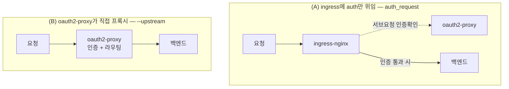
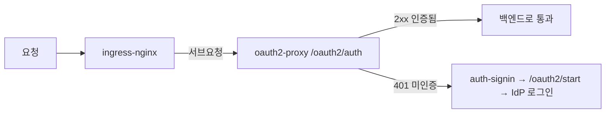
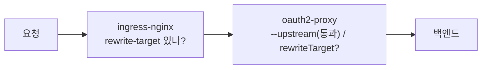

# oauth2-proxy — 인증 게이트 + 경로(path) 라우팅

> CKA 범위 밖 **실무 도구**지만, ingress-nginx annotation·경로 rewrite와 직결돼 여기 둔다.
> 관련: [ingress.md](./ingress.md)(IngressClass·rewrite-target·spec vs annotation) · [전체 계층 그림](./ingress.md#전체-그림--요청이-거치는-계층) · [README](./README.md)
> **직접 따라 하는 실습(kind+Keycloak, 모드 A·B)** → [practice-oauth2-proxy.md](./practice-oauth2-proxy.md)
> IdP **안쪽**(Keycloak realm·client·토큰, 사내 **AD 연동**) → [11_identity-keycloak](../11_identity-keycloak/)

## 개념 — oauth2-proxy는 무엇인가

**OAuth2/OIDC 인증을 대신 처리해 주는 리버스 프록시**다. 앱마다 로그인 코드를 넣지 않아도, 앞단에서 "로그인 했어? 안 했으면 IdP(예: Keycloak·Google·사내 SSO)로 보내" 를 처리한다. 인증을 통과한 요청만 백엔드로 흘려보내는 **인증 게이트**.

연동 방식이 두 가지인데, 이걸 구분하는 게 모든 혼란의 출발점이다.



| | (A) ingress auth annotation | (B) `--upstream` 직접 프록시 |
|---|---|---|
| oauth2-proxy 위치 | 트래픽 **옆**(인증 판정만) | 트래픽 **위**(직접 프록시) |
| 라우팅 주체 | ingress-nginx | **oauth2-proxy 자신** |
| 어떻게 붙나 | ingress **annotation** | oauth2-proxy **기동 플래그/config** |

---

## (A) ingress-nginx auth annotation 방식

ingress-nginx의 `auth_request` 기능으로, 요청을 백엔드로 보내기 **전에** oauth2-proxy에게 인증 여부를 묻는다. `rewrite-target`과 **같은 자리(annotation)** 에 꽂히는 형제 기능.

```yaml
metadata:
  annotations:
    nginx.ingress.kubernetes.io/auth-url:    "http://oauth2-proxy.../oauth2/auth"
    nginx.ingress.kubernetes.io/auth-signin: "https://auth.company.com/oauth2/start?rd=$escaped_request_uri"
    nginx.ingress.kubernetes.io/auth-response-headers: "X-Auth-Request-User,X-Auth-Request-Email"
```



| annotation | 역할 | rewrite성 동작 |
|---|---|---|
| `auth-url` | 매 요청마다 인증 확인할 oauth2-proxy 엔드포인트 | — |
| `auth-signin` | 미인증 시 보낼 로그인 URL. `rd=$escaped_request_uri`로 **원래 가려던 경로 보존** | URL 보존 |
| `auth-response-headers` | 확인된 사용자 정보를 `X-Auth-Request-*` **헤더로 백엔드에 주입** | 헤더 rewrite |

---

## (B) `--upstream` 직접 프록시 방식

oauth2-proxy가 백엔드 앞에 직접 서서, **인증 + 경로 라우팅**을 모두 담당한다.

### 핵심 1 — host는 안 본다. 오직 path로 가른다

oauth2-proxy는 ingress처럼 **host 기반 가상호스팅(vhost)을 하지 않는다.** 라우팅 판단은 **순수하게 path**다.

```
--upstream=http://frontend:3000/store/
--upstream=http://backend:3000/api/
```

각 `--upstream`은 두 부분으로 읽힌다:

| 부분 | 역할 |
|---|---|
| `http://frontend:3000` (scheme+host) | **어디로 보낼지** — 목적지 서버 |
| `/store/` (path) | **언제 이리로 보낼지** — 요청 경로의 **매칭 키** |

> ⚠️ 등장하는 host 두 개를 구분하라. **들어오는 요청의 Host 헤더**(`my.app.com`)는 라우팅에 안 쓴다. `frontend:3000` 같은 **upstream host**는 "조건"이 아니라 "목적지"일 뿐.
>
> 백엔드가 받는 `Host:` 헤더는 기본값 `--pass-host-header=true`라 **원래 클라이언트 Host가 그대로 전달**된다(연결은 upstream host로 가지만 헤더는 원본). 끄면 upstream host로 덮어쓴다.

### 핵심 2 — 우선순위: 가장 긴(구체적) 매칭이 이긴다

여러 upstream의 path가 겹쳐 매칭되면 **가장 긴 경로**가 선택된다. 그래서 `/`(catch-all)와 `/api/`를 같이 둘 수 있다.

### 핵심 3 — ⚠️ trailing slash 규칙 (제일 잘 데는 곳)

| upstream path | 매칭되는 요청 |
|---|---|
| `/api` (슬래시 **없음**) | **정확히 `/api` 만.** `/api/users` ❌, `/apifoo` ❌ |
| `/api/` (슬래시 **있음**) | `/api/`로 시작하는 **전부**: `/api/`, `/api/users`, `/api/a/b?x=1` ✅ |

**하위 경로까지 받으려면 반드시 trailing slash를 붙인다.**

---

## 경로는 어떻게 백엔드에 전달되나 — strip / prepend (⚠️ 버전 의존)

이 부분이 "뭔가 path를 깎는/사라지는 것 같다"는 혼란의 핵심인데, **단정하지 마라.** upstream의 path 처리는 **oauth2-proxy 버전에 따라 다르다.**

> ⚠️ **버전마다 동작이 다르다.** 소스·문서를 교차 확인하면 서로 어긋난다 — legacy 변환 코드는 `rewriteTarget`을 안 줘서 자동 strip이 없는데, alpha config 문서는 "URI path `/base` + 요청 `/dir` → `/base/dir`(**prepend**)"라 하고, 현재 master `http.go`는 "중복 막으려 URI path를 비운다(prepend도 안 함)"고 한다. 실제로 **v7.4.0 → v7.5.0 사이에 upstream path 처리에 (changelog에 안 적힌) breaking change**가 있었다([#2271](https://github.com/oauth2-proxy/oauth2-proxy/issues/2271)). 그래서 **"strip하나?"는 버전 없이 답할 수 없다.**

### 추측 말고 실측으로 확정한다 (가장 확실)

돌아가는 환경이 있으면 30초면 끝난다:

```bash
# 1) 버전 확인 — 모든 게 여기서 갈린다
kubectl -n <ns> get deploy <oauth2-proxy> -o jsonpath='{.spec.template.spec.containers[0].image}'

# 2) 실측 — backend 액세스 로그를 보며 한 방 쏘기
kubectl -n <ns> logs -f deploy/<backend>     # 한 터미널: 로그
curl -i https://my.app.com/api/users          # 다른 터미널: 요청
#  → backend 로그에 /api/users 로 찍히나 /users 로 찍히나? 그게 네 버전의 정답.
```

문서·소스 요약보다 **이 로그 한 줄이 확실하다.**

### 큰 그림 — 두 종류의 경로 변형

| 동작 | 의미 | oauth2-proxy에서 |
|---|---|---|
| **strip** | 매칭된 접두사를 떼고 보냄 (`/api/users` → `/users`) | 자동 strip은 없음. `rewriteTarget`(아래)으로 **명시할 때만** |
| **prepend** | upstream URI의 path를 백엔드 경로 앞에 붙임 (nginx `proxy_pass`식) | **버전에 따라** 붙기도/안 붙기도 → 실측 필요 |

> **prepend란?** nginx `proxy_pass http://backend/api/;`처럼 "upstream URL에 적은 path를 백엔드 경로 **앞에 덧붙이는**" 동작. 기대한 prepend가 안 일어나면 "경로가 사라진 것처럼" 보일 수 있다.

### 💡 혼란을 통째로 회피하는 법 — upstream을 루트(`/`) 하나로

이 버전별 path 모호함을 **안 겪는** 가장 안정적인 방법:

```
--upstream=http://frontend:3000        ← 루트 하나만
```

upstream path가 **루트뿐**이면 매칭이 단순해 경로 변형이 끼어들 여지가 없고, **들어온 경로가 그대로** 백엔드로 간다(버전 무관). `/api` 분기·경로 조작이 필요하면 그건 **백엔드(예: Next.js BFF)나 앞단 ingress에서 명시적으로** 처리한다 → oauth2-proxy의 애매한 path 규칙에 의존하지 않는다. ([실전 예제](#실전-예제--nextjsfrontend--nestjsbackend-한-도메인)의 single-upstream 변형이 이 방식.)

### 진짜로 경로를 바꾸려면 → `rewriteTarget` (신형 config 전용)

legacy 플래그엔 rewrite 기능이 없다. 신형 구조 config의 `upstreams[].rewriteTarget`이 ingress-nginx `rewrite-target`의 **직접 대응물**(이름까지 닮음).

```yaml
upstreams:
  - id: backend
    path: ^/api/(.*)$        # 정규식 + 캡처
    rewriteTarget: /$1       # /api 떼고 $1만 → /api/users → /users
    uri: http://backend:3000
  - id: frontend
    path: /
    uri: http://frontend:3000
```

| | ingress-nginx | oauth2-proxy(신형) |
|---|---|---|
| path | `/api(/\|$)(.*)` | `^/api/(.*)$` |
| 치환 | `rewrite-target: /$2` | `rewriteTarget: /$1` |
| 사는 곳 | Ingress **annotation** | upstream **구조 config(alpha)** |

> ⚠️ 정규식 path엔 `rewriteTarget`이 사실상 필수. 없이 정규식(`^()*`)만 쓰면 매칭이 안 돼 계속 404 ([issue #2242](https://github.com/oauth2-proxy/oauth2-proxy/issues/2242)).

> 💡 **그런데 strip을 *왜* 하나, 그리고 언제 피하나** — 내가 만든 앱이면 `rewriteTarget`으로 경로를 깎기보다 **앱에 base-path를 주는 게 정석**(NestJS `setGlobalPrefix` 등). strip은 못 고치는 앱을 위한 탈출구다. 자세한 이유 → [ingress.md "왜 이런 strip 기능이 존재하나"](./ingress.md#왜-이런-strip-기능이-존재하나--그리고-언제-피하나).

---

## 실전 예제 — Next.js(frontend) + Nest.js(backend) 한 도메인

목표: `my.app.com/` → Next.js, `my.app.com/api/` → Nest.js.

```
--upstream=http://frontend:3000/
--upstream=http://backend:3000/api/
```

- `/api/`가 더 구체적 → **backend**. 나머지(`/`, `/about`, `/_next/...`)는 catch-all `/` → **frontend**.

```
my.app.com/            → frontend:3000   (Next.js)
my.app.com/_next/...   → frontend:3000   (정적 에셋도 자동으로 여기로)
my.app.com/api/users   → backend:3000    (Nest.js)
```

> 💡 **frontend는 루트 `/`, backend만 prefix로 갈라낸다.** 사용자 대면 사이트인 frontend가 루트 네임스페이스를 소유하고, 구분은 **backend에만 `/api/`를 주는 비대칭**으로 한다 — frontend에 `/frontend/`를 줄 필요 없다(URL만 지저분해짐). 그래서 Next.js `basePath`도 **설정하지 않는 게**(루트) 정답. `basePath`는 한 도메인에 독립 앱이 여럿 얹힐 때(`/marketing`·`/app`·`/docs`)만 쓴다.

### ⚠️ 딱 하나 확인 — Nest.js가 `/api` 접두사를 쓰나?

legacy `--upstream`은 경로를 **그대로 통과**시키므로, 백엔드가 `/api/users`를 그대로 받는다. 따라서 Nest도 `/api` 밑에서 서빙해야 한다:

```ts
// main.ts
app.setGlobalPrefix('api');   // Nest 라우트를 /api/* 로 연다
```

| Nest 설정 | `/api/users` 도착 | 결과 |
|---|---|---|
| `setGlobalPrefix('api')` **있음** | backend가 `/api/users` 기대 ✅ | **그대로 동작, rewrite 불필요** |
| 접두사 **없음** (`/users`로 서빙) | backend가 `/api/users` 받지만 `/users`만 앎 → **404** | strip 필요 → 위 `rewriteTarget` 또는 ingress `rewrite-target` |

→ **권장: Nest에 `setGlobalPrefix('api')`를 두고 위 두 줄로 끝낸다.**

### 주의점

- **trailing slash 꼭.** `/api/`라야 하위가 다 잡힌다. `/api`면 정확히 `/api`만.
- **`/oauth2/...`는 oauth2-proxy 예약**(로그인·콜백). frontend에 `/oauth2` 경로를 만들면 가려진다(`--proxy-prefix`로 변경 가능).
- **Next.js 자체 API 라우트(`/api`)와 충돌.** Next의 `app/api/`·`pages/api/`를 쓰면 그 `/api`도 Nest로 가버린다. 백엔드를 Nest로 몰 거면 Next 쪽 `/api`는 안 쓰거나 다른 prefix(예: `/bff`)로.

---

## 연결 추적 — ingress·oauth2-proxy가 내부 service에 어떻게 붙어 있나

이미 돌고 있는(예: 사내) 클러스터에서 **"외부 요청이 어느 Pod까지 가는지"** 를 처음부터 끝까지 따라가는 레시피. 위 (A)/(B) 구분이 추적 경로를 가른다. **전부 읽기 전용**이라 클러스터를 건드리지 않는다. (Gateway API를 쓰면 객체 모델이 달라진다 → [gateway-api.md "연결 추적"](./gateway-api.md#연결-추적--gateway가-내부-service에-어떻게-붙어-있나).)

```
외부 → Ingress ─┬─(A) auth만 oauth2-proxy에 위임 → 진짜 백엔드 Service
                └─(B) Ingress 백엔드가 oauth2-proxy → --upstream → 진짜 Service
                                                              ↓
                                            Service → EndpointSlice → Pod
```

### Step 1 — Ingress가 어디로 보내는지 본다

```bash
# 전체 ingress + 백엔드 한눈에
kubectl get ingress -A

# 한 ingress의 host/path → service:port 규칙만
kubectl -n <ns> get ingress <name> -o jsonpath=\
'{range .spec.rules[*]}host: {.host}{"\n"}{range .http.paths[*]}  {.path}  ->  {.backend.service.name}:{.backend.service.port.number}{"\n"}{end}{end}'; echo
```

> 💡 사실 **`kubectl -n <ns> describe ingress <name>`** 하나면 규칙 + annotation + (최신 kubectl은) **백엔드 엔드포인트 IP까지** 보여준다. 추적의 90%는 이 명령.

### Step 2 — (A)인지 (B)인지 판별

```bash
# auth-url annotation이 있으면 → (A). 인증만 위임, spec의 백엔드가 '진짜 서비스'
kubectl -n <ns> get ingress <name> \
  -o jsonpath='{.metadata.annotations.nginx\.ingress\.kubernetes\.io/auth-url}'; echo
```

| 판별 | 의미 | 진짜 백엔드는 |
|---|---|---|
| `auth-url`이 채워짐 | **(A)** ingress가 oauth2-proxy에 인증만 물어봄 | `spec.rules`의 백엔드 Service **그대로** |
| Step 1의 백엔드가 **oauth2-proxy 서비스** | **(B)** oauth2-proxy가 직접 프록시 | oauth2-proxy의 `--upstream`을 더 따라가야 함 |

### Step 3 — Service → 실제 Pod 까지 (공통)

```bash
# 서비스가 어떤 파드를 고르나 (selector)
kubectl -n <ns> get svc <svc> -o jsonpath='{.spec.selector}'; echo

# 실제 연결된 엔드포인트(살아있는 파드 IP) — 연결 '됐는지'의 핵심
kubectl -n <ns> get endpointslices -l kubernetes.io/service-name=<svc> -o wide

# selector로 파드 직접
kubectl -n <ns> get pods -l <key=value> -o wide
```

> ⚠️ EndpointSlice가 **비어 있으면** = selector와 매칭되는 Ready 파드가 없다 = "ingress는 붙었는데 **502/503**" 의 전형적 원인. 연결 점검의 급소.

### Step 4 — (B)일 때만: oauth2-proxy의 upstream 읽기

oauth2-proxy는 host를 안 보고 **path로만** 가르므로([핵심 1](#핵심-1--host는-안-본다-오직-path로-가른다)) `--upstream` 목록이 곧 라우팅 표다.

```bash
# 기동 플래그에서 upstream 추출
kubectl -n <ns> get deploy <oauth2-proxy> \
  -o jsonpath='{.spec.template.spec.containers[0].args}' | tr ',' '\n' | grep -i upstream

# config 파일(ConfigMap) 방식이면
kubectl -n <ns> get cm -o yaml | grep -iA2 upstream
```

각 `--upstream=http://frontend:3000/store/` 의 `frontend:3000`이 다음 Service → 다시 **Step 3**으로 이어가면 끝까지 추적된다.

### 한 화면에서 보기 (시각화 툴)

| 툴 | 이 추적에 쓰는 법 |
|---|---|
| **Headlamp / OpenLens** | Ingress 클릭 → 연결된 Service·Pod로 따라가는 링크. 구조 추적에 적합 |
| **Hubble UI** (CNI가 Cilium일 때) | 인증 서브요청(ingress→oauth2-proxy)·백엔드 흐름을 **실제 트래픽**으로 — (A)/(B)를 눈으로 구분 |
| **kubectl-graph** (krew) | Ingress→Service→Pod 관계를 Graphviz 정적 그림으로 추출 |

> ⚠️ 어떤 툴도 **사내 L4/L7 LB·방화벽·NAT**(인프라 레이어)까지는 못 그린다 → k8s 경계 안쪽 + 진입/egress 지점까지가 한계. 그 바깥은 인프라팀 네트워크 다이어그램과 합쳐야 완성.

---

## 디버깅 — "이 경로가 왜 이렇게 도착하지?"

경로는 체인의 **여러 층**에서 바뀔 수 있다. 백엔드가 받는 경로가 이상하면 **두 곳을 다 본다.**



```bash
# ① ingress 쪽에 rewrite/auth가 있나 (가장 흔한 진범)
kubectl get ingress -A -o yaml | grep -i 'rewrite-target\|auth-url\|auth-signin'

# ② oauth2-proxy가 플래그식인지·버전·upstream 설정
kubectl -n <ns> get deploy <oauth2-proxy> -o yaml | grep -A20 'args:\|image:'
kubectl -n <ns> get cm,deploy -o yaml | grep -A3 'upstream\|rewriteTarget'

# ③ oauth2-proxy가 어디 떠 있나
kubectl get deploy,svc -A | grep oauth2
```

`args`에 `--upstream=...`만 있고 구조 config(`--config`/alpha)가 없으면 **legacy 모드.** 단 legacy의 path 처리도 **버전에 따라 다르니**(위 ⚠️ 참고) `image:` 태그를 함께 확인하고, 위 **실측(curl + backend 로그)**으로 확정한다. strip이 보인다면 범인은 보통 ①(ingress rewrite-target)이거나 ②의 버전별 prepend 동작.

---

## 앱은 무엇을 받나 — oauth2-proxy가 백엔드에 넘기는 것

자주 헷갈리는 질문: *"oauth2-proxy가 Keycloak 토큰을 받으면, 그걸 앱으로 그대로 내려주나?"* → **기본은 아니다.** oauth2-proxy는 토큰을 **자기 세션에 보관**하고, 백엔드엔 보통 **신원 헤더만** 넘긴다. 토큰 원본은 **명시적으로 켜야** 전달된다.

```
브라우저 ──(oauth2-proxy 암호화 쿠키 _oauth2_proxy)── oauth2-proxy ──(헤더)── 내 앱
                                                          │
                                              Keycloak 토큰은 여기 세션에 보관
```

- 브라우저↔oauth2-proxy 쿠키는 **oauth2-proxy 자체 암호화 쿠키**지 Keycloak 토큰이 아니다.
- 토큰(access/ID)은 oauth2-proxy 세션 저장소(쿠키 or Redis)에 있고, 백엔드로는 **선택적으로만** 흐른다.

### ⚠️ 누가 OIDC client인가 — scope·로그인은 oauth2-proxy가 정한다

자주 막히는 오해: *"그럼 내 앱이 scope를 어떻게 정하지?"* → **이 구조에선 못 정한다.** Keycloak에 로그인하는 **OIDC client = oauth2-proxy**고, scope도 oauth2-proxy가 정한다. **내 앱은 Keycloak에 등록조차 안 된** 단순 소비자다.

```
[브라우저] → [oauth2-proxy] ⇄ [Keycloak]   ← oauth2-proxy가 OIDC client (로그인·scope 결정)
                  │
              (헤더/토큰)
                  ↓
              [내 앱]   ← Keycloak 모름. client 아님. scope 결정권 없음
```

- Keycloak에 등록된 client = **oauth2-proxy**(client-id/secret 가진 그 하나). 내 앱은 OIDC를 안 한다.
- scope는 oauth2-proxy 설정에서: `--scope="openid profile email groups"`. 여기에 Keycloak의 **oauth2-proxy client scope/mapper**가 더해져 토큰이 정해진다.

**내 앱이 원하는 claim을 받으려면** — 직접 scope를 못 정하니 체인 각 단계를 설정(보통 인프라/플랫폼 담당과 협의):

| 단계 | 어디서 | 무엇을 |
|------|------|------|
| ① scope 요청 | **oauth2-proxy** `--scope` | 예: `groups` 받으려면 포함 |
| ② 토큰에 claim 싣기 | **Keycloak**(oauth2-proxy client의 scope/mapper) | group membership mapper 등 |
| ③ 앱으로 전달 | **oauth2-proxy** `--pass-*`/`--set-*` | `X-Forwarded-Groups` 등 |
| ④ 읽기 | **내 앱** | 그 헤더로 인가 |

> 💡 **앱이 직접 scope를 정하려면** = 앱을 **별도 OIDC client로 Keycloak에 등록**해 앱의 OIDC 라이브러리에서 직접 로그인할 때다(oauth2-proxy 없이/별개). 그땐 앱이 client라 scope·토큰 검증을 앱이 책임진다. 앞단 oauth2-proxy와 앱 직접 OIDC를 **섞으면** 토큰이 두 종류 생기니 의도 확인 필요. claim의 출처·검증은 → [11 concepts.md](../11_identity-keycloak/concepts.md#scope--토큰이-다룰-범위).

### 앱이 받는 것 — 기본 vs 옵션

| 무엇이 앱에 도달 | 기본? | 켜는 플래그 | 헤더 |
|------|------|------|------|
| **사용자 식별 정보**(이메일·유저·그룹) | ✅ 기본 | `--pass-user-headers`(기본 on) | `X-Forwarded-User` / `-Email` / `-Preferred-Username` / `-Groups` |
| **access token 원본(JWT)** | ❌ | `--pass-access-token` | `X-Forwarded-Access-Token` |
| **ID token 원본(JWT, JSON Web Token)** | ❌ | `--pass-authorization-header` | `Authorization: Bearer <ID token>` |

> 기본 철학: oauth2-proxy가 **이미 토큰을 검증**했으니, 앱엔 "검증된 결과(헤더)"만 준다. 토큰 원본(서명된 JWT)은 기본적으로 앱까지 **안 간다.**

### `--upstream`과의 관계 — 두 플래그 무리는 짝이다

위 `--pass-*`는 `--upstream`과 **별개가 아니라 짝**이다. `--upstream`이 "oauth2-proxy가 트래픽 위에 서서 **직접 프록시한다(모드 B)**" 는 경로를 정하고, `--pass-*`는 "그 **경로로 가는 요청에 무엇을 붙일지**" 를 정한다. 즉 `--pass-*` 헤더가 백엔드에 닿는 건 `--upstream`이 oauth2-proxy를 경로에 세워줬기 때문.

| 플래그 | 무엇을 정함 | 어디에 붙나 | 모드 |
|------|------|------|------|
| **`--upstream`** | 어디로 **프록시**할지(=모드 B 스위치) | 경로 자체 | **(B)** |
| `--pass-user-headers` · `--pass-access-token` · `--pass-authorization-header` | upstream으로 가는 **요청(request)** 에 헤더/토큰 부착 | 백엔드로 가는 **요청** | **(B)** — oauth2-proxy가 경로에 있어야 의미 |
| `--set-xauthrequest` · `--set-authorization-header` | **인증 응답(response)** 헤더로 세팅 | `/oauth2/auth` **응답** → nginx가 복사 | **(A)** |

- **(B) `--upstream` 직접 프록시**: oauth2-proxy가 직접 프록시하니 **요청에 붙이는** `--pass-*`가 그대로 백엔드로 흘러간다.
- **(A) ingress auth_request**: oauth2-proxy는 프록시를 안 하고 `/oauth2/auth`에 **답만** 한다 → `--pass-*`(요청용)가 아니라 **응답 헤더로 세팅하는** `--set-xauthrequest`(토큰까지 원하면 `--pass-access-token` 병행)/`--set-authorization-header`를 쓰고, ingress `auth-response-headers`에 **그 헤더 이름을 나열**해야 백엔드까지 복사된다(안 적으면 안 옴). → [위 (A) 표](#a-ingress-nginx-auth-annotation-방식)의 `auth-response-headers`.

> 한 줄 요약: **`--upstream` = "프록시한다"(모드 B), `--pass-*` = "그 프록시 요청에 신원/토큰을 싣는다".** 모드 A엔 `--upstream`이 없으니 `--pass-*` 대신 `--set-*`를 쓴다.

### 앱은 어떻게 써야 하나

| 앱이 받는 것 | 앱이 할 일 |
|------|------|
| **헤더만**(`X-Forwarded-Email` 등) | 헤더를 **신뢰**하고 사용 (oauth2-proxy가 이미 검증) |
| **토큰 원본**도 받음 | 필요 시 앱이 **JWKS로 재검증**하거나 추가 claim 활용 |

> ⚠️ **헤더 신뢰의 전제 = 위조 차단.** `X-Forwarded-*`를 믿으려면 그 헤더가 **오직 oauth2-proxy를 거쳐야만** 도달하게 해야 한다(외부→백엔드 직접 경로에서 같은 이름 헤더를 주입해 우회하지 못하도록 네트워크 격리/strip). 백엔드가 직접 노출돼 있으면 헤더 스푸핑으로 인증 우회 위험.

> 💡 **언제 토큰을 굳이 넘기나** — 앱이 (a) 토큰의 추가 claim이 필요하거나 (b) 받은 토큰으로 **다른 API를 호출**(토큰 릴레이)할 때. 단순 로그인 보호만이면 헤더로 충분. 토큰 안의 claim이 어디서 왔는지(AD→Keycloak)는 [11 concepts.md](../11_identity-keycloak/concepts.md).

### 단일 oauth2-proxy로 frontend+backend — "backend에만 토큰"이 되나

하나의 oauth2-proxy가 `--upstream`으로 frontend·backend를 같이 프록시하는 모드 B에서, *"토큰을 backend에만 선택적으로 내릴 수 있나?"* → **oauth2-proxy 자체로는 안 된다.** `--pass-access-token` 등 패스 플래그는 **프록시 전역**이라, 켜면 **frontend·backend 두 upstream 요청에 모두** 토큰 헤더가 붙는다(upstream별 헤더 선택 기능 없음).

**그래도 대체로 안전한 이유** — 토큰이 frontend upstream에 붙어도 그건 **frontend 서버(Pod)로 가는 요청 헤더**다. **브라우저(JS)엔 전달되지 않는다**(서버→upstream 요청 헤더는 클라이언트 응답으로 새지 않음).

```
브라우저 ──(응답: HTML/JS, 토큰 없음)── oauth2-proxy ──[전역 --pass-access-token]──┬─→ frontend Pod (헤더 받지만 보통 무시)
                                                                                   └─→ backend Pod (헤더 읽어 디코드)
```

- frontend가 정적/번들 서버면 그 헤더를 그냥 무시 → **전역으로 켜도 브라우저는 토큰을 못 본다.**
- **잔여 리스크** = frontend 서버가 그 헤더를 **로그에 남기거나 SSR에서 요청 헤더를 클라이언트로 노출**하는 경우뿐. 일반 frontend는 안 그럼.

**진짜로 backend에만 주려면** — oauth2-proxy엔 upstream별 선택이 없으니 **path를 아는 레이어**에서 가른다:

| 방법 | 어떻게 |
|------|------|
| **모드 A로 전환** | `--set-xauthrequest`+`--pass-access-token`으로 토큰을 응답 헤더로 만들고, **`/api` Ingress에만** `auth-response-headers`에 그 헤더를 나열 → **path별 선택 가능** |
| 경로/프록시 분리 | frontend·backend를 다른 ingress path나 별도 oauth2-proxy로 (구성 복잡↑) |
| frontend에서 차단 | frontend 서버가 그 헤더를 **로그·노출 안 하게**(또는 strip) — 가장 간단, 보통 이걸로 충분 |

> 정리: **모드 B 단일 프록시 = 토큰 패스는 전역**(backend-only 분리 불가). 하지만 어차피 **브라우저엔 안 가므로** frontend가 무시/로그제외하면 그냥 켜도 OK. 진짜 분리가 필요하면 **모드 A로 옮겨 `/api` Ingress에서만** 토큰 헤더를 붙인다. ⚠️ frontend가 **SSR**(요청 헤더를 렌더링에 쓰는 Next.js 등)이면 그 헤더를 클라이언트로 흘리지 않게 점검.

### 특정 정보(부서명·role)가 앱까지 오는지 — 끝까지 점검

"내 앱(backend+frontend)이 원하는 claim(예: `department`, role)을 받나" 는 **5개 고리**가 다 이어져야 한다. 어디서 끊겼는지 순서대로 본다.

| # | 고리 | 확인 위치 | `department`(임의 claim) | role |
|---|------|------|------|------|
| ① | AD에 값 존재 + bind 계정 읽기 권한 | AD | 속성 채워졌나 | 그룹/롤 |
| ② | LDAP 매퍼 (AD→Keycloak 사용자) | Keycloak User federation | user-attribute 매퍼 | group/role 매퍼 |
| ③ | Protocol 매퍼 + scope (→토큰 claim) | Keycloak client(=oauth2-proxy) | 토큰에 `department` 실리나 | `realm_access.roles` 등 |
| ④ | **oauth2-proxy passthrough** | oauth2-proxy 플래그 | ⚠️ 함정1 | groups로 우회 |
| ⑤ | 앱이 읽기 | 내 backend/frontend | ⚠️ 함정2 | |

> ①②는 [11 ad-federation.md](../11_identity-keycloak/ad-federation.md), ③은 [11 concepts.md](../11_identity-keycloak/concepts.md). ④⑤가 이 문서 구간.

**⚠️ 함정 1 — oauth2-proxy 헤더는 고정 세트다.** 헤더로 내려주는 건 정해진 몇 개뿐: `X-Forwarded-User` / `-Email` / `-Preferred-Username` / `-Groups`. **`X-Forwarded-Department` 같은 임의 claim 헤더는 없다.**

| 원하는 것 | 받는 법 |
|------|------|
| **role** | role을 **groups claim에 싣고** oauth2-proxy `--oidc-groups-claim`을 그 claim으로 가리키면 `X-Forwarded-Groups`로 옴 |
| **부서명(임의 claim)** | 헤더 불가 → **토큰을 통째로 내려서**(`--pass-access-token`→`X-Forwarded-Access-Token`, 또는 `--pass-authorization-header`→`Authorization: Bearer`) **backend가 JWT를 디코드**해 읽기 |

→ ③에서 토큰에 `department`를 넣었어도, **④에서 토큰을 안 내려주면 backend가 영영 못 본다.**

**⚠️ 함정 2 — frontend는 `X-Forwarded-*`를 못 본다.** 이 헤더는 oauth2-proxy가 **backend로 가는 요청**에 붙이는 것 → 브라우저(frontend JS)엔 안 온다.

| 주체 | 어떻게 받나 |
|------|------|
| **backend** | oauth2-proxy가 붙인 `X-Forwarded-*` 헤더 / 내려준 토큰을 **서버에서** 읽음 |
| **frontend** | ⓐ **backend가 `/api/me`로 중계**(가장 흔함) / ⓑ oauth2-proxy `/oauth2/userinfo`(user·email·groups만 JSON) / ⓒ frontend가 별도 OIDC client면 자기 ID token |

**점검 순서 (부서명이 안 올 때)**
1. **③ 토큰에 있나** — Keycloak 콘솔 *Client scopes → Evaluate*로 그 사용자 토큰에 `department`가 보이나. 없으면 ②/③ 매퍼 문제.
2. **④ 내려오나** — backend에서 `X-Forwarded-Access-Token`(or `Authorization`)이 오나? 안 오면 `--pass-access-token` 미설정.
3. **⑤ 디코드** — backend가 그 토큰을 디코드해 읽나(+ JWKS 검증).
4. **frontend** — backend `/api/me`가 그 값을 노출하나.

> 요점: **role은 groups 헤더로 받을 여지가 있지만, 부서명 같은 임의 claim은 "토큰 통째 + backend 디코드"가 정석**이고, frontend는 backend 경유가 기본.

---

## 시험·실무 팁

- oauth2-proxy는 **CKA 범위 밖**이지만, 그 토대인 ingress **auth/rewrite annotation**과 path 매칭은 04 영역이다 → [ingress.md](./ingress.md).
- **host 라우팅 = ingress의 일 / path 라우팅 + 인증 = oauth2-proxy의 일.** 보통 `ingress(host vhost) → oauth2-proxy(인증 + path 분기) → 앱` 으로 층을 이룬다.
- 경로 변형의 이식성: ingress·oauth2-proxy 모두 **자기 방식 rewrite**라 키가 제각각 → 이 문제를 표준 필드로 푼 게 [Gateway API](./gateway-api.md)의 `URLRewrite` 필터.
- **가장 흔한 함정 = trailing slash.** "루트는 되는데 하위 경로가 404"면 십중팔구 이것.

## 참고

- [oauth2-proxy — Overview/Configuration](https://oauth2-proxy.github.io/oauth2-proxy/configuration/overview/)
- [oauth2-proxy — Alpha Configuration (`upstreams`·`rewriteTarget`)](https://oauth2-proxy.github.io/oauth2-proxy/configuration/alpha-config/)
- [oauth2-proxy `pkg/upstream/http.go` (경로 통과 동작 소스)](https://github.com/oauth2-proxy/oauth2-proxy/blob/master/pkg/upstream/http.go)
- [issue #2242 — 정규식 path + rewriteTarget](https://github.com/oauth2-proxy/oauth2-proxy/issues/2242)
- [ingress-nginx — External OAUTH Authentication](https://kubernetes.github.io/ingress-nginx/examples/auth/oauth-external-auth/)
- 관련 문서 → [ingress.md](./ingress.md) · [gateway-api.md](./gateway-api.md)
