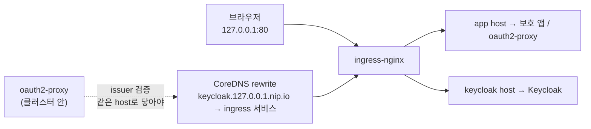

# oauth2-proxy — 실습 (kind에서 Keycloak 연동, 모드 A·B 둘 다)

> **직접 따라 하며 실행**하는 실습. 개념은 [oauth2-proxy.md](./oauth2-proxy.md), 사내 전체 스택 그림은 [external-access.md](./external-access.md) 참고.
> 🔎는 **관찰 포인트**, 🧪는 **스스로 해볼 과제**.
>
> **흐름**: kind+ingress-nginx 준비 → Keycloak(IdP) 설치·세팅 → oauth2-proxy 설치 → **(A) ingress-nginx `auth_request` 인증 게이트** → **(B) `--upstream` 직접 프록시(path 라우팅·strip 실측)**.

## 이 랩의 설계 — 왜 이렇게 하나

- **HTTP + nip.io**: TLS·DNS 세팅 없이 가도록 전부 **평문 HTTP**, 호스트명은 `*.127.0.0.1.nip.io`(어떤 서브도메인이든 `127.0.0.1`로 풀린다). 브라우저가 `app.127.0.0.1.nip.io` → `127.0.0.1` → kind가 매핑한 80포트 → ingress-nginx.
- **두 호스트**: `app.127.0.0.1.nip.io`(보호할 앱) / `keycloak.127.0.0.1.nip.io`(IdP). 둘 다 ingress-nginx로 들어간다.
- ⚠️ **이 랩에서 제일 까다로운 지점(issuer 도달성)**: oauth2-proxy는 **클러스터 안**에서 OIDC issuer(`http://keycloak.127.0.0.1.nip.io/...`)에 닿아 토큰을 검증해야 한다. 그런데 `*.nip.io`는 클러스터 안에서도 `127.0.0.1`(= 파드 자기 자신)로 풀려 ingress에 못 닿는다. → **CoreDNS rewrite**로 그 이름만 ingress 서비스로 보낸다(실습 1에서).



---

## 실습 0 — kind + ingress-nginx 준비

### (가) 80/443을 호스트로 빼는 kind 클러스터

ingress가 호스트 80/443으로 노출돼야 브라우저가 `127.0.0.1`로 접속한다. `extraPortMappings` + ingress용 노드 라벨이 필요하다.

`kind-oauth2.yaml`:
```yaml
kind: Cluster
apiVersion: kind.x-k8s.io/v1alpha4
nodes:
  - role: control-plane
    kubeadmConfigPatches:
      - |
        kind: InitConfiguration
        nodeRegistration:
          kubeletExtraArgs:
            node-labels: "ingress-ready=true"
    extraPortMappings:
      - { containerPort: 80,  hostPort: 80,  protocol: TCP }
      - { containerPort: 443, hostPort: 443, protocol: TCP }
```
```bash
kind create cluster --name oauth2 --config kind-oauth2.yaml
```
> 💡 기존 `study` 클러스터에 80/443 매핑이 없으면 이 실습만 별도 클러스터로 띄우는 게 편하다(끝나면 `kind delete cluster --name oauth2`).

### (나) ingress-nginx 설치 (kind provider 매니페스트)

```bash
kubectl apply -f https://raw.githubusercontent.com/kubernetes/ingress-nginx/main/deploy/static/provider/kind/deploy.yaml
kubectl -n ingress-nginx wait --for=condition=ready pod \
  -l app.kubernetes.io/component=controller --timeout=180s
```
🔎 `kind` provider 매니페스트는 `ingress-ready=true` 노드에 뜨고 hostPort로 바인딩된다. `curl -I http://127.0.0.1` 하면 ingress-nginx의 404가 돌아온다(= 입구는 열렸다).

---

## 실습 1 — Keycloak(IdP) 설치 & realm/client/user 세팅

### (가) 배포

```bash
kubectl apply -f manifests/oauth2-proxy/keycloak.yaml
kubectl rollout status deploy/keycloak --timeout=180s     # start-dev라 30~60초 걸림
```
🔎 매니페스트의 env가 핵심이다(→ [keycloak.yaml](./manifests/oauth2-proxy/keycloak.yaml)): `KC_HOSTNAME`으로 **issuer URL을 고정**하고, `KC_PROXY_HEADERS=xforwarded`로 ingress의 `X-Forwarded-*`를 신뢰한다(v26부터 옛 `KC_PROXY` 제거).

```bash
# discovery 문서가 뜨나 — issuer가 우리가 기대한 URL인지
curl -s http://keycloak.127.0.0.1.nip.io/realms/master/.well-known/openid-configuration | head -c 200; echo
```
🔎 `"issuer":"http://keycloak.127.0.0.1.nip.io/realms/master"` 가 보이면 호스트네임 고정이 먹혔다.

### (나) 관리 콘솔에서 realm·client·user 만들기 (브라우저)

http://keycloak.127.0.0.1.nip.io → **admin / admin** 로그인. 아래를 만든다(현재 콘솔 필드명 기준):

1. **Realm 생성**: 좌상단 드롭다운 → *Create realm* → 이름 `lab`.
2. **Client 생성**: *Clients → Create client* (OpenID Connect)
   - Client ID: `oauth2-proxy`
   - 다음 화면 **Client authentication = On** ← 이게 confidential(비밀키 보유) 클라이언트로 만든다.
   - **Authentication flow → Standard flow = On** (Authorization Code)
   - **Valid redirect URIs**: `http://app.127.0.0.1.nip.io/oauth2/callback`
3. **Client Secret 확보**: 만든 client → *Credentials* 탭 → **Client Secret** 값 복사(실습 2에서 씀).
4. **테스트 User 생성**: *Users → Create user*
   - Username: `tester`, **Email**: `tester@example.com`(email-domain 매칭용), Email verified: On 권장
   - 만든 뒤 *Credentials* 탭 → *Set password* → 비번 입력, **Temporary = Off**(강제 변경 끔).

🧪 **과제**: discovery 문서에서 `authorization_endpoint`/`token_endpoint`/`jwks_uri`를 찾아본다 — oauth2-proxy가 이걸 자동으로 읽어 동작한다.
```bash
curl -s http://keycloak.127.0.0.1.nip.io/realms/lab/.well-known/openid-configuration \
  | tr ',' '\n' | grep -E 'issuer|authorization_endpoint|token_endpoint|jwks_uri'
```

### (다) ⚠️ CoreDNS rewrite — 클러스터 안에서도 issuer에 닿게 (이 랩의 핵심)

지금 oauth2-proxy를 띄우면 **issuer 검증에서 실패**한다. 클러스터 안에서 `keycloak.127.0.0.1.nip.io`가 `127.0.0.1`(파드 자신)로 풀려 ingress에 못 닿기 때문. 그 이름만 **ingress 서비스로 rewrite**한다.

```bash
kubectl -n kube-system edit configmap coredns
```
`.:53 { ... }` 블록 안, `ready` 줄 다음(= `kubernetes` 앞)에 한 줄 추가:
```
rewrite name keycloak.127.0.0.1.nip.io ingress-nginx-controller.ingress-nginx.svc.cluster.local
```
저장 후 반영:
```bash
kubectl -n kube-system rollout restart deploy/coredns
```

검증 — **클러스터 안에서** discovery가 닿는지:
```bash
kubectl run dnscheck --rm -it --restart=Never --image=curlimages/curl -- \
  curl -s http://keycloak.127.0.0.1.nip.io/realms/lab/.well-known/openid-configuration | head -c 120; echo
```
🔎 파드 안에서도 issuer JSON이 돌아오면 성공. (안 되면 oauth2-proxy가 `failed to fetch ... /.well-known/openid-configuration`로 죽는다.)

> 💡 **왜 hostAliases가 아니라 CoreDNS인가**: `hostAliases`는 파드마다 박아야 하고 **고정 IP**가 필요해 서비스 ClusterIP가 바뀌면 깨진다. CoreDNS rewrite는 **서비스 이름으로 동적 해석**돼 클러스터 전체에 한 번에 적용된다. ([oauth2-proxy.md](./oauth2-proxy.md)에서 말한 "issuer 일관성"의 실전판.)

---

## 실습 2 — oauth2-proxy 설치 (시크릿 + 공통 설정)

먼저 **client secret + cookie secret**을 Secret으로 넣는다(매니페스트가 env로 읽는다).

```bash
# client secret: 실습 1(다)에서 복사한 Keycloak Credentials 값
CLIENT_SECRET='<Keycloak에서 복사한 값>'
# cookie secret: 32바이트 URL-safe base64 (16/24/32바이트만 유효)
COOKIE_SECRET=$(openssl rand -base64 32 | tr -- '+/' '-_')

kubectl create secret generic oauth2-proxy \
  --from-literal=client-secret="$CLIENT_SECRET" \
  --from-literal=cookie-secret="$COOKIE_SECRET"
```
🔎 cookie secret 길이를 틀리면(예: 그냥 `openssl rand -hex 16`) `cookie_secret must be 16, 24, or 32 bytes`로 기동 실패한다. 위 `tr`로 URL-safe base64를 만든다.

이제 모드 A부터 간다(설치는 실습 3에서 매니페스트로). 공통으로 쓰는 oauth2-proxy 플래그 의미:

| 플래그 | 역할 |
|---|---|
| `--provider=keycloak-oidc` | Keycloak용 OIDC(역할/그룹 클레임 처리 포함) |
| `--oidc-issuer-url` | discovery를 읽을 issuer(= `.../realms/lab`) |
| `--reverse-proxy=true` | ingress 뒤이므로 `X-Forwarded-*` 신뢰 |
| `--cookie-secure=false` | 랩이 HTTP라 secure 쿠키 끔(운영은 true) |
| `--email-domain=*` | 모든 이메일 허용(특정 도메인만 받으려면 좁힌다) |

---

## 실습 3 — (A) ingress-nginx `auth_request` 인증 게이트

ingress가 요청을 백엔드로 보내기 **전에** oauth2-proxy에게 "이 사용자 로그인했어?"를 서브요청으로 묻는다. 통과한 요청만 backend(echo)로 간다.

```bash
kubectl apply -f manifests/oauth2-proxy/echo-apps.yaml          # backend(보호 대상) + frontend
kubectl apply -f manifests/oauth2-proxy/oauth2-proxy-modeA.yaml # static://200 + set-xauthrequest
kubectl apply -f manifests/oauth2-proxy/ingress-modeA.yaml      # app(auth annotation) + /oauth2 ingress
kubectl rollout status deploy/oauth2-proxy --timeout=120s
```
🔎 [ingress-modeA.yaml](./manifests/oauth2-proxy/ingress-modeA.yaml)의 annotation 3종이 핵심이다:
- `auth-url` → 매 요청 oauth2-proxy `/oauth2/auth`에 인증 확인(200/401)
- `auth-signin` → 미인증이면 `/oauth2/start?rd=$escaped_request_uri`로 보내 **원래 가려던 경로 보존**
- `auth-response-headers` → 확인된 사용자 정보를 `X-Auth-Request-*` 헤더로 backend에 주입

### 동작 확인 (브라우저)

1. **시크릿 창**으로 http://app.127.0.0.1.nip.io 접속 → **Keycloak 로그인 페이지로 리다이렉트**된다.
2. `tester` / 위에서 설정한 비번으로 로그인 → 다시 app으로 돌아오고, **echo JSON**이 보인다.
3. echo JSON의 `request.headers`에서 **`x-auth-request-user` / `x-auth-request-email`** 을 찾는다.

🔎 헤더가 backend까지 왔다는 건 "ingress가 oauth2-proxy에 인증을 위임 → 통과 → 사용자 정보를 헤더로 주입"이 다 돌았다는 뜻. **앱은 OIDC 코드를 한 줄도 안 넣었는데** 인증이 걸렸다.

### CLI로 401 → 게이트 확인

```bash
# 인증 없이 보호 앱을 치면? (리다이렉트/401)
curl -sI http://app.127.0.0.1.nip.io/ | head -n 5
# oauth2-proxy의 인증 엔드포인트 직접 — 미인증이라 401
curl -sI http://app.127.0.0.1.nip.io/oauth2/auth | head -n 1
```
🔎 미인증이면 `auth-signin` 덕에 로그인으로 유도되고, `/oauth2/auth`는 `401 Unauthorized`. 로그인 쿠키가 있어야 200.

🧪 **과제**: oauth2-proxy 로그를 보며 위 흐름을 추적한다.
```bash
kubectl logs -f deploy/oauth2-proxy        # 한 터미널
# 브라우저에서 로그인 → AuthSuccess / 콜백 처리 로그가 흐른다
```

> ⚠️ **자주 막히는 곳**: 로그인 후 `redirect_uri` 에러가 나면 Keycloak client의 **Valid redirect URIs**가 `http://app.127.0.0.1.nip.io/oauth2/callback`와 정확히 같은지 확인. issuer fetch 에러면 실습 1(다) CoreDNS rewrite를 다시 본다.

---

## 실습 4 — (B) `--upstream` 직접 프록시 (path 라우팅·strip 실측)

이번엔 oauth2-proxy가 ingress 뒤에서 **직접 프록시**한다. host는 안 보고 **path로만** 가른다: `/api/` → backend, 나머지 → frontend.

먼저 모드 A의 ingress를 걷고 모드 B로 교체(같은 이름이라 oauth2-proxy Deployment는 apply가 덮어쓴다):

```bash
kubectl delete -f manifests/oauth2-proxy/ingress-modeA.yaml
kubectl apply  -f manifests/oauth2-proxy/oauth2-proxy-modeB.yaml   # --upstream 2개로 교체
kubectl apply  -f manifests/oauth2-proxy/ingress-modeB.yaml        # app host 전체 → oauth2-proxy
kubectl rollout status deploy/oauth2-proxy --timeout=120s
```
🔎 [oauth2-proxy-modeB.yaml](./manifests/oauth2-proxy/oauth2-proxy-modeB.yaml)의 `--upstream`이 곧 라우팅 표다:
```
--upstream=http://backend.../api/    # /api/ 로 시작하는 전부 → backend
--upstream=http://frontend.../       # 나머지 catch-all → frontend
```

### 동작 확인 (브라우저)

http://app.127.0.0.1.nip.io 접속(필요시 다시 로그인) →
- `/` , `/about` → **frontend** echo
- `/api/users` → **backend** echo

### ⚠️ trailing slash 실측 (제일 잘 데는 곳)

`/api/`(슬래시 있음)는 하위 전부를 잡지만 `/api`(없음)는 정확히 그것만 매칭한다. backend 로그를 보며 직접 확인한다 — **추측 말고 실측**([oauth2-proxy.md](./oauth2-proxy.md#핵심-3--️-trailing-slash-규칙-제일-잘-데는-곳)).

```bash
kubectl logs -f deploy/backend        # 한 터미널: backend가 받는 경로를 본다
```
브라우저(쿠키 있는 상태)나 다음으로 한 방씩 쏜다:
```bash
# 로그인 쿠키가 필요하므로 보통 브라우저로 확인. CLI로 보려면 쿠키를 꺼내 -b로 전달.
# /api/users 가 backend에 어떤 경로로 도착하나?
```
🔎 **backend echo의 `request.path`(또는 backend 로그)가 `/api/users`로 찍히나, `/users`로 찍히나?** 그게 네가 쓰는 oauth2-proxy 버전의 정답이다. (legacy `--upstream`은 보통 경로를 **그대로 통과** → backend는 `/api`까지 받는다. 그래서 backend 앱이 `/api` prefix를 알고 있어야 한다.)

> 💡 **경로 strip 동작은 버전 의존**이라 문서로 단정 못 한다. 이 로그 한 줄이 확실하다. 경로를 진짜로 깎으려면 신형 config의 `upstreams[].rewriteTarget`을 써야 한다 → [oauth2-proxy.md "진짜로 경로를 바꾸려면"](./oauth2-proxy.md#진짜로-경로를-바꾸려면--rewritetarget-신형-config-전용).

🧪 **과제**: [oauth2-proxy.md](./oauth2-proxy.md#핵심-2--우선순위-가장-긴구체적-매칭이-이긴다) "가장 긴 매칭이 이긴다"를 확인 — `/api/`가 catch-all `/`보다 우선해 backend로 가는지 경로별로 쏘며 본다.

---

## 모드 A vs B — 한눈에 (이 랩에서 무엇이 달랐나)

| | (A) ingress auth_request | (B) `--upstream` 직접 프록시 |
|---|---|---|
| oauth2-proxy 위치 | 트래픽 **옆**(인증 판정만, `static://200`) | 트래픽 **위**(직접 프록시·라우팅) |
| 라우팅 주체 | ingress-nginx | **oauth2-proxy 자신**(path로만) |
| 어떻게 붙였나 | ingress **annotation**(auth-url 등) | oauth2-proxy **`--upstream` 플래그** |
| 사용자 정보 전달 | `auth-response-headers`로 `X-Auth-Request-*` | oauth2-proxy가 직접 헤더 주입 |
| 대표 함정 | redirect URI 불일치, auth-signin host | **trailing slash / 경로 strip(버전 의존)** |

---

## 정리 (실습 후 청소)

```bash
# 이 랩을 별도 클러스터로 띄웠으면 통째로 삭제가 제일 깔끔
kind delete cluster --name oauth2

# 기존 클러스터에 올렸다면 객체만 제거
kubectl delete -f manifests/oauth2-proxy/ 2>/dev/null
kubectl delete secret oauth2-proxy
# CoreDNS rewrite 줄도 되돌리려면 configmap 편집 후 rollout restart
```

## 한 장 요약 (체득 포인트)

| 무엇을 배웠나 | 핵심 |
|---|---|
| 인증 게이트 원리 | 앱 수정 없이 **앞단에서** OIDC 로그인 강제(미인증 → IdP → 통과만 백엔드로) |
| issuer 일관성(이 랩의 급소) | oauth2-proxy가 **클러스터 안에서** issuer에 같은 host로 닿아야 → **CoreDNS rewrite** |
| (A) ingress auth_request | `auth-url`/`auth-signin`/`auth-response-headers` 3종, `static://200`, `--set-xauthrequest` |
| (B) `--upstream` | host 무시·**path로만** 라우팅, **trailing slash** 필수, 경로 strip은 **버전 의존→실측** |
| Keycloak 26 | `KC_BOOTSTRAP_ADMIN_*`·`KC_PROXY_HEADERS`(옛 `KC_PROXY` 제거), issuer=`/realms/<r>` |

## 참고

- [oauth2-proxy.md](./oauth2-proxy.md) — 개념(모드 A/B·path·rewrite) · [external-access.md](./external-access.md) — 사내 전체 스택
- [oauth2-proxy — Keycloak OIDC](https://oauth2-proxy.github.io/oauth2-proxy/configuration/providers/keycloak_oidc/) · [overview(플래그)](https://oauth2-proxy.github.io/oauth2-proxy/configuration/overview/)
- [Keycloak — server/hostname](https://www.keycloak.org/server/hostname) · [reverse proxy](https://www.keycloak.org/server/reverseproxy)
- [ingress-nginx — External OAUTH Authentication](https://kubernetes.github.io/ingress-nginx/examples/auth/oauth-external-auth/) · [kind — Ingress](https://kind.sigs.k8s.io/docs/user/ingress/)
- [CoreDNS — rewrite 플러그인](https://coredns.io/plugins/rewrite/)
