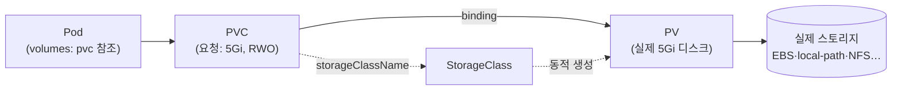

# 05_storage

> CKA 도메인: **Storage (~10%)**

파드에 영속 저장소를 연결하는 방법.

> 🧪 **실습**: [practice-pvc.md](./practice-pvc.md) — PVC·정적 PV·StorageClass·StatefulSet을 busybox로 손에 익히는 CKA 집중 랩. (MinIO 실습은 별도 → [minio.md](./minio.md))

## 다루는 내용
- Volume 개요 — emptyDir, hostPath
- PersistentVolume (PV) / PersistentVolumeClaim (PVC)
- StorageClass — 동적 프로비저닝
- accessModes (RWO/ROX/RWX), reclaimPolicy
- volumeMode, PVC 확장(resize)
- ConfigMap/Secret를 볼륨으로 마운트 (03번과 연계)
- (실무) EKS의 EBS/EFS CSI 드라이버 → `09_aws-eks`
- **오브젝트 스토리지(S3 호환) — MinIO** (실무, CKA 밖) → [minio.md](./minio.md)
  - PV/PVC(block/file)와 **다른 계층** — 마운트가 아니라 S3 API로 접근. 온프렘 "사내 S3"
  - ⚠️ 2025~2026 오픈소스 상황 변화(콘솔 관리기능 제거·저장소 아카이브)·대안 포함

## 정리

> CKA Storage(~10%)는 **PVC를 만들어 파드에 붙이고, StorageClass로 동적 프로비저닝**까지 하는 게 핵심. 시험은 "PVC를 만들어 파드에 마운트하라", "PV를 만들어 PVC와 바인딩하라" 같은 실기 위주다.

### 1. Volume — 파드 수명에 묶인 임시 저장소

컨테이너의 파일시스템은 컨테이너가 죽으면 사라진다. **Volume**은 파드 안 컨테이너들이 공유하는 디렉터리로, 데이터를 컨테이너 재시작 너머로 유지한다. 단, **대부분의 Volume은 파드가 사라지면 같이 사라진다**(영속이 아님).

| 타입 | 수명 | 용도 / 주의 |
|---|---|---|
| `emptyDir` | **파드와 함께 생성·소멸** | 컨테이너 간 임시 공유(캐시, sidecar 데이터 전달). 파드 삭제 시 소멸 |
| `hostPath` | 노드 디스크에 직접 | 노드의 경로를 마운트. **보안·이식성 위험**(노드 바뀌면 데이터 없음) → 프로덕션 지양, DaemonSet 로그수집 정도 |
| `configMap`/`secret` | 파드와 함께 | 설정·민감정보를 파일로 마운트 ([03번 ConfigMap/Secret](../03_workloads-scheduling/)과 연계) |
| `persistentVolumeClaim` | **파드와 독립(영속)** | 아래 PV/PVC. **DB·상태 저장은 무조건 이것** |

```bash
# emptyDir 빠른 예: 두 컨테이너가 /cache 공유
# (spec.volumes에 emptyDir: {}, 각 컨테이너 volumeMounts로 같은 이름 마운트)
```

### 2. PV / PVC — 영속 저장소의 핵심 추상화

영속 저장소는 **두 오브젝트로 역할을 분리**한다 (관심사 분리):

- **PersistentVolume (PV)**: *실제 저장 장치* 그 자체(클러스터 자원). 관리자/프로비저너가 만든다. 네임스페이스 없음(클러스터 스코프).
- **PersistentVolumeClaim (PVC)**: *"이만큼 이런 조건으로 저장소 주세요"* 라는 **사용자의 요청**. 네임스페이스 소속. 파드는 PVC만 참조한다.



**바인딩**: PVC를 만들면 조건(용량·accessMode·StorageClass)에 맞는 PV와 1:1로 묶인다(bound). 정적(미리 만든 PV)·동적(StorageClass가 즉석 생성) 두 방식.

```bash
kubectl get pv,pvc                      # 상태 확인 (STATUS: Bound/Available/Pending)
kubectl get pvc data-clickhouse-0 -o wide
kubectl describe pvc <name>             # Pending이면 Events에서 이유 확인(시험 단골)
```

> ⚠️ **PVC가 `Pending`에서 안 넘어감** = 흔한 함정. 원인: 맞는 PV가 없음 / StorageClass 이름 오타 / 기본 StorageClass 없음 / accessMode·용량 불일치. `kubectl describe pvc`의 Events를 먼저 본다.

### 3. StorageClass — 동적 프로비저닝

PV를 미리 안 만들어도, PVC가 오면 **StorageClass의 프로비저너**가 PV를 자동 생성한다. 클라우드는 거의 다 이 방식.

```bash
kubectl get storageclass                # (default) 표시 확인
kubectl get sc                          # 약어
```

- `provisioner`: 실제 디스크를 만드는 드라이버(예: `rancher.io/local-path`, `ebs.csi.aws.com`).
- **기본 StorageClass**: PVC가 `storageClassName`을 생략하면 default SC가 쓰인다. kind는 `standard`(local-path)가 기본.
- `storageClassName: ""`(빈 문자열)로 지정하면 **동적 프로비저닝을 끄고** 정적 PV만 쓴다.
- `volumeBindingMode: WaitForFirstConsumer`: 파드가 스케줄될 때까지 PV 생성을 미룸(노드 지역성 보장. kind·EBS 기본).

### 4. 알아둘 필드 (시험 포인트)

| 필드 | 값 | 의미 |
|---|---|---|
| **accessModes** | `ReadWriteOnce`(RWO) | 한 **노드**에서 읽기·쓰기 (대부분의 블록 스토리지·EBS) |
| | `ReadOnlyMany`(ROX) | 여러 노드에서 읽기 전용 |
| | `ReadWriteMany`(RWX) | 여러 노드에서 읽기·쓰기 (NFS·EFS·CephFS 등 파일 스토리지만) |
| | `ReadWriteOncePod`(RWOP) | 단 하나의 **파드**만 (1.22+) |
| **persistentVolumeReclaimPolicy** | `Retain` | PVC 삭제해도 PV·데이터 보존(수동 정리) |
| | `Delete` | PVC 삭제 시 PV·실제 디스크까지 삭제(동적 프로비저닝 기본) |
| **volumeMode** | `Filesystem`(기본) | 디렉터리로 마운트 |
| | `Block` | raw 블록 디바이스로 노출(DB가 직접 관리) |

> 💡 **EBS는 RWO** — 여러 파드가 같은 EBS를 동시에 쓸 수 없다. "여러 파드가 한 볼륨 공유"가 필요하면 **EFS(RWX)**. 시험·실무 단골 헷갈림.

**PVC 확장(resize)**: StorageClass에 `allowVolumeExpansion: true`면 PVC의 `spec.resources.requests.storage`를 키워 늘릴 수 있다(축소는 불가).

```bash
kubectl edit pvc <name>    # storage 값을 키운다 → 자동 확장 (드라이버가 지원해야 함)
```

### 5. StatefulSet과의 연결 → 12장에서 실전

DB처럼 **파드마다 전용 디스크**가 필요하면 StatefulSet의 `volumeClaimTemplates`를 쓴다.

**왜 파드 이름이 `clickhouse-0`, `-1`처럼 고정 번호인가** — 번호로 **PVC를 1:1로 짝짓기** 위해서다. Deployment는 파드 이름이 랜덤(`web-7d9f-x8k2p`)이라 죽으면 신원이 사라지지만, StatefulSet은 고정이라 재생성돼도 같은 번호로 돌아온다:

```
clickhouse-0  ──>  PVC: data-clickhouse-0  ──>  디스크 A
clickhouse-1  ──>  PVC: data-clickhouse-1  ──>  디스크 B
```

`clickhouse-0`이 죽었다 다시 떠도 "0번"이라 **항상 `data-clickhouse-0`(디스크 A)에 다시 붙어** 자기 데이터를 되찾는다. 이름이 랜덤이면 "이 파드가 아까 그 0번이었는지"를 알 수 없어 어느 디스크에 붙일지 정할 수 없다 — DB엔 치명적. (기숙사 지정석 사물함과 같다: 내 번호 = 내 칸.)

> ⚠️ **`replicas`를 늘린다고 자동으로 복제 DB가 되진 않는다.** k8s는 파드 N개 + 각자 PVC + 파드별 DNS까지만 해준다. "0번 데이터를 1번에 복제"는 **DB 소프트웨어 설정(또는 오퍼레이터) 몫** — [03번 StatefulSet 정리](../03_workloads-scheduling/#4-statefulset--12장에서-실전) 참고. 단일 노드 학습엔 `replicas: 1`로 충분.

- StatefulSet 자체 개념 → [`03_workloads-scheduling`](../03_workloads-scheduling/)
- **실전 적용(ClickHouse를 StatefulSet+PVC로 배포, 데이터 영속성 직접 확인)** → [`12_data-stores/clickhouse.md`](../12_data-stores/clickhouse.md) 3절 · [`practice-clickhouse.md`](../12_data-stores/practice-clickhouse.md) 2절·과제 1번

### 6. 실무(EKS) — CSI 드라이버

클라우드에서 실제 디스크를 붙이는 건 **CSI(Container Storage Interface) 드라이버**다. EKS는 **EBS CSI**(블록·RWO), **EFS CSI**(파일·RWX)를 애드온으로 설치해 StorageClass로 노출한다. 자세한 운영은 [`09_aws-eks`](../09_aws-eks/).

### 7. 오브젝트 스토리지는 다른 계층

S3 호환 **MinIO**는 PV/PVC와 **다른 계층**이다 — 파일시스템 마운트가 아니라 **S3 API(HTTP)로 접근**한다. "사내 S3"로 백업·로그·아티팩트 저장에 쓴다 → [minio.md](./minio.md).

## 실습 매니페스트

> [practice-pvc.md](./practice-pvc.md)에서 단계별로 사용한다.

- `manifests/pvc-dynamic.yaml` — 동적 프로비저닝 PVC (기본 StorageClass가 PV 자동 생성)
- `manifests/pod-with-pvc.yaml` — 위 PVC를 `/data`에 마운트하는 파드
- `manifests/pv-static.yaml` — 관리자가 직접 만드는 정적 PV (hostPath, 학습용)
- `manifests/pvc-static.yaml` — 정적 PV에 바인딩되는 PVC (`storageClassName: manual`)
- `manifests/statefulset.yaml` — 최소 StatefulSet + Headless Service (`volumeClaimTemplates`로 파드별 PVC)

## 참고

- [Storage](https://kubernetes.io/docs/concepts/storage/)
- [Volumes](https://kubernetes.io/docs/concepts/storage/volumes/)
- [Persistent Volumes](https://kubernetes.io/docs/concepts/storage/persistent-volumes/)
- [Storage Classes](https://kubernetes.io/docs/concepts/storage/storage-classes/)
- [Dynamic Provisioning](https://kubernetes.io/docs/concepts/storage/dynamic-provisioning/)
