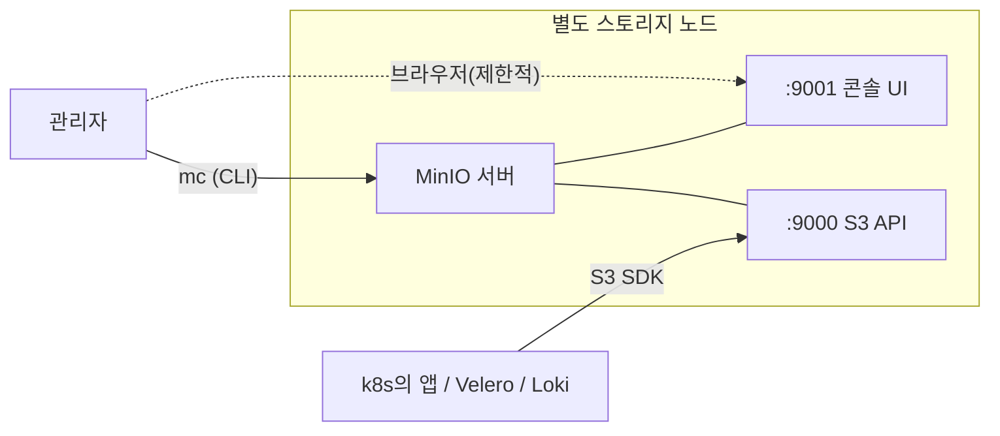

# MinIO — 온프렘 S3 호환 오브젝트 스토리지

> 클라우드 S3가 없는 사내 환경에서 **"사내 S3"** 를 세우는 대표 도구. **CKA 범위 아님**(부가 인프라)이지만, "오브젝트 스토리지는 PV/PVC와 무엇이 다른가"는 스토리지 개념으로 알아둘 가치가 있어 여기 둔다.
> 관련: PV/PVC·StorageClass는 [README](./README.md) · EKS에선 이 자리를 AWS S3가 대신 → [09_aws-eks](../09_aws-eks/)

## ⚠️ 0. 먼저 — 2025~2026 오픈소스 상황이 바뀌었다 (중요)

"MinIO = 웹 콘솔로 버킷·사용자 만드는 것"은 **오래된 그림**이다. 최근 변화:

| 시점 | 일어난 일 |
|---|---|
| **2025-06** | 커뮤니티(오픈소스)판 **콘솔(웹 UI)에서 관리 기능 제거** — 버킷/사용자/정책/구성/라이프사이클 관리가 빠지고 **"오브젝트 브라우저"만** 남음 |
| **2025-12** | 커뮤니티 에디션 **maintenance mode**(상용 AIStor로 무게중심 이동) |
| **2026-02-13** | `minio/minio` GitHub 저장소 **공식 archive("no longer maintained")** — 읽기 전용 |

> 즉 **네가 떠올린 "운영자 UI로 버킷 만들기"는 지금 커뮤니티판에선 안 된다.** 그 방식이 유효한 경우는:
> - **상용 AIStor**(MinIO사 유료 제품)의 콘솔, 또는
> - **OpenMaxIO** 같은 커뮤니티 포크(제거된 UI를 되살림), 또는
> - **2025-06 이전 버전을 핀 고정**해 쓰는 경우.
> 현재 커뮤니티판으로 운영하면 **버킷·사용자·정책은 `mc`(CLI)로** 관리한다. → 새로 온프렘 S3를 깔 거면 [대안들](#10-대안--2025-상황-때문에)도 함께 검토.

**그래도 이 문서를 읽을 가치**: ① MinIO는 이미 **수많은 곳에 깔려 운영 중**이고, ② 여기서 배우는 **S3 호환 오브젝트 스토리지 개념은 대안(Ceph RGW·SeaweedFS·Garage)과 AWS S3에 그대로 이식**된다.

## 1. 오브젝트 스토리지란 — PV/PVC와 무엇이 다른가

스토리지엔 세 계층이 있다. **MinIO는 object 계층**이고, **CKA의 PV/PVC는 block/file 계층**이다 — 같은 "스토리지"지만 결이 다르다.

| 종류 | 접근 방식 | 단위 | k8s에서 | 예 |
|---|---|---|---|---|
| **block** | 디스크처럼(블록 디바이스) | 볼륨 | PV/PVC로 **파드에 마운트** | EBS, iSCSI, LVM |
| **file** | 파일시스템(POSIX, 디렉터리) | 파일 | PV/PVC로 **마운트**(RWX 가능) | NFS, EFS, CephFS |
| **object** | **HTTP API(S3)** — GET/PUT | 객체(버킷 안) | **마운트 안 함.** 앱이 SDK/HTTP로 접근 | **MinIO**, AWS S3, Ceph RGW |

> 💡 **핵심 구분**: 오브젝트 스토리지는 파드에 `volumeMounts`로 붙이는 게 **아니다.** 앱이 코드에서 **S3 클라이언트로 엔드포인트 URL에 접속**해 객체를 읽고 쓴다. 그래서 PV/PVC/StorageClass와는 **메커니즘이 완전히 다르다**(이 문서가 05에 있지만 "또 다른 스토리지"인 이유).
> - 큰 파일·백업·로그·이미지·정적 자산처럼 **통째로 쓰고 통째로 읽는** 데이터에 강하다(부분 수정엔 약함).
> - 무한 확장·메타데이터·버저닝·수명주기(lifecycle)에 유리.

## 2. MinIO의 정체 + 배포 형태

S3 API를 그대로 구현한 단일 바이너리(Go). 띄우는 방식은 셋:

| 형태 | 모습 | 언제 |
|---|---|---|
| **별도 노드 단독** | 스토리지 전용 서버에 `minio server /data` | 소규모 "사내 S3". (네가 말한 방식) |
| **별도 노드 분산** | 여러 노드·여러 디스크에 **erasure coding**으로 분산 | 용량·가용성이 필요한 운영 |
| **k8s 안(Operator/StatefulSet)** | 클러스터 워크로드로 | 모든 걸 k8s에 올리는 팀 |

> 💡 **클러스터와 분리하는 게 정석에 가깝다.** 스토리지는 컴퓨트(클러스터)와 **수명·디스크 요구가 다르다.** 별도 노드에 두면 클러스터를 갈아엎어도 데이터가 안전하고, k8s 워크로드는 그 MinIO를 **S3 엔드포인트(URL)로 가리키기만** 한다(7장).

## 3. 세 인터페이스 + 두 포트

같은 데이터에 입구가 셋, 포트는 보통 둘이다.

| 입구 | 무엇 | 포트(기본) | 누가 | 현재 커뮤니티판 |
|---|---|---|---|---|
| **S3 API** | AWS S3와 동일한 HTTP API | **9000** | **앱·도구**(SDK, Velero, Loki…) | 정상 |
| **콘솔(웹 UI)** | 브라우저 운영자 UI | **9001** | 사람(관리자) | ⚠️ **오브젝트 브라우저만**(관리기능 제거, 0장) |
| **`mc` (CLI)** | MinIO Client. 버킷·사용자·정책·admin | — | 사람·스크립트 | **여기로 관리**(권장) |



## 4. 핵심 모델 — 버킷 / 객체 / 키 / 버저닝

- **버킷(bucket)**: 객체를 담는 최상위 컨테이너(≈ 네임스페이스). `s3://mybucket/...`
- **객체(object)**: 실제 데이터 + 메타데이터. **키(key)** 로 식별.
- **키의 `/`는 가짜 폴더**: `logs/2026/06/app.log`처럼 보여도 실제 디렉터리가 아니라 **접두사(prefix)** 다. "폴더"는 prefix 필터일 뿐.
- **버저닝**: 같은 키에 덮어써도 옛 버전 보존(실수 복구). 
- **라이프사이클/티어링**: 오래된 객체 자동 삭제·저비용 계층으로 이동(상용/일부 기능).

## 5. 인증·접근통제 — AWS S3와 똑같은 모델

- **root 사용자**: 기동 시 `MINIO_ROOT_USER` / `MINIO_ROOT_PASSWORD`(비번 8자+)로 지정.
- **액세스 키 / 시크릿 키**: AWS의 `AWS_ACCESS_KEY_ID` / `AWS_SECRET_ACCESS_KEY`와 **동일 역할**. 앱은 이 키로 S3 접속.
- **사용자·정책(policy)**: AWS IAM과 유사한 JSON 정책으로 버킷·액션 단위 권한. (현재 커뮤니티판은 **`mc admin user` / `mc admin policy`로** 관리 — UI 아님.)

## 6. 직접 띄워보기 (랩 — docker, 5분)

로컬 실습 환경(colima+docker)에서 단일 노드로 체험. **별도 노드에 깔 때와 같은 그림**이다(여긴 컨테이너일 뿐).

```bash
# MinIO 서버 띄우기 (API :9000, 콘솔 :9001)
docker run -d --name minio -p 9000:9000 -p 9001:9001 \
  -e "MINIO_ROOT_USER=admin" -e "MINIO_ROOT_PASSWORD=admin12345" \
  quay.io/minio/minio server /data --console-address ":9001"
```
> ⚠️ 저장소가 아카이브돼 `latest`는 2025년 어느 시점 이미지다. 재현성·UI가 필요하면 **2025-06 이전 릴리스를 핀 고정**하거나 **포크(OpenMaxIO)** 이미지를 쓴다.

```bash
# mc(CLI)로 관리 — 별칭 등록 → 버킷 생성 → 업로드 → 목록
mc alias set local http://localhost:9000 admin admin12345
mc mb local/demo                      # 버킷 생성 (UI 대신 CLI)
echo "hello object storage" > f.txt
mc cp f.txt local/demo/               # 객체 업로드
mc ls local/demo                      # 목록
mc cat local/demo/f.txt               # 내용 확인
```
🔎 브라우저로 http://localhost:9001 (admin/admin12345) → **오브젝트 브라우저**로 방금 올린 객체가 보인다. 단 **버킷 만들기/사용자/정책 메뉴는 커뮤니티판에선 없거나 비활성**(0장) — 그래서 위처럼 `mc`로 했다.

🧪 **과제**: `mc admin user add local appuser appsecret123` 로 사용자를 만들고, `mc admin policy attach local readwrite --user appuser` 로 권한을 준 뒤, 그 키로 `mc alias set`을 다시 해 접근되는지 본다.

## 7. k8s에서 쓰는 법 — "외부 엔드포인트"로 소비

k8s는 MinIO를 **마운트하지 않는다.** 앱이 **S3 클라이언트로 엔드포인트에 접속**할 뿐. 보통:

1. MinIO 접속 키를 **Secret**으로 둔다(평문 금지 → [10_ecosystem-gitops 시크릿 관리](../10_ecosystem-gitops/secrets-management.md)).
2. 앱 env에 `S3_ENDPOINT=http://minio.storage.svc:9000`(또는 사내 노드 URL) + 키 주입.
3. 앱은 AWS S3 SDK로 그대로 접근. **온프렘이라 보통 `path-style` 엔드포인트**(`http://endpoint/bucket/key`)를 켠다(AWS는 virtual-host style `http://bucket.endpoint/...`로 이동 중).

```yaml
# 앱이 읽을 접속정보 (값은 SealedSecret/ESO로 안전하게)
apiVersion: v1
kind: Secret
metadata: { name: minio-cred }
type: Opaque
stringData:
  AWS_ACCESS_KEY_ID: appuser
  AWS_SECRET_ACCESS_KEY: appsecret123
  S3_ENDPOINT: http://minio.storage.svc:9000   # 사내 MinIO 노드면 그 URL
```

**누가 S3 백엔드로 MinIO를 요구하나**(온프렘에서 MinIO가 그 자리를 채움):

| 도구 | S3를 쓰는 이유 |
|---|---|
| **Velero** | 클러스터/PV 백업 저장소 |
| **Loki · Mimir · Thanos · Tempo** | 로그·메트릭·트레이스 장기 저장(chunk를 객체로) |
| **CloudNativePG 등 DB** | 베이스백업/WAL 아카이브 타깃 |
| **레지스트리·아티팩트·ML 데이터셋** | 큰 바이너리 보관 |

## 8. 데이터 보호 / 가용성

- **erasure coding**: 객체를 데이터+패리티 조각으로 쪼개 여러 디스크/노드에 분산. **일부 디스크·노드가 죽어도 복구**(RAID 비슷하지만 소프트웨어).
- **distributed mode**: 여러 노드(보통 4대+)로 묶어 가용성·용량 확보.
- PV 복제와 **계층이 다르다** — MinIO는 자기 레벨에서 내결함성을 처리하므로, 밑에 깔리는 디스크는 단순 로컬 디스크여도 된다.

## 9. EKS / 실무 — S3로 치환

- **EKS면 MinIO 대신 그냥 AWS S3.** 앱은 IRSA(IAM Role for ServiceAccount)로 키 없이 S3에 접근 → [09_aws-eks](../09_aws-eks/).
- 즉 **MinIO는 "온프렘에서 S3를 흉내내는 자리"**. 코드·도구 설정은 `endpoint`와 `path-style`만 다르고 나머진 S3와 동일해서 이식이 쉽다.

## 10. 대안 (2025 상황 때문에)

0장 변화로 **새로 깐다면** 후보를 함께 본다:

| 대안 | 성격 |
|---|---|
| **OpenMaxIO** | MinIO 커뮤니티 **포크** — 제거된 UI·기능 복원, "원래 MinIO" 유지가 목표 |
| **Ceph Object Gateway(RGW)** | 대규모·엔터프라이즈 S3(블록/파일/오브젝트 통합 스토리지) |
| **SeaweedFS** | 가볍고 다중 프로토콜, 대량 소파일에 강함 |
| **Garage** | 경량·엣지 지향 S3 |
| **Apache Ozone** | 빅데이터(하둡) 친화 오브젝트 스토리지 |

> 선택 기준: **규모/운영부담**(Ceph는 강력하지만 무겁다) vs **단순함**(Garage·SeaweedFS) vs **MinIO 호환 UI 유지**(OpenMaxIO).

## 시험·실무 팁

- **CKA 범위 아님.** 시험 스토리지는 PV/PVC/StorageClass(block/file) → [README](./README.md). MinIO는 **object 계층**이라 출제 대상이 아니다.
- **꼭 가져갈 개념**: 오브젝트 스토리지는 **마운트가 아니라 S3 API로 접근**한다 — PV/PVC와 헷갈리지 말 것. 이 구분만 잡으면 Velero·Loki 등이 "왜 S3가 필요하다는지" 단번에 이해된다.
- **키는 시크릿으로.** MinIO 액세스/시크릿 키는 평문 금지 → [시크릿 관리 스택](../10_ecosystem-gitops/secrets-management.md).
- **MinIO를 새로 도입한다면** 0장(아카이브)을 반드시 고려 — 운영 중이면 괜찮지만, 신규는 대안/포크/상용 중 선택.

## 참고

- [MinIO 문서](https://min.io/docs/minio/linux/index.html) · [`mc` (MinIO Client)](https://min.io/docs/minio/linux/reference/minio-mc.html)
- 2025~2026 변화: [Blocks&Files — admin UI removed (2025-06)](https://www.blocksandfiles.com/ai-ml/2025/06/19/minio-users-complain-after-admin-ui-removed-from-community-edition/1610856) · [GitHub issue #21584](https://github.com/minio/minio/issues/21584) · [Community Edition Archived — what's next](https://thecloudsupportengineer.com/the-end-of-an-era-minio-community-edition-is-archived-whats-next/)
- 대안: [OpenMaxIO](https://github.com/OpenMaxIO) · [Ceph RGW](https://docs.ceph.com/en/latest/radosgw/) · [SeaweedFS](https://github.com/seaweedfs/seaweedfs) · [Garage](https://garagehq.deuxfleurs.fr/)
- 오브젝트 vs 블록/파일: [AWS — Object storage](https://aws.amazon.com/what-is/object-storage/)
