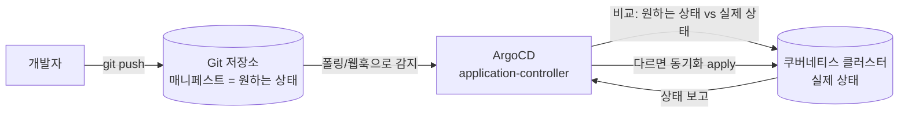
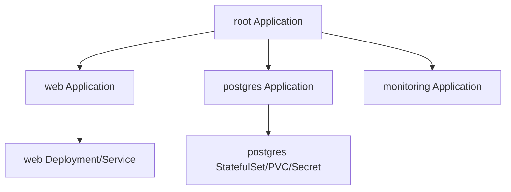

# ArgoCD (GitOps CD)

> **GitOps** = Git을 "원하는 상태(desired state)"의 **단일 소스(single source of truth)**로 삼고, 도구가 클러스터를 그 상태로 **자동으로 맞추는** 운영 방식. ArgoCD는 그 일을 하는 쿠버네티스용 CD(Continuous Delivery) 컨트롤러다.
>
> CKA 시험 범위는 아니지만 EKS 등 실무에서 표준처럼 쓰인다. 실습은 [practice.md](./practice.md).

---

## 개념 — "kubectl apply"와 무엇이 다른가

기존 방식은 **사람(또는 CI)이 클러스터에 명령을 민다(push)**: `kubectl apply -f ...`. 누가 언제 무엇을 적용했는지 추적이 어렵고, 클러스터가 매니페스트와 어긋나도(드리프트) 알기 힘들다.

GitOps는 방향을 뒤집는다 — **클러스터 안의 에이전트가 Git을 계속 보고(pull), 다르면 스스로 맞춘다.**



이 구조가 주는 것:
- **선언적 + 버전 관리**: 클러스터 상태가 Git 히스토리에 남는다. 리뷰(PR)·롤백(`git revert`)이 그대로 배포 워크플로가 된다.
- **드리프트 감지/교정**: 누가 클러스터를 손으로 바꾸면 ArgoCD가 `OutOfSync`로 표시하고, `selfHeal`이면 Git 상태로 되돌린다.
- **감사/일관성**: "지금 클러스터에 뭐가 떠 있나?"의 답이 곧 "Git의 그 커밋".

---

## 핵심 구성요소

| 구성요소 | 역할 |
|---|---|
| **application-controller** | 핵심 두뇌. 원하는 상태(Git)와 실제 상태(클러스터)를 비교(diff)하고 동기화한다. Sync/Health 상태를 계산. |
| **repo-server** | Git을 clone하고 매니페스트를 **렌더링**한다(plain YAML·Helm·Kustomize → 최종 매니페스트). |
| **api-server / Web UI / `argocd` CLI** | 사용자 인터페이스. Application 조회·수동 sync·로그아웃. |
| **redis** | 렌더링·diff 결과 캐시. |
| **dex** (선택) | SSO(OIDC/SAML) 연동. |

### Application — 배포의 기본 단위

ArgoCD에서 "무엇을 어디에 배포할지" 한 묶음이 **`Application`** 커스텀 리소스다. 두 축으로 정의된다:

- **source** — *무엇을* (어디서 가져오나): `repoURL` + `targetRevision`(브랜치/태그) + `path`(디렉토리). 그 path가 Helm 차트면 `helm:`, Kustomize면 `kustomize:` 블록으로 값을 준다.
- **destination** — *어디에* (어느 클러스터/네임스페이스): `server`(in-cluster면 `https://kubernetes.default.svc`) + `namespace`.

```yaml
apiVersion: argoproj.io/v1alpha1
kind: Application
metadata:
  name: web
  namespace: argocd            # Application 객체 자체는 argocd 네임스페이스에 둔다
spec:
  project: default
  source:
    repoURL: https://github.com/<나>/<repo>.git
    targetRevision: main
    path: 10_ecosystem-gitops/manifests/web
  destination:
    server: https://kubernetes.default.svc
    namespace: web
  syncPolicy:
    automated: { prune: true, selfHeal: true }
    syncOptions: [ CreateNamespace=true ]
```

> **AppProject** — 여러 Application을 묶는 경계. 어떤 repo/대상 클러스터/리소스 종류를 허용할지 제한한다(멀티팀 RBAC·가드레일). 처음엔 기본 `default` 프로젝트면 충분.

---

## Sync — 상태를 맞추는 동작

ArgoCD는 두 가지 상태를 따로 본다:
- **Sync 상태**: Git(원하는 상태)과 클러스터(실제 상태)가 같은가? → `Synced` / `OutOfSync`
- **Health 상태**: 배포된 리소스가 건강한가? → `Healthy` / `Progressing` / `Degraded` / `Missing`

| Sync 정책/옵션 | 의미 |
|---|---|
| **manual** (기본) | `OutOfSync`여도 사람이 직접 Sync를 눌러야 적용. |
| **automated** | 차이를 감지하면 자동으로 apply. |
| **prune** | Git에서 **삭제된** 리소스를 클러스터에서도 지운다. (automated에서 기본 off — 켜야 함) |
| **selfHeal** | 클러스터에서 **수동 변경**되면 Git 상태로 되돌린다. |
| **CreateNamespace=true** | destination 네임스페이스가 없으면 만들어 준다. |

> ⚠️ **prune·selfHeal은 강력한 만큼 위험**하다. 운영 클러스터에서 `selfHeal`은 "긴급 수동 패치"를 자동으로 되돌려버릴 수 있고, `prune`은 의도치 않은 삭제를 부른다. 처음엔 **수동 sync로 diff를 눈으로 보고** 익숙해진 뒤 켜는 걸 권한다.

ArgoCD는 기본적으로 **3분마다 Git을 폴링**한다(웹훅을 걸면 즉시). 그래서 push 후 자동 sync가 수십 초~수 분 걸릴 수 있고, 급하면 UI/CLI에서 **Refresh**(즉시 diff)·**Sync**(즉시 적용)를 누른다.

---

## App of Apps 패턴

Application을 수십 개 손으로 만들기는 번거롭다. **하나의 "부모" Application이 여러 "자식" Application 매니페스트가 든 디렉토리를 가리키게** 하면, 부모만 만들면 자식들이 줄줄이 생성된다(부트스트랩).



이 저장소의 [`manifests/argocd-apps/`](./manifests/argocd-apps/)에 자식 Application들을 모아 두었으니, 그 디렉토리를 가리키는 부모 Application 하나로 App of Apps를 실습할 수 있다(→ [practice.md](./practice.md)의 보너스 과제).

---

## 시험·실무 팁

- **CKA에는 안 나온다.** ArgoCD/GitOps는 커리큘럼 밖. 단, ArgoCD가 결국 적용하는 **Deployment·StatefulSet·Service·Secret·PVC 자체는 CKA 핵심**이니, 그 매니페스트를 읽고 쓰는 능력이 진짜 자산이다.
- **Helm/Kustomize는 ArgoCD가 렌더링**한다. ArgoCD는 `helm template`/`kustomize build`에 해당하는 일을 repo-server에서 하고 결과를 적용할 뿐 — Helm/Kustomize 자체는 [`06_cluster-ops`](../06_cluster-ops/) 영역.
- **Secret을 평문으로 Git에 두지 말 것.** GitOps의 최대 함정. Sealed Secrets / SOPS / External Secrets Operator로 암호화하거나 외부 시크릿 저장소(AWS Secrets Manager 등)를 참조한다. (이 저장소 실습은 학습 단순화를 위해 평문 — 실무 금지)
- **EKS 실무**: ArgoCD를 EKS에 올리고, IAM(IRSA)·SSO(dex/OIDC)·다중 클러스터(허브-스포크) 구성으로 확장한다. → [`09_aws-eks`](../09_aws-eks/).
- **상태가 있는 워크로드(PostgreSQL)**는 PVC/StorageClass 이해가 전제 → [`05_storage`](../05_storage/). 실무 운영 DB는 보통 매니지드(RDS/Aurora)나 전용 오퍼레이터(CloudNativePG 등)를 쓴다.

---

## 참고

- [Argo CD 공식 문서](https://argo-cd.readthedocs.io/)
- [Argo CD – Getting Started](https://argo-cd.readthedocs.io/en/stable/getting_started/)
- [Argo CD – Application Spec](https://argo-cd.readthedocs.io/en/stable/user-guide/application-specification/)
- [App of Apps 패턴](https://argo-cd.readthedocs.io/en/stable/operator-manual/cluster-bootstrapping/)
- [OpenGitOps – GitOps 원칙](https://opengitops.dev/)
