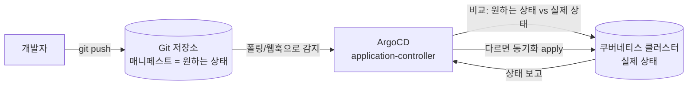
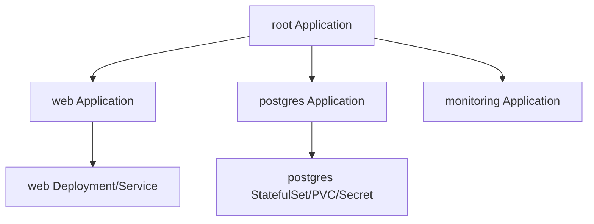

# ArgoCD (GitOps CD)

> **GitOps** = Git을 "원하는 상태(desired state)"의 **단일 소스(single source of truth)**로 삼고, 도구가 클러스터를 그 상태로 **자동으로 맞추는** 운영 방식. ArgoCD는 그 일을 하는 쿠버네티스용 CD(Continuous Delivery) 컨트롤러다.
>
> CKA 시험 범위는 아니지만 EKS 등 실무에서 표준처럼 쓰인다. 실습은 [practice.md](./practice.md).

---

## 개념 — "kubectl apply"와 무엇이 다른가

기존 방식은 **사람(또는 CI)이 클러스터에 명령을 민다(push)**: `kubectl apply -f ...`. 누가 언제 무엇을 적용했는지 추적이 어렵고, 클러스터가 매니페스트와 어긋나도(드리프트) 알기 힘들다.

GitOps는 방향을 뒤집는다 — **클러스터 안의 에이전트가 Git을 계속 보고(pull), 다르면 스스로 맞춘다.**



이 구조가 주는 것:
- **선언적 + 버전 관리**: 클러스터 상태가 Git 히스토리에 남는다. 리뷰(PR)·롤백(`git revert`)이 그대로 배포 워크플로가 된다.
- **드리프트 감지/교정**: 누가 클러스터를 손으로 바꾸면 ArgoCD가 `OutOfSync`로 표시하고, `selfHeal`이면 Git 상태로 되돌린다.
- **감사/일관성**: "지금 클러스터에 뭐가 떠 있나?"의 답이 곧 "Git의 그 커밋".

> **"Git"은 우리가 아는 그 Git이다.** GitHub/GitLab에 `git push` 하는 평범한 Git을 **배포의 중심**에 둔 것뿐이다. 새 도구를 배우는 게 아니라, 이미 잘 쓰는 Git의 기능이 그대로 배포 기능이 된다:
>
> | Git의 평범한 기능 | GitOps에서의 의미 |
> |---|---|
> | commit 히스토리 | **누가·언제·왜 배포를 바꿨나** 감사 로그가 그냥 생김 |
> | `git revert` | **롤백 = 이전 커밋으로 되돌리기** (kubectl 없이) |
> | Pull Request / 리뷰 | **배포 승인 절차**가 코드 리뷰와 똑같아짐 |
> | branch | dev/staging/prod 환경 분리 |
> | diff | "지금 클러스터 ≠ Git"을 ArgoCD가 보여주는 그 `OutOfSync` diff |
>
> 그래서 "Git이 단일 소스"라는 말은 **"클러스터를 손으로 바꾸지 마라(`kubectl apply` 직접 금지)"** 와 짝이다. 손으로 바꾸면 Git과 클러스터가 어긋나고, 그게 바로 `selfHeal`이 되돌리는 상황·`OutOfSync` 진단으로 이어진다.

---

## 핵심 구성요소

| 구성요소 | 역할 |
|---|---|
| **application-controller** | 핵심 두뇌. 원하는 상태(Git)와 실제 상태(클러스터)를 비교(diff)하고 동기화한다. Sync/Health 상태를 계산. |
| **repo-server** | Git을 clone하고 매니페스트를 **렌더링**한다(plain YAML·Helm·Kustomize → 최종 매니페스트). |
| **api-server / Web UI / `argocd` CLI** | 사용자 인터페이스. Application 조회·수동 sync·로그아웃. |
| **redis** | 렌더링·diff 결과 캐시. |
| **dex** (선택) | SSO(OIDC/SAML) 연동. |

### Application — 배포의 기본 단위

ArgoCD에서 "무엇을 어디에 배포할지" 한 묶음이 **`Application`** 커스텀 리소스다. 두 축으로 정의된다:

- **source** — *무엇을* (어디서 가져오나): `repoURL` + `targetRevision`(브랜치/태그) + `path`(디렉토리). 그 path가 Helm 차트면 `helm:`, Kustomize면 `kustomize:` 블록으로 값을 준다.
- **destination** — *어디에* (어느 클러스터/네임스페이스): `server`(in-cluster면 `https://kubernetes.default.svc`) + `namespace`.

```yaml
apiVersion: argoproj.io/v1alpha1
kind: Application
metadata:
  name: web
  namespace: argocd            # Application 객체 자체는 argocd 네임스페이스에 둔다
spec:
  project: default
  source:
    repoURL: https://github.com/<나>/<repo>.git
    targetRevision: main
    path: 10_ecosystem-gitops/manifests/web
  destination:
    server: https://kubernetes.default.svc
    namespace: web
  syncPolicy:
    automated: { prune: true, selfHeal: true }
    syncOptions: [ CreateNamespace=true ]
```

> **AppProject** — 여러 Application을 묶는 경계. 어떤 repo/대상 클러스터/리소스 종류를 허용할지 제한한다(멀티팀 RBAC·가드레일). 처음엔 기본 `default` 프로젝트면 충분.

---

## Sync — 상태를 맞추는 동작

ArgoCD는 두 가지 상태를 따로 본다:
- **Sync 상태**: Git(원하는 상태)과 클러스터(실제 상태)가 같은가? → `Synced` / `OutOfSync`
- **Health 상태**: 배포된 리소스가 건강한가? → `Healthy` / `Progressing` / `Degraded` / `Missing`

| Sync 정책/옵션 | 의미 |
|---|---|
| **manual** (기본) | `OutOfSync`여도 사람이 직접 Sync를 눌러야 적용. |
| **automated** | 차이를 감지하면 자동으로 apply. |
| **prune** | Git에서 **삭제된** 리소스를 클러스터에서도 지운다. (automated에서 기본 off — 켜야 함) |
| **selfHeal** | 클러스터에서 **수동 변경**되면 Git 상태로 되돌린다. |
| **CreateNamespace=true** | destination 네임스페이스가 없으면 만들어 준다. |

> ⚠️ **prune·selfHeal은 강력한 만큼 위험**하다. 운영 클러스터에서 `selfHeal`은 "긴급 수동 패치"를 자동으로 되돌려버릴 수 있고, `prune`은 의도치 않은 삭제를 부른다. 처음엔 **수동 sync로 diff를 눈으로 보고** 익숙해진 뒤 켜는 걸 권한다.

ArgoCD는 기본적으로 **3분마다 Git을 폴링**한다(웹훅을 걸면 즉시). 그래서 push 후 자동 sync가 수십 초~수 분 걸릴 수 있고, 급하면 UI/CLI에서 **Refresh**(즉시 diff)·**Sync**(즉시 적용)를 누른다.

### OutOfSync 진단 — diff 읽는 법과 조사 순서

`OutOfSync`는 **클러스터(live) ≠ Git(desired)**라는 뜻이다. UI의 **APP DIFF**는 git diff와 같은 방향으로 읽는다:

- **왼쪽 (빨강 / `-`) = live** (지금 클러스터에 떠 있는 실제 상태)
- **오른쪽 (초록 / `+`) = desired** (Git이 원하는 상태)

그래서 **리소스 하나가 한쪽에만 통째로 보이면** 상황이 갈린다:

| diff 모습 | 의미 | Sync(+prune)하면 |
|---|---|---|
| **왼쪽에만** 있다 (live O / Git X) | Git에 없는 리소스가 클러스터에 떠 있음 | 그 리소스를 **삭제(prune)** |
| **오른쪽에만** 있다 (live X / Git O) | Git엔 있는데 아직 클러스터에 없음 | 그 리소스를 **생성** |

> ⚠️ **"왼쪽에만 있는 리소스"는 위험하다.** prune을 켜고 sync하면 그게 운영 중인 리소스(예: frontend의 Ingress)여도 삭제돼 외부 접근이 끊길 수 있다. **누르기 전에 "이게 있어야 하는 리소스인가"부터 판단**한다 — 있어야 하면 Git에 추가/복구해 정상화하고, 잔재면 prune으로 정리한다.

**조사 순서** (왼쪽에만 있는 리소스 = "Git엔 없는데 클러스터엔 있다"의 원인 찾기):

1. **누가 만들었나 — 추적 라벨 확인** (가장 빠른 단서)
   ```bash
   kubectl -n <ns> get <kind> <name> -o yaml | grep -A6 'labels:\|annotations:'
   ```
   - `argocd.argoproj.io/tracking-id` 또는 `app.kubernetes.io/instance: <앱>` **라벨 O** → 예전에 **ArgoCD가 Git 보고 만든 것** → 누군가 **Git에서 매니페스트를 지웠다**(원인: Git 삭제).
   - 그 라벨 **없음** → 누가 **수동(kubectl/콘솔)으로 만든 것** → ArgoCD 밖의 변경(원인: out-of-band).
2. **Git 이력 확인** — 정말 Git에서 빠졌는지/언제 빠졌는지
   ```bash
   git log --oneline -- <앱의 source path>/
   ```
   Helm/Kustomize면 값·조건 변화도 본다(예: `ingress.enabled: true→false`, `{{ if }}` 조건이 빠져 **렌더링 결과에서 사라짐**).
3. **UI 리소스 트리** — prune 대상 리소스는 보통 **점선 테두리**로 표시된다. 클릭하면 위 라벨/생성 정보를 바로 확인할 수 있다.

> 💡 반대로 **selfHeal이 켜져 있는데 자꾸 OutOfSync↔Synced를 오간다면**, 보통 **다른 컨트롤러(HPA·웹훅·오퍼레이터)가 같은 필드를 계속 바꾸는** 경우다. ArgoCD가 Git값으로 되돌리고 → 그 컨트롤러가 또 바꾸고 → 무한 반복. 이럴 땐 해당 필드를 `ignoreDifferences`로 제외한다.

---

## App of Apps 패턴

Application을 수십 개 손으로 만들기는 번거롭다. **하나의 "부모" Application이 여러 "자식" Application 매니페스트가 든 디렉토리를 가리키게** 하면, 부모만 만들면 자식들이 줄줄이 생성된다(부트스트랩).



이 저장소의 [`manifests/argocd-apps/`](./manifests/argocd-apps/)에 자식 Application들을 모아 두었으니, 그 디렉토리를 가리키는 부모 Application 하나로 App of Apps를 실습할 수 있다(→ [practice.md](./practice.md)의 보너스 과제).

---

## 실무 메모 — Application을 등록하는 방법과 사내 흔한 패턴

같은 `Application`을 만드는 통로가 여럿이지만 **클러스터에 생기는 결과물(Application 객체)은 동일**하다. 차이는 *거치는 경로*와 *권한 통제 방식*이다.

| 통로 | 거치는 곳 | 필요한 것 | 권한 통제 |
|---|---|---|---|
| `kubectl apply -f app.yaml` | k8s API 서버 **직접** | 그 클러스터 kubeconfig | k8s RBAC |
| `argocd app create ...` (CLI) | argocd-server → k8s API | argocd 로그인 | ArgoCD RBAC |
| **UI "+ NEW APP" → EDIT AS YAML → 붙여넣기** | argocd-server → k8s API | UI 로그인(보통 **SSO**) | **ArgoCD RBAC/Project** |

**사내에서 흔한 패턴**: Application YAML을 **Git에 두고**(source of truth → 재현·리뷰·버전관리), 그 파일을 **UI EDIT AS YAML로 붙여넣어 등록**하라고 가이드한다. 이는 `kubectl apply`와 결과가 같되, 통로가 UI일 뿐이다. 왜 이렇게 하나:

- 개발자에게 **운영 클러스터의 raw kubectl 자격증명을 주지 않고**, SSO로 ArgoCD UI만 열어준다.
- 등록이 **argocd-server를 거치므로 ArgoCD RBAC/AppProject로 "어느 팀이 어떤 repo/네임스페이스에 배포 가능한지" 통제**된다.
- YAML 복붙이라 온보딩 문서로 주기 편하다.

> ⚠️ **등록은 일회성이다.** UI 붙여넣기·`kubectl apply`로 등록한 **Application 객체 자체**는, 이후 Git에서 `app.yaml`을 고쳐도 **자동으로 따라 바뀌지 않는다**(ArgoCD가 관리하는 건 그 앱이 *가리키는* 워크로드이지, 앱 정의 자신이 아니다).
> → 이걸 자동화하는 게 **[App of Apps](#app-of-apps-패턴)**: 부모 앱이 `argocd-apps/` 같은 디렉토리를 관리하면, Git에서 자식 Application 정의를 고치는 것까지 자동 동기화된다. "한 번 등록 후엔 Git만 고쳐도 다 반영"되는 사내 환경이라면 십중팔구 **루트/부모 앱(App of Apps)이 깔려 있고**, 내가 붙여넣는 건 그 체계의 한 조각이다. (앱 목록에 `root`·`bootstrap` 같은 부모 앱이 있는지 확인해 보면 안다.)

## 시험·실무 팁

- **CKA에는 안 나온다.** ArgoCD/GitOps는 커리큘럼 밖. 단, ArgoCD가 결국 적용하는 **Deployment·StatefulSet·Service·Secret·PVC 자체는 CKA 핵심**이니, 그 매니페스트를 읽고 쓰는 능력이 진짜 자산이다.
- **Helm/Kustomize는 ArgoCD가 렌더링**한다. ArgoCD는 `helm template`/`kustomize build`에 해당하는 일을 repo-server에서 하고 결과를 적용할 뿐 — Helm/Kustomize 자체는 [`06_cluster-ops`](../06_cluster-ops/) 영역.
- **Secret을 평문으로 Git에 두지 말 것.** GitOps의 최대 함정. Sealed Secrets / SOPS / External Secrets Operator로 암호화하거나 외부 시크릿 저장소(AWS Secrets Manager 등)를 참조한다. (이 저장소 실습은 학습 단순화를 위해 평문 — 실무 금지)
- **EKS 실무**: ArgoCD를 EKS에 올리고, IAM(IRSA)·SSO(dex/OIDC)·다중 클러스터(허브-스포크) 구성으로 확장한다. → [`09_aws-eks`](../09_aws-eks/).
- **상태가 있는 워크로드(PostgreSQL)**는 PVC/StorageClass 이해가 전제 → [`05_storage`](../05_storage/). 실무 운영 DB는 보통 매니지드(RDS/Aurora)나 전용 오퍼레이터(CloudNativePG 등)를 쓴다.

---

## 참고

- [Argo CD 공식 문서](https://argo-cd.readthedocs.io/)
- [Argo CD – Getting Started](https://argo-cd.readthedocs.io/en/stable/getting_started/)
- [Argo CD – Application Spec](https://argo-cd.readthedocs.io/en/stable/user-guide/application-specification/)
- [App of Apps 패턴](https://argo-cd.readthedocs.io/en/stable/operator-manual/cluster-bootstrapping/)
- [OpenGitOps – GitOps 원칙](https://opengitops.dev/)
