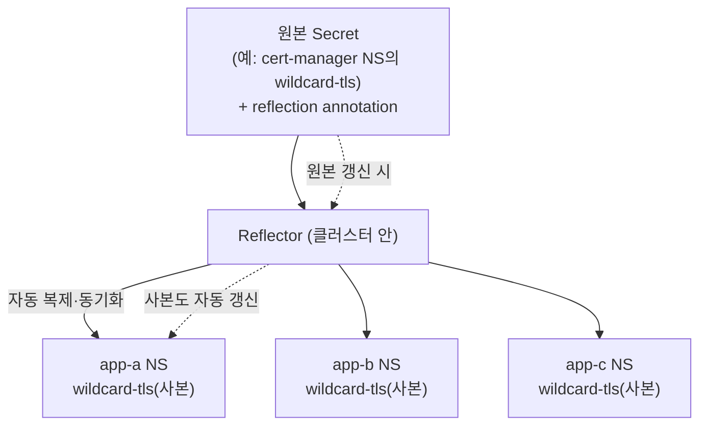

# Reflector — Secret/ConfigMap을 네임스페이스 간 복제

> k8s `Secret`은 **네임스페이스에 갇힌다.** Reflector는 원본에 단 annotation을 보고 그 Secret/ConfigMap을 **다른 NS로 자동 복제·동기화**한다.
> 큰 그림 → [secrets-management.md](./secrets-management.md)

## 왜 필요한가 — Secret은 NS를 못 넘는다

같은 시크릿을 여러 네임스페이스의 파드가 써야 하는 상황이 흔하다:
- **와일드카드 TLS 인증서**(`*.example.com`) 하나를 여러 앱 NS의 Ingress가 공유
- **이미지 풀 시크릿**(`dockerconfigjson`)을 모든 NS에 배포
- **이 스택의 사례 — Strimzi `KafkaUser` 시크릿**: Strimzi가 특정 NS에 만들어 준 Kafka 접속 자격증명을, 이를 쓰는 앱 NS들로 복제

매번 손으로 복사하면 원본이 갱신될 때(인증서 재발급 등) 사본이 낡는다. **Reflector는 원본이 바뀌면 사본도 자동 동기화**한다.

> ⚠️ **Reflector는 암호화와 무관**하다. [Sealed Secrets](./sealed-secrets.md)(git 암호화 저장)·[SOPS/age](./sops-age.md)(백업·키보호)와 층이 다르다 — Reflector는 **이미 클러스터에 존재하는** Secret을 NS로 *퍼뜨리는* 배포 단계만 맡는다.



## 두 가지 모드 — auto(밀어넣기) vs 수동(끌어오기)

### 모드 1 — 자동 미러링 (원본이 "퍼져라"라고 지정)

원본 Secret에 annotation만 달면, Reflector가 **대상 NS에 같은 이름의 사본을 알아서 만든다.** 대상에 빈 리소스를 미리 만들 필요 없음.

```yaml
# 📖 Reflector: https://github.com/emberstack/kubernetes-reflector
apiVersion: v1
kind: Secret
metadata:
  name: wildcard-tls
  namespace: cert-manager
  annotations:
    # ① 이 원본을 복제해도 된다 (필수)
    reflector.v1.k8s.emberstack.com/reflection-allowed: "true"
    # ② 어느 NS로 허용? (콤마구분 정규식. 생략하면 전체 허용)
    reflector.v1.k8s.emberstack.com/reflection-allowed-namespaces: "app-.*,staging"
    # ③ 자동으로 사본 생성까지 (없으면 '허용'만 하고 생성은 수동)
    reflector.v1.k8s.emberstack.com/reflection-auto-enabled: "true"
    # ④ (선택) 자동 생성할 NS를 더 좁히기 (allowed 범위 안에서)
    reflector.v1.k8s.emberstack.com/reflection-auto-namespaces: "app-.*"
type: kubernetes.io/tls
data: { tls.crt: <base64>, tls.key: <base64> }
```

- 라벨 셀렉터로도 대상 NS를 고를 수 있다(이름 목록과 OR): `reflection-allowed-namespaces-selector: "env in (production, staging)"`.

### 모드 2 — 수동 미러 (대상이 "이걸 끌어와"라고 지정)

원본은 `reflection-allowed: "true"`만 두고, **대상 NS에 빈 리소스를 만들어 어떤 원본을 비출지** annotation으로 가리킨다. 사본 위치를 명시적으로 통제하고 싶을 때.

```yaml
apiVersion: v1
kind: Secret
metadata:
  name: wildcard-tls          # 사본 이름(원본과 달라도 됨)
  namespace: app-a
  annotations:
    # "이 원본(네임스페이스/이름)을 비춰라"
    reflector.v1.k8s.emberstack.com/reflects: "cert-manager/wildcard-tls"
# data는 비워둔다 → Reflector가 원본 내용으로 채우고 계속 동기화
```

| | 자동(auto) | 수동(reflects) |
|---|---|---|
| 누가 주도 | **원본**이 "퍼져라" | **대상**이 "끌어와" |
| 대상 리소스 | 미리 안 만들어도 됨(자동 생성) | 빈 리소스를 미리 만들어 annotation |
| 통제 | 패턴/셀렉터로 범위 지정 | 사본을 둘 곳을 일일이 지정 |

## annotation 빠른 참고 (prefix: `reflector.v1.k8s.emberstack.com/`)

| 위치 | annotation | 뜻 |
|---|---|---|
| 원본 | `reflection-allowed: "true"` | 복제 허용(필수) |
| 원본 | `reflection-allowed-namespaces` | 허용 대상 NS (콤마구분 정규식) |
| 원본 | `reflection-allowed-namespaces-selector` | 허용 대상 NS (라벨 셀렉터) |
| 원본 | `reflection-auto-enabled: "true"` | 사본 자동 생성 |
| 원본 | `reflection-auto-namespaces` / `...-selector` | 자동 생성할 NS 좁히기 |
| 대상 | `reflects: "<ns>/<name>"` | (수동) 이 원본을 비춤 |

> ConfigMap도 동일하게 동작한다(같은 annotation prefix).

## 점검 / 트러블슈팅

```bash
kubectl get pods -n <reflector-ns> -l app.kubernetes.io/name=reflector   # 컨트롤러 살아있나
kubectl get secret -A | grep wildcard-tls            # 대상 NS들에 사본이 생겼나
kubectl get secret wildcard-tls -n cert-manager -o jsonpath='{.metadata.annotations}'  # 원본 annotation 확인
kubectl logs -n <reflector-ns> deploy/reflector | tail   # 복제 거부/에러 사유
```

| 증상 | 원인 | 해결 |
|---|---|---|
| 사본이 안 생김 | 원본에 `reflection-allowed: "true"` 누락 | 원본 annotation 추가 |
| 일부 NS에만 안 감 | `allowed-namespaces` 정규식이 그 NS 불포함 | 패턴/셀렉터 범위 확인 |
| 사본은 있는데 갱신 안 됨 | (수동 모드) `reflects` 대상 오타 | `"<ns>/<name>"` 정확히 |
| 자동 생성이 안 됨 | `reflection-auto-enabled` 누락(허용만 함) | auto-enabled 추가 |

## 시험·실무 팁

- **CKA 범위 아님**(부가 도구).
- **Reflector vs cluster-wide SealedSecret**: 여러 NS 공유를 ① Sealed Secrets `cluster-wide` 스코프로 풀 수도, ② strict로 한 곳에 두고 **Reflector로 복제**할 수도 있다. 이 스택은 후자 — 시크릿 원본은 한 곳에서만 관리하고 배포는 Reflector에 맡긴다.
- **원본을 지우면 사본 동작은 설정에 따른다** — 동기화가 끊긴 사본이 남아 낡을 수 있으니, 원본 수명주기를 사본이 따라가게 관리한다.
- **EKS 실무**에선 같은 "여러 NS에 같은 시크릿" 요구를 External Secrets Operator가 각 NS에 직접 생성하는 방식으로 풀기도 한다 → [09_aws-eks](../09_aws-eks/).

## 참고

- [Reflector (emberstack/kubernetes-reflector)](https://github.com/emberstack/kubernetes-reflector)
- 같은 폴더: [secrets-management.md](./secrets-management.md) · [sealed-secrets.md](./sealed-secrets.md) · [sops-age.md](./sops-age.md) · [secrets-dr.md](./secrets-dr.md)
