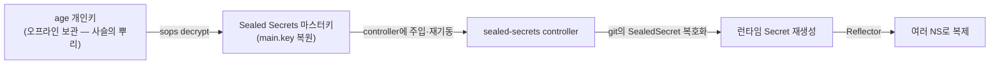

# 런타임 시크릿 DR 절차 (복구 런북)

> 클러스터를 잃었을 때 git의 암호화된 시크릿을 **다시 복호화 가능한 상태로** 되돌리는 순서. **복구는 순서가 곧 안전망**이다 — 체인을 거꾸로 따라간다.
> 도구별 상세 → [sealed-secrets.md](./sealed-secrets.md) · [sops-age.md](./sops-age.md) · [reflector.md](./reflector.md) · 큰 그림 → [secrets-management.md](./secrets-management.md)

## 신뢰의 사슬 — 무엇이 무엇을 푸나

평소 시크릿이 git에서 클러스터로 흐르는 길을 **거꾸로** 복구한다. 끝에서부터 거슬러 올라가면:



| 단계 | 무엇이 잠겨 있나 | 무엇으로 푸나 |
|---|---|---|
| 0 | (사람이 가진 것) | **age 개인키** — 오프라인 보관처에서 확보 |
| 1 | `main.key.enc.yaml` (마스터키 백업) | age 개인키로 **SOPS 복호화** |
| 2 | git의 모든 `SealedSecret` | 복원한 **마스터키 + controller** |
| 3 | NS별 사본 | **Reflector** annotation |

> 🔑 **모든 게 age 개인키 하나로 모인다.** 이게 없으면 어떤 것도 못 푼다 → 그래서 age 개인키를 **오프라인·다중 보관**하는 게 DR의 전부.

## 사전 준비 (평소에 해둘 것)

복구는 "평소 백업이 있었나"로 결정된다. 다음을 **정기적으로**(특히 Sealed Secrets 키 갱신 30일 주기마다) 갱신:

- [ ] `main.key.enc.yaml` — Sealed Secrets 마스터키 전부를 age로 암호화한 백업 (→ [sops-age.md](./sops-age.md#%EC%9D%B4-%EC%8A%A4%ED%83%9D%EC%97%90%EC%84%9C%EC%9D%98-%EB%91%90-%EA%B0%80%EC%A7%80-%EC%93%B0%EC%9E%84))
- [ ] **age 개인키** — 클러스터 밖, 오프라인·다중 보관처(예: 금고·비밀관리 HW·분리된 안전 저장소)
- [ ] git 저장소 — 모든 `SealedSecret` 매니페스트(이미 git에 있음)
- [ ] (선택) 복구 리허설 기록 — 아래 절차를 실제로 한 번 돌려보고 시간을 재둔다

```bash
# 마스터키 백업 + age 암호화 (키 갱신 때마다 다시)
kubectl get secret -n kube-system \
  -l sealedsecrets.bitnami.com/sealed-secrets-key -o yaml > main.key
sops encrypt main.key > main.key.enc.yaml && shred -u main.key
```

## 복구 절차 — 새 클러스터에서

전제: 새 클러스터가 떠 있고, `kubectl` 접근이 되며, age 개인키 파일을 손에 넣었다.

### 1. age 개인키 확보 · SOPS로 마스터키 복호화

```bash
export SOPS_AGE_KEY_FILE=/secure/age.key       # 오프라인 보관처에서 가져온 개인키
sops decrypt main.key.enc.yaml > main.key      # Sealed Secrets 마스터키 평문 복원 (안전한 호스트에서만)
```

### 2. 마스터키를 클러스터에 주입 · controller 재기동

```bash
# sealed-secrets controller가 설치돼 있어야 함(Helm/매니페스트). 그 위에 옛 키를 얹는다.
kubectl apply -f main.key                                  # kube-system에 옛 sealing key 복원
kubectl delete pod -n kube-system -l name=sealed-secrets-controller   # 재기동 → 복원된 키를 로드
shred -u main.key                                          # 평문 마스터키 즉시 파기
```

> ⚠️ **순서 주의**: controller가 옛 키를 가지기 *전에* SealedSecret을 apply하면 "no key could decrypt"로 실패한다. **키 주입 → 재기동 → 그 다음 SealedSecret**.

### 3. git의 SealedSecret 동기화 → 런타임 Secret 재생성

```bash
# GitOps면 ArgoCD가 자동 sync. 수동이면:
kubectl apply -f <repo>/.../sealed-secrets/        # SealedSecret들 적용
kubectl get sealedsecret -A
kubectl get secret -A | grep <복호화돼 나와야 할 이름>   # controller가 만든 런타임 Secret 확인
```

### 4. (필요 시) Reflector 복제 확인

```bash
kubectl get secret -A | grep <복제 대상>           # 사본이 대상 NS들에 다시 생겼나
# 원본만 복구되면 Reflector가 annotation 따라 사본을 자동 재생성한다 (→ reflector.md)
```

## 부분 장애 시나리오 (전체 재구축이 아닐 때)

| 상황 | 해야 할 일 |
|---|---|
| controller만 죽음(키·데이터 살아있음) | controller 재기동만 → SealedSecret 자동 재복호화 |
| 한 SealedSecret만 복호화 실패 | name/NS·스코프 확인, 해당 위치로 **다시 seal**(→ [sealed-secrets.md 스코프](./sealed-secrets.md#%EC%8A%A4%EC%BD%94%ED%94%84--%EC%95%94%ED%98%B8%EB%AC%B8%EC%9D%84-%EC%96%B4%EB%94%94%EA%B9%8C%EC%A7%80-%EC%9E%AC%EC%82%AC%EC%9A%A9%ED%95%A0-%EC%88%98-%EC%9E%88%EB%82%98-%ED%95%A8%EC%A0%95-%EC%A3%BC%EC%9D%98)) |
| controller도 클러스터도 없는데 값만 급히 봐야 함 | `kubeseal --recovery-unseal --recovery-private-key main.key < sealed.yaml` (오프라인 복호화) |
| 마스터키만 분실(클러스터는 살아있음) | 새 키로 controller 재구성 후 **모든 SealedSecret을 새 키로 다시 seal**(`--re-encrypt`) — 옛 암호문은 폐기 |

## 절대 피할 것

- ❌ **age 개인키를 클러스터 안에만** 두기 → 클러스터를 잃으면 복구 키도 같이 잃는다. 반드시 **밖에·오프라인**.
- ❌ **백업을 한 곳에만** 두기 → 단일 실패점. age recipient를 복수로(팀원+DR) 두거나 보관처를 다중화.
- ❌ **키 갱신 후 백업 방치** → 30일마다 새 키가 추가되므로, 그 사이 만든 SealedSecret은 옛 백업으론 복구 안 됨.
- ❌ **복구 리허설 없이 믿기** → 실제로 한 번 돌려보지 않은 DR 절차는 없는 것과 같다.

## 시험·실무 팁

- **CKA 범위 아님.** 다만 etcd 백업/복구(→ [06_cluster-ops](../06_cluster-ops/))와 **사고방식이 같다** — "무엇을, 어디에, 어떤 순서로 복원하나". 시크릿 DR은 거기에 "복호화 키 사슬"이 한 겹 더 있는 것.
- **온프렘이 복잡한 이유가 여기 다 모인다** — 클라우드면 KMS가 "키의 키"를 관리형으로 지켜주지만, 온프렘은 age 개인키 보관·백업·리허설을 **사람이 직접** 책임진다([secrets-management.md](./secrets-management.md) 참고).
- DR 절차서는 **실제 키 위치·보관처·담당자**를 적어 별도 안전 문서로도 둔다(이 공개 노트엔 절차만, 비밀은 안 적는다).

## 참고

- [Sealed Secrets — 백업·복구(FAQ)](https://github.com/bitnami-labs/sealed-secrets/blob/main/site/content/docs/latest/reference/faq.md)
- [SOPS](https://getsops.io/docs/) · [age](https://github.com/FiloSottile/age)
- 같은 폴더: [secrets-management.md](./secrets-management.md) · [sealed-secrets.md](./sealed-secrets.md) · [sops-age.md](./sops-age.md) · [reflector.md](./reflector.md)
