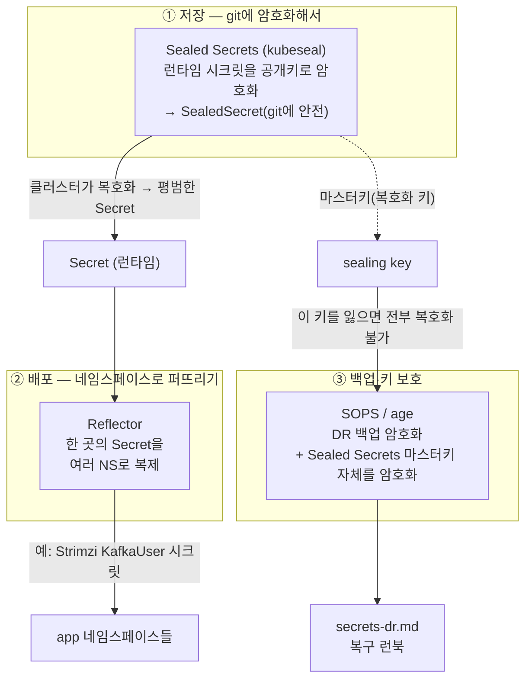

# GitOps 시크릿 관리 — 전체 그림

> "시크릿을 어떻게 **git에 안전하게 두고, 클러스터로 배포하고, 잃어버리지 않게 백업·복구하나**"를 한 장에 정리한다.
> 각 도구 깊은 내용은 전용 문서로 → [sealed-secrets.md](./sealed-secrets.md) · [sops-age.md](./sops-age.md) · [reflector.md](./reflector.md) · [secrets-dr.md](./secrets-dr.md)

## 문제 — GitOps인데 시크릿은 git에 평문으로 못 둔다

GitOps는 "git이 단일 소스(single source of truth)"가 원칙이다. 그런데 DB 비밀번호·API 키 같은 **시크릿을 평문 YAML로 git에 올릴 순 없다.** (k8s 기본 `Secret`은 그냥 **base64**일 뿐 암호화가 아니다 — 누구나 디코드.) 그래서 **암호화한 채로 git에 두고, 클러스터 안에서만 복호화**하는 도구들이 필요하다.

이 스택은 그 문제를 **세 단계 + 복구 절차**로 나눠 푼다.



## 세 도구가 맡는 역할 (헷갈리지 말 것)

| 도구 | 한 줄 정체 | 무엇을 암호화/이동하나 | 어디서 푸나 |
|---|---|---|---|
| **Sealed Secrets** | 런타임 시크릿을 **git에 암호화 저장** | 평문 Secret → `SealedSecret`(비대칭 암호) | 클러스터 안 controller가 마스터키로 자동 복호화 |
| **Reflector** | 이미 만들어진 Secret을 **NS 간 복제** | 암호화 아님 — 복사·동기화 | 클러스터 안에서 annotation 보고 자동 |
| **SOPS / age** | **백업·키 보호용** 파일 암호화 | DR 백업, 그리고 **Sealed Secrets 마스터키 자체** | 사람이 age 개인키로 복호화(복구 시) |

> ⚠️ **자주 헷갈리는 점:**
> - Sealed Secrets와 SOPS는 *경쟁 도구가 아니라 층이 다르다.* Sealed Secrets는 클러스터가 자동으로 푸는 **런타임 워크플로**, SOPS/age는 사람이 **백업·복구·키 보호**용으로 쓴다.
> - **Reflector는 암호화와 무관**하다. "한 NS에서 만든 Secret을 다른 NS도 써야 할 때" 복제만 한다(예: 공용 TLS, Strimzi가 만든 KafkaUser 시크릿).

## 왜 이 조합인가 — 각 결정의 이유

### ① Sealed Secrets — git에 암호화 저장
- 클러스터마다 controller가 **공개/개인 키쌍**을 갖는다. `kubeseal`이 **공개키로** 시크릿을 암호화 → 결과물(`SealedSecret`)은 git에 올려도 안전(공개키로는 못 푼다).
- 클러스터 안 controller만 **개인키(sealing/마스터키)** 로 복호화 → 평범한 `Secret`을 만든다.
- 그래서 **GitOps와 궁합이 좋다** — 암호화된 매니페스트를 ArgoCD가 그대로 동기화하고, 복호화는 클러스터가 알아서.

### ② Reflector — NS 간 복제
- k8s `Secret`은 **네임스페이스에 갇힌다.** 같은 시크릿을 여러 NS가 쓰려면 복제가 필요.
- Reflector는 원본 Secret의 annotation을 보고 대상 NS로 **자동 복제·동기화**한다.
- **이 스택의 사례**: Strimzi가 발급한 **KafkaUser 시크릿**(특정 NS에 생성)을 이를 쓰는 앱 NS들로 복제.

### ③ SOPS / age — 백업과 "키의 키"
- **DR 백업**: 런타임 시크릿/구성을 클러스터 밖에 안전 보관하려면 암호화가 필요 → SOPS가 YAML/JSON을 **age 키로** 암호화(값만 암호화, 키 이름은 평문이라 diff·리뷰 가능).
- **마스터키 보호(핵심)**: Sealed Secrets의 **개인키(sealing key)를 잃으면 git의 모든 SealedSecret을 영영 못 푼다.** 그래서 그 마스터키 자체를 **SOPS/age로 암호화해 따로 백업**한다 → "키를 지키는 키".
- **age를 쓰는 이유**: GPG보다 단순한 최신 파일 암호화 도구. 키 관리가 가볍고 SOPS와 잘 붙는다.

### ④ DR 절차 — 복구 순서가 곧 안전망
런타임 시크릿 DR은 **복구 순서**가 핵심이다(잘못된 순서면 복호화 체인이 끊긴다). 큰 흐름:

```
age 개인키 확보(오프라인 보관처)
  → SOPS로 Sealed Secrets 마스터키 복호화·복원
    → sealed-secrets controller에 마스터키 주입(재기동)
      → git의 SealedSecret들이 다시 복호화돼 런타임 Secret 재생성
        → (필요 시) Reflector가 NS로 재복제
```

자세한 단계별 런북 → [secrets-dr.md](./secrets-dr.md)

## 점검 체크리스트

```bash
# Sealed Secrets — controller / 마스터키 상태
kubectl -n kube-system get pods -l name=sealed-secrets-controller
kubectl -n kube-system get secret -l sealedsecrets.bitnami.com/sealed-secrets-key   # 마스터키(절대 평문 유출 금지)
kubectl get sealedsecret -A                       # git→클러스터로 동기화됐나
kubectl get secret -A | grep <복호화돼 나와야 할 이름>   # 복호화된 런타임 Secret 존재?

# Reflector — 복제가 됐나
kubectl get secret -A | grep <복제 대상 이름>      # 대상 NS들에 사본이 있나
# 원본 Secret의 reflector annotation 확인
kubectl get secret <name> -n <src-ns> -o jsonpath='{.metadata.annotations}'

# SOPS/age — 백업 파일은 git/저장소에 .enc로만 (평문 없는지)
sops --decrypt backup.enc.yaml   # 복구 리허설 시에만, 안전한 환경에서
```

| 증상 | 흔한 원인 | 확인 |
|---|---|---|
| SealedSecret 만들었는데 Secret 안 생김 | 다른 클러스터의 공개키로 sealing / scope 불일치 | controller 로그, `kubeseal --fetch-cert`로 현재 키 확인 |
| 클러스터 재구축 후 전부 복호화 실패 | **마스터키 미복원** | DR 절차대로 age→SOPS로 마스터키 복원 후 controller 재기동 |
| 복제본이 안 생기거나 안 갱신됨 | Reflector annotation 누락/오타, 대상 NS 미허용 | 원본 annotation, Reflector 로그 |
| 백업을 못 푼다 | age 개인키 분실 | 오프라인 보관처 — 분실 시 복구 불가(그래서 다중 보관) |

## 시험·실무 팁

- **CKA 범위 아님.** 시험에서 다루는 건 기본 `Secret`(base64) 개념이다(→ [03_workloads-scheduling](../03_workloads-scheduling/)). 이 문서는 **실무 GitOps 시크릿** 정리.
- **`Secret`은 암호화가 아니라 base64**라는 점을 늘 기억하라 — 이게 이 모든 도구가 존재하는 이유다. (클러스터 etcd 레벨 암호화는 또 별개: `EncryptionConfiguration`.)
- **마스터키·age 개인키 백업이 전부다.** 시크릿 도구의 안전성은 "그 키를 어디에 어떻게 백업했나"로 결정된다. 키 분실 = 복구 불가.
- **층을 분리해 생각하라** — 저장(Sealed Secrets) / 배포(Reflector) / 백업·키보호(SOPS·age). 문제가 나면 어느 층인지부터 가른다.
- EKS 실무에선 이 자리를 **External Secrets Operator + AWS Secrets Manager/Parameter Store**로 가는 경우가 많다(클라우드 KMS에 위임) → [09_aws-eks](../09_aws-eks/).

## 참고

- [Sealed Secrets (bitnami-labs)](https://github.com/bitnami-labs/sealed-secrets)
- [SOPS (getsops)](https://github.com/getsops/sops) · [age](https://github.com/FiloSottile/age)
- [Reflector (emberstack)](https://github.com/emberstack/kubernetes-reflector)
- [Kubernetes — Secret은 암호화가 아니다(주의)](https://kubernetes.io/docs/concepts/configuration/secret/#risks) · [etcd 저장 암호화](https://kubernetes.io/docs/tasks/administer-cluster/encrypt-data/)
