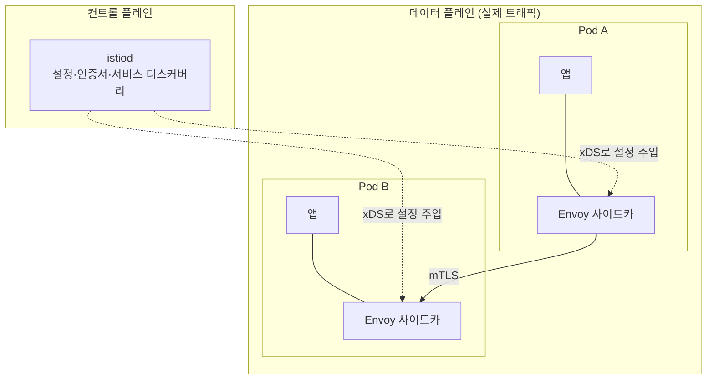

# 서비스 메시 (Service Mesh) — Istio · Envoy

> CKA 범위 **밖**이지만 **EKS 실무**에선 흔히 만난다. 관련: north-south 입구는 [`04`의 ingress.md](../04_services-networking/ingress.md) · [gateway-api.md](../04_services-networking/gateway-api.md)

## 개념 — 서비스 메시란

> **서비스 ↔ 서비스 통신(east-west)에 트래픽 제어·보안·관측을 앱 코드 수정 없이 얹어주는 인프라 계층.**

마이크로서비스가 많아지면 "재시도·타임아웃·mTLS·트레이싱"을 **앱마다 직접 구현**하기 벅차다. 이걸 **앱 밖(프록시)으로 빼서** 공통 인프라로 제공하는 게 서비스 메시다.

핵심은 north-south(입구)와 east-west(내부)를 나눠 보는 것:

| | 방향 | 역할 | 도구 |
|---|---|---|---|
| **Ingress / Gateway** | **north-south** (외부 → 클러스터) | 입구 라우팅 | ingress-nginx, Gateway API |
| **서비스 메시** | **east-west** (서비스 ↔ 서비스, 내부) | 내부 통신 제어·보안·관측 | **Istio**, Linkerd 등 |

## 어떻게 동작하나 — 데이터/컨트롤 플레인

Istio는 [Envoy](../04_services-networking/ingress.md) 프록시를 **모든 Pod 옆에 사이드카로** 꽂아, 그 Pod가 주고받는 **모든 트래픽이 Envoy를 거치게** 한다(앱은 모름). 그 수많은 Envoy를 **중앙에서 설정**하는 게 `istiod`.

- **데이터 플레인** = Envoy들 (트래픽이 실제로 지남)
- **컨트롤 플레인** = `istiod` (Envoy들에게 xDS로 라우팅·인증서·정책을 밀어넣음)

## 뭘 주나 — 3대 기능

| 영역 | 내용 | 핵심 리소스 |
|---|---|---|
| **트래픽 관리** | 카나리/A·B 배포, 가중치 분할, 재시도·타임아웃, 서킷브레이커, 장애 주입 | `VirtualService`, `DestinationRule` |
| **보안** | 서비스 간 **자동 mTLS**, 인증/인가 정책, 워크로드 신원(SPIFFE) | `PeerAuthentication`, `AuthorizationPolicy` |
| **관측성** | 메트릭·분산 트레이싱·액세스 로그 **자동**(모든 트래픽이 Envoy를 지나니까) | (자동) |

→ 이걸 **앱 수정 없이** 얻는 게 핵심 가치.

## Envoy와의 관계

- **Envoy** = 트래픽이 실제로 지나는 **프록시 본체(데이터 플레인)**. Lyft가 만든 C++ L7 프록시, CNCF 졸업. xDS API로 **런타임 동적 설정**(nginx의 reload 방식과 대비)·재시도·서킷브레이커·mTLS·관측이 1급 기능.
- **Istio** = 그 Envoy 수십·수백 개를 **프로그래밍하는 컨트롤 플레인** + 메시 기능. **Envoy 없인 Istio도 없다.**
- Envoy는 메시 밖에서도 쓰인다 — **Envoy 기반 게이트웨이**(Contour·Emissary·Gloo·Envoy Gateway)가 ingress-nginx의 nginx 자리를 대신하는 식. ([04 전체 그림](../04_services-networking/ingress.md#전체-그림--요청이-거치는-계층)의 Controller 박스를 Envoy가 채우는 것)

## 사이드카 vs 앰비언트

| 모드 | 구조 | 특징 |
|---|---|---|
| **사이드카(클래식)** | Pod마다 Envoy 1개 | 강력하지만 **리소스 오버헤드** 큼 |
| **앰비언트(ambient, 신형)** | 노드 단위 **ztunnel(L4)** + 필요 시 **waypoint(L7)** | 사이드카 없이 더 가볍게. 최근 흐름 |

## oauth2-proxy·인증과 겹치는 영역

메시는 **east-west 인증/인가**도 한다 — Istio `AuthorizationPolicy`나 Envoy `ext_authz` 필터로 "이 요청 통과?"를 외부 인증 서비스(OPA 등)에 묻는다. 이는 [04에서 본](../04_services-networking/oauth2-proxy.md) ingress-nginx `auth-url`(auth_request) 패턴의 메시 버전. 즉 **north-south는 ingress+oauth2-proxy, east-west는 메시**가 비슷한 인증 패턴을 각자 계층에서 수행.

## 언제 도입하나 — 현실적 주의

- 강력하지만 **복잡하고 운영 부담이 크다.** 컨트롤 플레인·사이드카·인증서·디버깅 난이도가 다 올라간다.
- **작은 클러스터엔 과하다.** 서비스 수가 많고 **통신 보안(mTLS)·세밀한 트래픽 제어(카나리)·전구간 관측**이 절실할 때 도입.
- **EKS 실무**에선 흔함 — 멀티 서비스 환경에서 보안·관측을 표준화하려고 얹는다.

## 대안 / 생태계

| 도구 | 특징 |
|---|---|
| **Istio** | 기능 최다·생태계 최대. 가장 널리 쓰임(↔ 복잡) |
| **Linkerd** | **가벼움·단순** 지향. 자체 Rust 마이크로프록시(Envoy 미사용). CNCF 졸업 |
| **Cilium** | **eBPF** 기반 CNI + 메시 기능. 사이드카 없이 커널 레벨에서, L7은 Envoy 활용 |
| **Consul** | HashiCorp. Envoy 기반, 멀티클라우드/VM 혼합에 강점 |

> AWS는 관리형 **App Mesh**(Envoy 기반)를 제공했으나 그 방향에서 물러나는 추세 → EKS에선 Istio 등 오픈소스 메시 직접 운용이 일반적. 도입 전 최신 지원 상태를 확인할 것.

## 참고

- [Istio 공식 문서](https://istio.io/latest/docs/)
- [Istio — Ambient Mesh](https://istio.io/latest/docs/ambient/)
- [Envoy 공식 문서](https://www.envoyproxy.io/docs)
- [Linkerd](https://linkerd.io/) · [Cilium Service Mesh](https://cilium.io/use-cases/service-mesh/)
- 관련 → [04 ingress.md](../04_services-networking/ingress.md) · [04 gateway-api.md](../04_services-networking/gateway-api.md) · [04 oauth2-proxy.md](../04_services-networking/oauth2-proxy.md)
