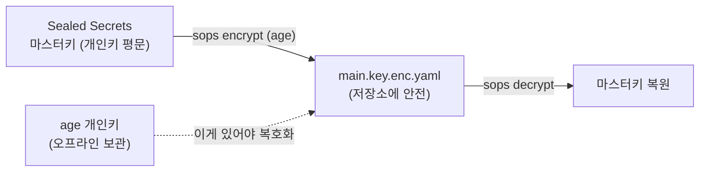

# SOPS / age — 백업 암호화 + "키를 지키는 키"

> SOPS는 **YAML/JSON의 값만 암호화**해(키 이름은 평문 → diff·리뷰 가능) git에 두는 도구, age는 그 암호화에 쓰는 **가볍고 단순한 키**다.
> 이 레포 스택에서의 역할은 둘 — ① **DR 백업** 암호화, ② **[Sealed Secrets](./sealed-secrets.md)의 마스터키 자체를 암호화**("키를 지키는 키").
> 큰 그림 → [secrets-management.md](./secrets-management.md) · 복구 런북 → [secrets-dr.md](./secrets-dr.md)

## SOPS와 age는 무엇이고 왜 같이 쓰나

| 도구 | 정체 | 역할 |
|---|---|---|
| **SOPS** (Secrets OPerationS) | 암호화 파일 *편집기* | YAML/JSON/ENV/INI의 **값(value)만** 암호화. 키 이름·구조는 평문으로 둔다 → git diff·코드리뷰가 됨 |
| **age** | 단순 현대 암호화 도구 | SOPS가 쓸 수 있는 백엔드 중 하나. GPG보다 키 관리가 가볍다. 키쌍 1개면 끝 |

> SOPS는 **백엔드 여러 개**를 지원한다 — age, PGP, **AWS KMS / GCP KMS / Azure Key Vault**, HashiCorp Vault. 클라우드면 KMS에 위임하지만, **온프렘은 관리형 KMS가 없어 age로 키를 자체 관리**한다(이게 온프렘이 더 손이 가는 핵심 이유 → 맨 아래 참고).

### Sealed Secrets와 뭐가 다른가 (헷갈리지 말 것)

| | Sealed Secrets | SOPS / age |
|---|---|---|
| 누가 복호화? | **클러스터 controller가 자동** | **사람이 age 개인키로** (CI·복구 시) |
| 무엇을 암호화? | 전체 Secret → `SealedSecret` | 파일의 **값만** (키는 평문) |
| 주 용도 | **런타임** 시크릿을 git→클러스터로 흘리기 | **백업·DR·키 보호**, 사람이 다루는 설정 |
| 결과물 가독성 | 통째로 암호문(diff 어려움) | 키는 보이고 값만 암호 → **diff·리뷰 잘 됨** |

→ 경쟁 도구가 아니라 **층이 다르다.** Sealed Secrets는 런타임 워크플로, SOPS/age는 그 밑을 받치는 백업·키보호.

## age 키 만들기

```bash
age-keygen -o age.key
# 출력 예:
#   Public key: age1ql3z7hjy54pw3hyww5ayyfg7zqgvc7w3j2elw8zmrj2kg5sfn9aqmcac8r   ← 암호화용(공개, 공유 OK)
# age.key 파일 안엔 AGE-SECRET-KEY-... (개인키) → 절대 유출 금지·오프라인 보관
```

- **공개키(`age1...`)** 로 암호화 → 누구나 잠글 수 있다.
- **개인키(`AGE-SECRET-KEY-...`)** 로만 복호화 → 이 키가 곧 복구 능력. **이 개인키를 잃으면 SOPS로 암호화한 모든 게 영영 못 풀린다.**

## 기본 사용 — 암호화 / 복호화 / 제자리 편집

```bash
export SOPS_AGE_RECIPIENTS=age1ql3z7hjy54pw3hyww5ayyfg7zqgvc7w3j2elw8zmrj2kg5sfn9aqmcac8r

# 암호화 (값만 암호화됨 → git에 .enc.yaml 커밋)
sops encrypt secret.yaml > secret.enc.yaml

# 복호화 (개인키 위치를 SOPS_AGE_KEY_FILE로 알려준다)
export SOPS_AGE_KEY_FILE=$HOME/age.key
sops decrypt secret.enc.yaml > secret.yaml

# 제자리 편집 — 열면 복호화해서 에디터로, 저장하면 다시 암호화 (제일 많이 씀)
sops secret.enc.yaml
```

암호화된 파일은 이렇게 생긴다 — **키는 평문, 값만 암호문**이라 어디가 바뀌었는지 리뷰가 된다:

```yaml
database:
    host: db.internal          # 평문 (민감하지 않음 → encrypted_regex로 제외 가능)
    password: ENC[AES256_GCM,data:9j2k...,iv:...,tag:...,type:str]   # 값만 암호화
sops:
    age:
        - recipient: age1ql3z7...
          enc: |
            -----BEGIN AGE ENCRYPTED FILE-----
            ...
    mac: ENC[...]              # 파일 전체 무결성(변조 감지)
```

## `.sops.yaml` — 규칙으로 자동 적용

매번 recipient를 지정하지 않게, 저장소 루트에 `.sops.yaml`을 두면 **경로 패턴별로 어떤 키로 암호화할지**가 자동 적용된다:

```yaml
# .sops.yaml
creation_rules:
  # secrets/ 밑 yaml은 이 age 공개키들로 암호화 (여러 명이면 누구 키로든 복호화 가능)
  - path_regex: secrets/.*\.yaml$
    age: >-
      age1ql3z7hjy54pw3hyww5ayyfg7zqgvc7w3j2elw8zmrj2kg5sfn9aqmcac8r,
      age1qe5lxzzeppw5k79vxn3872272sgy224g2nzqlzy3uljs84say3yqgvd0sw
    # 민감한 키만 골라 암호화하고 싶으면:
    encrypted_regex: '^(data|stringData|password|token)$'
```

- **recipient를 여러 개** 넣으면 그중 **아무 개인키로나** 복호화된다 → 팀원·DR 키를 함께 등록해 "한 사람만 풀 수 있는" 단일 실패점을 없앤다.
- `encrypted_regex`(또는 `unencrypted_regex`)로 **어떤 필드를 암호화할지** 고른다. 안 주면 모든 값 암호화.

## 이 스택에서의 두 가지 쓰임

### ① DR 백업 암호화
런타임 시크릿/구성의 백업을 클러스터 밖에 보관할 때 평문이면 안 된다 → SOPS로 암호화한 `.enc.yaml`로 보관. 키 이름이 보이니 "무엇을 백업했는지"는 리뷰되고 값만 가려진다.

### ② Sealed Secrets 마스터키 보호 — "키를 지키는 키"
[Sealed Secrets](./sealed-secrets.md)의 안전성은 마스터키(sealing key) 백업에 달려 있는데, 그 백업(`main.key`) 자체가 **개인키 평문**이라 그냥 두면 안 된다. 그래서 한 겹 더 — **age로 암호화**해 보관한다:

```bash
# 1) Sealed Secrets 마스터키 전부 백업 (개인키 평문 — 위험)
kubectl get secret -n kube-system \
  -l sealedsecrets.bitnami.com/sealed-secrets-key -o yaml > main.key

# 2) 그 백업을 age로 암호화 → 이제 git/저장소에 둬도 안전
sops encrypt main.key > main.key.enc.yaml
shred -u main.key                       # 평문 즉시 파기

# 복구 시: age 개인키로 풀어서 클러스터에 되돌린다 (→ secrets-dr.md)
```



> 결국 신뢰의 뿌리는 **age 개인키 하나**로 모인다. 이걸 안전히(오프라인·다중 보관) 지키는 게 전부.

## 점검 / 트러블슈팅

```bash
sops decrypt --extract '["database"]["password"]' secret.enc.yaml  # 특정 값만 꺼내 확인
sops updatekeys secret.enc.yaml      # .sops.yaml의 recipient가 바뀌었을 때 기존 파일 키 갱신
```

| 증상 | 원인 | 해결 |
|---|---|---|
| `no matching creation rules` | `.sops.yaml` 경로 패턴 불일치 | `path_regex` 확인, 파일 위치/이름 |
| 복호화 시 `no key could decrypt` | 내 age 개인키가 recipient에 없음 | 그 파일 recipient에 내 공개키 추가 후 `updatekeys`, 또는 올바른 키 파일(`SOPS_AGE_KEY_FILE`) |
| MAC mismatch | 암호문을 손으로 편집함 | 직접 편집 금지 — 항상 `sops <file>`로 열고 저장 |
| 값이 통째로 암호화돼 diff 안 됨 | `encrypted_regex` 없이 전체 암호화 | 민감 필드만 `encrypted_regex`로 지정 |

## 시험·실무 팁

- **CKA 범위 아님**(부가 도구).
- **age 개인키 백업이 전부.** SOPS/age 안전성은 "그 개인키를 어디에 어떻게(오프라인·다중) 보관했나"로 결정된다 — Sealed Secrets 마스터키와 똑같은 원칙이 한 단계 위에 또 있는 셈.
- **git엔 항상 `.enc.*`만.** pre-commit 훅 등으로 평문 커밋을 막는 게 실무 표준.
- **클라우드라면 age 대신 KMS.** EKS에선 SOPS의 `kms`(AWS KMS) 백엔드나 아예 **External Secrets Operator + Secrets Manager**로 가서 키 관리를 클라우드에 위임한다 → 온프렘이 손이 더 가는 이유([secrets-management.md](./secrets-management.md) 참고). → [09_aws-eks](../09_aws-eks/).

## 참고

- [SOPS 공식 (getsops.io)](https://getsops.io/docs/) · [getsops/sops (GitHub)](https://github.com/getsops/sops)
- [age (FiloSottile/age)](https://github.com/FiloSottile/age)
- 같은 폴더: [secrets-management.md](./secrets-management.md) · [sealed-secrets.md](./sealed-secrets.md) · [reflector.md](./reflector.md) · [secrets-dr.md](./secrets-dr.md)
