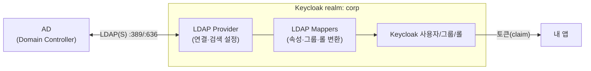
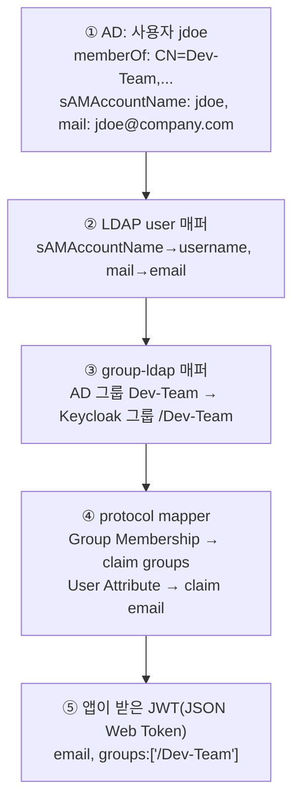

# Keycloak ↔ AD 연동 (User Federation / LDAP)

> [concepts.md](./concepts.md)의 **경계 ①** — "Keycloak이 AD에서 사용자 정보를 어떻게 받아서, 어떻게 앱까지 내려주나" 를 끝까지 따라간다.
> 전제 개념(realm·client·토큰)은 [concepts.md](./concepts.md)를 먼저 보면 좋다.

---

## 한 줄 정리

**Keycloak은 사용자를 자기가 만들지 않고, realm에 등록한 LDAP(Lightweight Directory Access Protocol, 디렉터리 조회·인증 프로토콜)/AD(Active Directory, 윈도우 도메인의 사용자 디렉터리) 연결(User Federation)을 통해 AD를 "사용자 저장소"로 빌려 쓴다.** 로그인 검증은 AD에 위임하고, AD 속성·그룹은 **매퍼**로 Keycloak 모델에 옮긴 뒤, **protocol mapper**로 토큰에 실어 앱에 내려준다.



---

## 전체 사슬 — AD 그룹이 앱까지 가는 길

이게 사용자가 가장 궁금해하는 부분. **5단계**로 끊어 보면 명확하다.



| 단계 | 무슨 일 | 설정 위치 |
|------|------|------|
| ① AD | 사용자·그룹의 **원본**(source of truth) | AD/도메인 컨트롤러 |
| ② 속성 매핑 | AD 속성 → Keycloak 사용자 필드 | LDAP **user 매퍼** |
| ③ 그룹 매핑 | AD 그룹(`memberOf`) → Keycloak 그룹 | LDAP **group 매퍼** |
| ④ 토큰 매핑 | Keycloak 그룹·속성 → 토큰 claim | client **protocol mapper** ([concepts.md](./concepts.md)) |
| ⑤ 앱 | claim만 보고 인가 | 내 앱 코드 |

> 핵심: **②③은 "AD→Keycloak"(이 문서), ④는 "Keycloak→앱"([concepts.md](./concepts.md)).** 두 매핑이 따로 있다는 걸 분리해 기억하면 디버깅이 쉽다 — claim이 안 오면 "AD에서 못 가져왔나(②③)" vs "토큰에 안 실었나(④)" 를 나눠 본다.

---

## 인증은 누가? — AD에 위임, 비밀번호는 안 가져온다

| | 어디서 처리 |
|------|------|
| **비밀번호 검증** | Keycloak이 로그인 시 **사용자 자격으로 AD에 LDAP bind** → 성공하면 인증 OK |
| **비밀번호 저장** | **AD에만.** Keycloak은 import해도 비번은 복제하지 않음 |
| **속성·그룹** | AD에서 읽어와 Keycloak에 반영(매퍼 따라) |

> 즉 AD가 **항상 인증의 진실**이다. AD에서 계정을 잠그거나 비번을 바꾸면 그게 곧 적용된다(아래 MSAD(Microsoft Active Directory) 매퍼가 계정 비활성/만료도 반영).

---

## LDAP Provider 설정 — 연결과 검색

realm → **User Federation → Add LDAP provider**. Vendor를 **Active Directory**로 고르면 AD에 맞는 기본값이 자동으로 채워진다(아래 값들은 그 프리셋 기준 — 환경마다 다를 수 있으니 인프라/AD 팀 값으로 확인).

### 먼저 — AD/LDAP 이름·속성 용어

설정 값에 나오는 `CN=...,OU=...,DC=...`와 `sAMAccountName` 같은 이름들의 정체. AD의 모든 객체는 **DN(Distinguished Name, 고유 경로)** 으로 식별되는데, **파일 절대경로와 비슷하되 오른쪽이 뿌리**다.

```
CN=John Doe, OU=Users, OU=Seoul, DC=company, DC=com
└─객체 본인─┘ └────── 담긴 위치(폴더) ──────┘ └─ 도메인 company.com ─┘
```

**① DN을 이루는 경로 조각**

| 조각 | 풀이 | 뜻 | 비유 |
|------|------|------|------|
| **CN** | Common Name | 객체 자신의 이름 | 파일명 |
| **OU** | Organizational Unit | 객체가 담긴 조직 단위(컨테이너) | 폴더 |
| **DC** | Domain Component | 도메인을 점(.)으로 쪼갠 조각 | `company.com` → `DC=company,DC=com` |

**② 사용자/그룹 객체의 속성(attribute)**

| 속성 | 뜻 | 예 |
|------|------|------|
| **sAMAccountName** | 윈도우 옛(2000 이전) 로그인 ID. 짧고(≤20자) 도메인 내 유일. `sAM`=*Security Account Manager* | `jdoe` |
| **userPrincipalName** (UPN) | 이메일 모양의 로그인 ID | `jdoe@company.com` |
| **mail** | 이메일 주소 | `jdoe@company.com` |
| **objectGUID** | 변하지 않는 고유 ID(이름 바뀌어도 동일) | (16바이트 바이너리) |
| **memberOf** | (사용자가) 속한 그룹들 | `CN=Dev-Team,OU=...` |
| **member** | (그룹의) 구성원들 | 사용자 DN 목록 |

> 💡 Keycloak이 "로그인 ID로 쓸 속성"을 고를 때 AD에선 보통 `sAMAccountName`(`jdoe`)이나 `userPrincipalName`(`jdoe@company.com`) 중 하나를 쓴다.

### 연결·검색 설정값

| 항목 | 의미 | AD에서 흔한 값 |
|------|------|------|
| **Connection URL** | AD 주소 | `ldaps://dc.company.com:636` (운영은 **LDAPS(LDAP over TLS, 암호화 LDAP) 권장**) |
| **Bind DN** | Keycloak이 AD를 읽을 **서비스 계정**의 DN | `CN=svc-keycloak,OU=Service,DC=company,DC=com` |
| **Bind credential** | 그 계정 비번 | (시크릿) |
| **Users DN** | 사용자 검색 시작 지점 | `OU=Users,DC=company,DC=com` |
| **Username LDAP attribute** | 로그인 ID로 쓸 속성 | `sAMAccountName` (또는 UPN(User Principal Name) `userPrincipalName`) |
| **RDN LDAP attribute** | 엔트리 상대 이름(RDN, Relative Distinguished Name) | `cn` |
| **UUID LDAP attribute** | 불변 고유 ID(UUID, Universally Unique Identifier — 이름 바뀌어도 추적) | `objectGUID` |
| **User object classes** | 사용자로 볼 객체 | `person, organizationalPerson, user` |

> ⚠️ **운영에선 `ldaps://`(636).** 평문 `ldap://`(389)은 bind 비밀번호가 네트워크에 노출된다. AD가 자체 서명 인증서면 Keycloak에 해당 CA(Certificate Authority, 인증 기관)를 신뢰시켜야 한다(truststore).

> 💡 **`objectGUID`(UUID)가 중요한 이유** — 사용자가 부서 이동으로 DN이 바뀌거나 이름이 바뀌어도 Keycloak이 **같은 사람으로 인식**하게 해주는 불변 키다. 잘못 잡으면 사용자가 중복 생성된다.

---

## Edit Mode & Import — 동기화 방식

| 설정 | 옵션 | 의미 |
|------|------|------|
| **Edit mode** | `READ_ONLY` | Keycloak에서 사용자 수정 불가(AD가 주인). **사내 표준 권장** |
| | `WRITABLE` | Keycloak 변경이 AD로 역기록됨(서비스 계정에 쓰기 권한 필요) |
| | `UNSYNCED` | Keycloak DB에서만 수정, AD엔 반영 안 됨 |
| **Import users** | on | 첫 로그인/동기화 때 사용자를 Keycloak DB로 **복제**(로그인 빨라짐, 검색 편함) |
| | off | 복제 없이 **매번 AD 조회**(항상 최신, AD 부하↑) |

> 대부분 사내 구성은 **`READ_ONLY` + import on** 이 무난하다. AD가 권위를 갖고, Keycloak은 캐시처럼 동작.

### 동기화(Sync)

import on이면 주기적으로 AD와 맞춘다.

| Sync | 동작 |
|------|------|
| **Full sync** | 전체를 다시 읽어 반영(첫 구성·대량 변경 후) |
| **Changed users sync** | AD `whenChanged` 기준으로 바뀐 것만(정기 실행, 가벼움) |

> ⚠️ **삭제 전파 주의** — AD에서 지운 사용자가 Keycloak에 남을 수 있다(설정·버전 따라). 퇴사자 처리 정책은 sync 동작을 확인하고 세운다.

---

## LDAP Mappers — AD 속성/그룹을 Keycloak으로 (경계 ①의 실체)

provider 안에 **Mappers** 탭이 있고, AD vendor 선택 시 기본 매퍼들이 깔린다. 여기가 **②③ 매핑이 실제로 일어나는 곳.**

> **AD에서 무엇을 가져올지는 누가 정하나?** — **능동적 선택은 Keycloak(관리자)** 이 매퍼로 한다. 단 세 관문을 모두 통과해야 가져와진다:
> ① 그 속성이 **AD에 존재·값이 채워져** 있어야(AD 관리자) → ② bind 서비스 계정이 그 속성을 **읽을 권한**이 있어야(AD ACL — 민감 속성은 막힐 수 있음) → ③ Keycloak에 **그 속성용 매퍼**가 있어야. ①②가 막으면 Keycloak이 원해도 못 가져온다.
> - **기본 매퍼**(username·email·이름·groups·MSAD)는 AD vendor 선택 시 자동 생성 → 흔한 정보는 손 안 대도 들어옴.
> - **추가 속성**(예: `department`·`employeeID`)은 관리자가 **user-attribute-ldap-mapper를 직접 추가**해야 한다.
> - 검색 범위도 Keycloak이 **Users DN + object classes/필터**로 좁힌다(디렉터리 전체를 빨아오지 않음).
> - ⚠️ 여기서 가져온다고(경계 ①) 앱이 보는 건 아니다 — **토큰에 싣는 protocol mapper(경계 ②)** 까지 켜야 앱까지 간다 → [concepts.md](./concepts.md).

| Mapper | 종류 | 하는 일 |
|------|------|------|
| `username`, `email`, `first name`, `last name` | **user-attribute-ldap-mapper** | AD 속성 → Keycloak 사용자 필드 (②) |
| `MSAD account controls` | **msad-user-account-control-mapper** | AD 계정 **비활성/잠금/비번 만료** 상태를 Keycloak에 반영 (AD 전용) |
| `groups` | **group-ldap-mapper** | AD 그룹 → Keycloak 그룹 (③) |
| `roles` | **role-ldap-mapper** | AD 그룹/속성 → Keycloak 롤 (선택) |

### Group 매퍼 — AD 그룹을 어떻게 가져오나

가장 중요한 매퍼. 핵심 설정:

| 항목 | 의미 | AD 흔한 값 |
|------|------|------|
| **LDAP Groups DN** | 그룹 검색 시작점 | `OU=Groups,DC=company,DC=com` |
| **Group Name LDAP Attribute** | 그룹 이름 속성 | `cn` |
| **Group Object Classes** | 그룹으로 볼 객체 | `group` |
| **Membership LDAP Attribute** | 멤버십을 담은 속성 | `member` |
| **Membership User LDAP Attribute** | member 값이 가리키는 사용자 키 | `cn`/`distinguishedName` |
| **Mode** | `READ_ONLY` / `LDAP_ONLY` / `IMPORT` | 보통 READ_ONLY |
| **User Groups Retrieve Strategy** | 멤버십 조회 방법 | AD는 **`LOAD_GROUPS_BY_MEMBER_ATTRIBUTE`**(=`memberOf` 활용)가 흔함·빠름 |

> 💡 **AD의 `memberOf`** — AD는 사용자 엔트리에 `memberOf`로 소속 그룹을 들고 있어서, Keycloak이 사용자 한 명의 그룹을 빠르게 안다. 중첩 그룹(그룹 안의 그룹)까지 풀려면 추가 설정(`LOAD_GROUPS_BY_MEMBER_ATTRIBUTE_RECURSIVELY`)이 필요할 수 있다.

> ⚠️ **그룹 매퍼만으론 토큰에 안 나온다.** Keycloak 그룹까지 들어와도, 앱 토큰에 실으려면 client에 **Group Membership protocol mapper**가 따로 있어야 한다([concepts.md](./concepts.md) 경계 ②). 두 매핑은 별개다.

---

## 매퍼를 어디서 설정하나 — 콘솔 vs 코드(kcadm.sh)

매퍼 설정은 **두 군데**에 있다(메뉴가 다름):

| 매퍼 | 경계 | 콘솔(Admin Console) 경로 |
|------|------|------|
| **LDAP 매퍼** | ① | **User federation** → LDAP provider → **Mappers** 탭 |
| **Protocol 매퍼** | ② | **Clients** → client → **Client scopes** → `*-dedicated` → Add mapper |

콘솔 클릭은 탐색·학습엔 좋지만 **명령형이라 재현이 안 된다.** 관리 방법은 콘솔 / Admin REST API / **kcadm.sh(CLI 래퍼)** / Terraform(`keycloak/keycloak`) / Operator(Realm import CRD) 등이 있고, **온프렘 k8s에선 kcadm.sh 스크립트를 ConfigMap에 담아 Job/initContainer로 실행**하는 방식이 흔하다.

### kcadm.sh로 매퍼 걸기

Keycloak 컨테이너의 `/opt/keycloak/bin/kcadm.sh`. 먼저 관리자 세션을 연다.

```bash
kcadm.sh config credentials --server http://localhost:8080 \
  --realm master --user "$KC_ADMIN" --password "$KC_ADMIN_PW"
```

**① LDAP 매퍼** = provider를 부모로 갖는 **component**:

```bash
# LDAP provider의 내부 id 조회
LDAP_ID=$(kcadm.sh get components -r corp \
  --query 'type=org.keycloak.storage.UserStorageProvider' --fields id,name \
  | jq -r '.[] | select(.name=="ldap") | .id')

kcadm.sh create components -r corp \
  -s name=group-mapper \
  -s providerId=group-ldap-mapper \
  -s providerType=org.keycloak.storage.ldap.mappers.LDAPStorageMapper \
  -s parentId=$LDAP_ID \
  -s 'config."groups.dn"=["OU=Groups,DC=company,DC=com"]' \
  -s 'config."group.name.ldap.attribute"=["cn"]'
```

> `providerId`가 매퍼 종류: `user-attribute-ldap-mapper`·`group-ldap-mapper`·`role-ldap-mapper`·`msad-user-account-control-mapper`. config 키는 콘솔 필드명을 점(.) 표기로.

**② Protocol 매퍼** = client에 건다:

```bash
CID=$(kcadm.sh get clients -r corp --query clientId=my-app --fields id | jq -r '.[0].id')
kcadm.sh create clients/$CID/protocol-mappers/models -r corp \
  -s name=groups -s protocol=openid-connect \
  -s protocolMapper=oidc-group-membership-mapper \
  -s 'config."claim.name"=groups' -s 'config."full.path"=false' \
  -s 'config."access.token.claim"=true' -s 'config."id.token.claim"=true'
```

### ⚠️ 멱등 함정 — 그래서 헬퍼 함수가 많아진다

`kcadm.sh create`는 **멱등이 아니다** — 이미 있으면 409로 실패한다. 그래서 ConfigMap 스크립트는 보통 **"있으면 update, 없으면 create"** 헬퍼로 감싼다(재실행 안전성). 사내 스크립트에 함수가 많은 이유가 이것 + UUID 조회·대기 로직이다.

```bash
REALM=corp
# 이름으로 찾아 없으면 create, 있으면 update — Job 재실행해도 안전
ensure_ldap_mapper() {
  local name=$1; shift
  local id
  id=$(kcadm.sh get components -r "$REALM" \
        --query "parent=$LDAP_ID&name=$name" --fields id | jq -r '.[0].id // empty')
  if [ -z "$id" ]; then
    kcadm.sh create components -r "$REALM" -s name="$name" -s parentId="$LDAP_ID" \
      -s providerType=org.keycloak.storage.ldap.mappers.LDAPStorageMapper "$@"
  else
    kcadm.sh update "components/$id" -r "$REALM" "$@"
  fi
}
```

```
Git(.sh) → ConfigMap(스크립트 mount) → Job/initContainer가 Keycloak Pod에서 실행
            → kcadm 헬퍼 함수들이 realm·client·LDAP·매퍼를 멱등 적용
```

> 💡 이 방식은 **콘솔(클릭)과 Terraform(풀 선언형 IaC)의 중간**이다. 스크립트를 git에 둬 리뷰·재현이 되지만, 진짜 선언형이 아니라 **멱등성은 사람이 함수로 보장**해야 한다(그래서 함수가 많다). 완전 선언형을 원하면 Terraform/Operator로 이전 검토.

---

## 검증 — 잘 붙었나 확인 (읽기 전용)

> 클러스터/Keycloak을 바꾸지 않는 확인 위주. 실제 연결·동기화 실행은 관리자가 콘솔에서.

1. **연결 테스트** — provider 설정 화면의 *Test connection* / *Test authentication* 버튼.
2. **사용자 보임?** — realm → Users 에서 AD 사용자가 조회되나(import on이면 sync 후).
3. **속성·그룹 들어왔나** — 사용자 상세에서 email·groups 확인.
4. **토큰에 실리나** — Clients → 내 client → Client scopes → **Evaluate** 로 해당 사용자의 *예상 토큰* 미리보기. 여기 `groups`/`email`이 보이면 앱도 받는다.
5. **앱 입장 확인** — discovery 문서로 엔드포인트 확인:
   `https://keycloak.company.com/realms/corp/.well-known/openid-configuration`

---

## 트러블슈팅 (증상 → 원인 → 해결)

| 증상 | 흔한 원인 | 해결 |
|------|------|------|
| 로그인 자체가 안 됨 | bind DN/비번 오류, 방화벽(389/636), LDAPS 인증서 불신뢰 | Test connection·Test authentication, 인증서 truststore 등록 |
| 사용자는 보이는데 **그룹이 비어 있음** | group 매퍼 DN/membership 속성·retrieve 전략 부적합 | Groups DN·`member`/`memberOf` 전략 점검, full sync |
| Keycloak엔 그룹 있는데 **토큰 `groups` 없음** | client에 Group Membership **protocol mapper** 누락 | client scope에 mapper 추가([concepts.md](./concepts.md)) |
| 앱이 `groups`를 못 읽음 | claim 이름/형식 불일치(`/dev` vs `dev`, 배열 vs 문자열) | mapper의 full group path·claim 이름 앱과 일치 |
| 이름 바꾼 사용자가 **중복 생성** | UUID 속성 오설정 | `objectGUID`로 UUID 매퍼 지정 |
| AD에서 잠근 계정이 **여전히 로그인** | MSAD account-control 매퍼 누락/미동기화 | msad-user-account-control-mapper 활성, sync |
| 비번 바꿨는데 한참 옛 비번 됨 | import된 캐시 + 검증 경로 문제 | edit mode/sync 확인(비번 검증은 항상 AD bind여야) |

---

## 보안·운영 메모

- **서비스 계정 최소권한** — bind 계정은 AD **읽기 전용**으로(WRITABLE 안 쓰면 쓰기 불필요). 비번은 시크릿으로 관리 → [10 secrets-management.md](../10_ecosystem-gitops/secrets-management.md).
- **LDAPS 필수** — 평문 bind 금지. 인증서 갱신 주기 추적.
- **그룹 폭증 주의** — AD 그룹을 통째로 가져오면 수천 개가 될 수 있다. Groups DN을 좁히거나 필요한 그룹만 필터.
- **퇴사자/비활성** — MSAD account-control 매퍼 + sync로 비활성이 즉시 반영되게.
- **CKA 범위 아님** — 이건 순수 실무(IdP(Identity Provider) 운영). 시험엔 안 나온다.

---

## 참고

- [Keycloak — User Federation (LDAP)](https://www.keycloak.org/docs/latest/server_admin/#_ldap)
- [Keycloak — LDAP Mappers](https://www.keycloak.org/docs/latest/server_admin/#_ldap_mappers)
- [Microsoft — Active Directory LDAP 개요](https://learn.microsoft.com/en-us/windows/win32/ad/active-directory-domain-services)
- 토큰·protocol mapper(경계 ②) → [concepts.md](./concepts.md)
- 앱 앞단 인증 게이트 → [04 oauth2-proxy.md](../04_services-networking/oauth2-proxy.md)
