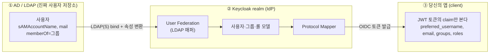
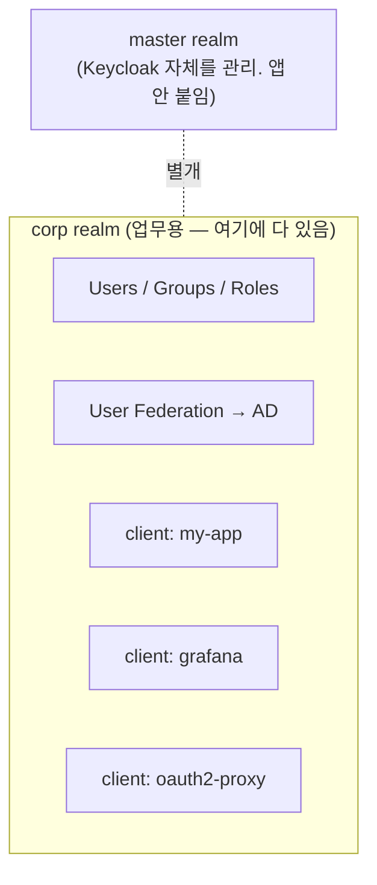
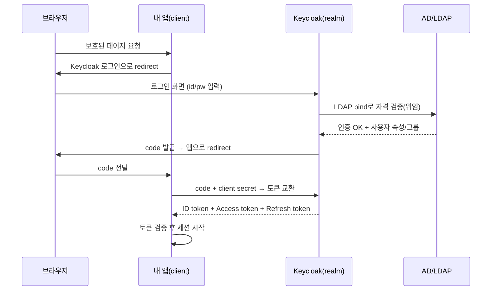

# Keycloak 큰 그림 — realm · client · 토큰

> Keycloak은 **IdP(Identity Provider, 신원 제공자)** 다. "누가 로그인했는지" 를 책임지고, 앱 대신 인증을 처리한 뒤 **토큰**으로 사용자 정보를 내려준다. 앱과는 주로 **OIDC(OpenID Connect, OAuth 2.0 위에 얹은 인증 표준)** 프로토콜로 대화한다.
> 사내 구성에서는 그 뒤에 **AD(Active Directory, 윈도우 도메인의 사용자 디렉터리)가 진짜 사용자 저장소**로 붙는다 → [ad-federation.md](./ad-federation.md).
> 앱 앞단에서 이 토큰을 강제하는 게 oauth2-proxy → [04 oauth2-proxy.md](../04_services-networking/oauth2-proxy.md).

---

## 한 장 요약 — 3개 경계, 2번의 매핑

핵심 직관: **AD와 당신의 앱은 서로 직접 모른다.** 가운데 Keycloak이 통역사처럼 양쪽을 잇고, **경계마다 "매핑(mapper)"** 이 한 번씩 일어난다.



| 경계 | 무슨 변환이 일어나나 | 어디서 설정 |
|------|------|------|
| **① AD → Keycloak** | AD 속성/그룹 → Keycloak 사용자·그룹·롤 | **User Federation의 LDAP(Lightweight Directory Access Protocol, 디렉터리 조회·인증 프로토콜) 매퍼** ([ad-federation.md](./ad-federation.md)) |
| **② Keycloak → 앱** | Keycloak 사용자·그룹·롤 → **토큰 claim** | **Protocol Mapper / Client Scope** (이 문서) |

> 그래서 *"AD 그룹이 앱까지 어떻게 오나"* 의 전체 사슬은:
> **AD `memberOf` → (LDAP group mapper) → Keycloak 그룹 → (protocol mapper) → 토큰의 `groups` claim → 앱이 인가에 사용.**

---

## Realm — 격리된 보안 영역(테넌트)

**Realm = 사용자·그룹·롤·client·federation 설정이 모두 들어있는, 서로 완전히 분리된 보안 공간.** 멀티테넌시의 "테넌트"라고 보면 된다.



| 개념 | 뭔가 | 비고 |
|------|------|------|
| **master realm** | Keycloak **자기 자신**(관리자·관리 콘솔)을 관리하는 특별한 realm | 여기에 업무 앱을 붙이지 **않는다** |
| **업무용 realm** (예: `corp`) | AD federation + 모든 앱 client + 사용자/그룹/롤 | 보통 조직당 하나 만들어 거기 다 둠 |
| realm 간 격리 | A realm 사용자는 B realm에서 안 보임 | 토큰 발급자(`iss`)도 realm별로 다름 |

- 한 realm 안의 **여러 client(앱)** 가 **같은 사용자 풀 + SSO(Single Sign-On, 한 번 로그인으로 여러 앱 통과)** 를 공유한다 → 한 번 로그인하면 같은 realm의 다른 앱도 통과.
- 토큰의 발급자 URL이 곧 realm을 가리킨다: `https://keycloak.company.com/realms/corp`.

---

## Client — Keycloak을 쓰는 "앱" 하나

당신이 만드는 앱은 realm 안에 **client**로 등록된다. client 설정이 "이 앱은 어떻게 로그인시키고, 토큰에 뭘 담아줄지" 를 정한다.

| 설정 | 의미 | 당신 앱에서 |
|------|------|------|
| **Client ID** | 앱 식별자 (예: `my-app`) | 토큰 `azp`/`aud`에 등장 |
| **Client type** | `confidential`(서버, secret 보유) vs `public`(SPA/모바일, secret 없음) | 백엔드 있으면 confidential |
| **Valid redirect URIs** | 로그인 후 돌아올 수 있는 URL 화이트리스트 | `https://my.app.com/*` |
| **Client scopes** | 토큰에 어떤 claim 묶음을 넣을지 | 아래 protocol mapper로 이어짐 |
| **Service account** | 사용자 없이 앱 자체가 토큰 받기(M2M, Machine-to-Machine — 서버 간 호출) | 배치/서버 간 호출용 |

> 💡 **confidential vs public** — 비밀(client secret)을 안전하게 보관할 수 있으면(서버 사이드) confidential, 브라우저에 코드가 다 노출되는 SPA(Single Page Application)면 public + PKCE(Proof Key for Code Exchange, public client용 코드 가로채기 방지). 당신 앱에 백엔드가 있으면 confidential이 정석.

---

## 로그인 흐름 — Authorization Code Flow

웹앱 표준 흐름. 앱은 비밀번호를 **절대 직접 받지 않는다** — 로그인 화면은 Keycloak이 띄운다.



- **비밀번호는 Keycloak↔AD 사이에서만** 오간다. 앱은 결과 토큰만 받는다.
- 한번 받은 access token은 만료가 짧고(보통 분 단위), **refresh token**으로 갱신한다.

---

## 앱이 실제로 받는 것 — 토큰과 claim

Keycloak이 내려주는 건 **JWT(JSON Web Token)** 3종이다. 당신 앱은 AD를 전혀 안 보고 **이 토큰 안의 claim만** 본다.

| 토큰 | 용도 | 누구를 위한 것 |
|------|------|------|
| **ID token** | "누가 로그인했나"(인증 사실) | client(앱) 본인 |
| **Access token** | "무엇을 할 수 있나"(API 호출 시 첨부) | 리소스 서버(API) |
| **Refresh token** | access token 갱신용 | 앱 (저장) |

> ⚠️ **셋은 따로따로가 아니라 한 번에 온다.** 로그인(code 교환)이 끝나면 토큰 엔드포인트가 **하나의 JSON 응답**으로 셋을 같이 준다 — "Keycloak이 내려주는 토큰" = 특정 하나가 아니라 **세트**고, 앱이 그중 목적에 맞는 걸 골라 쓴다.

```jsonc
// POST .../realms/corp/protocol/openid-connect/token  응답
{
  "access_token":  "eyJ...",   // 출입증(API 호출용) — JWT
  "id_token":      "eyJ...",   // 신분증(누가 로그인했나) — JWT
  "refresh_token": "eyJ...",   // 재발급용
  "token_type":    "Bearer",
  "expires_in":    300         // access token 수명(초)
}
```

> Keycloak의 access token은 **JWT라서 그 자체로 claim을 담고 있다.** 디코드하면 사용자 정보가 들어있다(별도 조회 불필요). 아래 예시는 위 응답의 `access_token` **하나**를 까본 것.

### ID token vs Access token — 헷갈리지 말 것

한마디로 **ID token = 신분증(앱에게 "누가 로그인했나"), Access token = 출입증/열쇠(API에게 "이 리소스 접근 가능").**

| | **ID token** | **Access token** |
|------|------|------|
| 출신 표준 | OIDC | OAuth 2.0 |
| 목적 | **인증** — 누구인가 | **인가** — 무엇을 할 수 있나 |
| 대상(`aud`) | **앱(client) 자신** | **리소스 서버(API)** |
| 누가 소비 | 앱이 직접 까서 사용자 파악 | API가 검증·권한 확인 |
| 전달 방법 | 로그인 후 토큰 교환 응답으로 | API 호출 시 `Authorization: Bearer`로 첨부 |
| 형식 | **항상 JWT**(OIDC 규약) | OAuth2상 불투명해도 됨 — **Keycloak은 JWT** |
| 담긴 것 | 사용자 신원 claim(`sub`·`name`·`email`) | 권한(roles·scope) + 사용자 식별 |
| 검증 주체 | **앱** | **API(리소스 서버)** |

**자주 하는 실수**
- **ID token을 API에 보내 인가에 쓰지 말 것** — API엔 access token. `aud`가 안 맞아 거부되거나 의미상 틀림.
- **프론트에서 "누가 로그인했나"를 access token으로 판단하지 말 것** — 그건 ID token(또는 `/userinfo`)의 일. access token은 "키"라 어디선 불투명해 못 깐다.
- Keycloak access token은 JWT라 디코드는 되지만, **검증할 정당한 주체는 API**다.

> **refresh token**은 결이 다름 — 사용자 정보가 아니라 **만료된 access token을 새로 받기 위한** 토큰. 앱(또는 oauth2-proxy)이 보관만 한다.

**"access token에 사용자 정보가 있는데 ID token이 왜 필요?"** — claim이 양쪽에 보여도 *역할(계약)* 이 다르다:

| 이유 | 설명 |
|------|------|
| access token은 **앱이 깔 게 아니다**(계약상) | access token은 **API용**. 앱은 원칙적으로 내용을 안 본다. Keycloak이 JWT로 주니 "보일" 뿐, 표준상 불투명·암호화·형식 변경 가능 → 거기서 사용자 정보 읽게 짜면 깨지기 쉽다 |
| `aud`(대상)가 다르다 | ID token `aud`=**앱 자신**→"나를 위해 발급=인증 성공"을 앱이 검증. access token `aud`=**API**. 앱이 access token을 자기 인증 근거로 쓰는 건 의미상 틀림 |
| ID token만 **로그인 사건**을 증명 | `nonce`(로그인 요청과 묶어 토큰 주입/재생 방지)·`auth_time`·`acr`/`amr`(MFA 여부 등)은 ID token에만. access token엔 이 바인딩이 없다 |
| 수명이 다르다 | access token은 짧고 refresh로 계속 재발급. ID token은 **그 로그인 순간**의 신원 증명 |

> 한마디로 **access token = "API 열쇠", ID token = "로그인했다는 서명된 증명서".** 앱이 신원을 신뢰하는 근거는 ID token이다.
>
> 💡 실무에선 오히려 **access token을 가볍게**(roles·scope만) 두고 신원은 ID token/`/userinfo`로 보내는 걸 권장 — Keycloak은 매퍼마다 *ID token에 넣기 / access token에 넣기 / userinfo에 넣기* 를 따로 토글할 수 있다. "access token에 사용자 정보가 있다"는 건 **기본값**일 뿐. 단, **순수 백엔드 API/서버 간 호출**은 ID token 없이 access token만 쓰기도 한다.

> 🔗 **oauth2-proxy 연결** — `--pass-authorization-header`는 `Authorization: Bearer`에 **ID token**을, `--pass-access-token`은 `X-Forwarded-Access-Token`에 **access token**을 싣는다. ⚠️ Authorization 헤더에 access token이 아니라 **ID token**이 실리는 게 함정 → [04 oauth2-proxy.md](../04_services-networking/oauth2-proxy.md#앱은-무엇을-받나--oauth2-proxy가-백엔드에-넘기는-것).

### 디코드한 access token 예시

```json
{
  "iss": "https://keycloak.company.com/realms/corp",  // 발급 realm
  "sub": "f:abc...:jdoe",            // 사용자 고유 ID
  "aud": "my-app",                    // 이 토큰의 대상 client
  "azp": "my-app",
  "exp": 1718000000,                  // 만료(짧음)
  "preferred_username": "jdoe",       // ← AD sAMAccountName 출신
  "email": "jdoe@company.com",        // ← AD mail 출신
  "name": "John Doe",
  "groups": ["/dev-team", "/admins"], // ← AD memberOf 출신
  "realm_access": { "roles": ["app-user", "app-admin"] }
}
```

| claim | 앱에서 쓰는 곳 | 어디서 왔나 |
|------|------|------|
| `sub` | 사용자 식별 키(불변) | Keycloak 내부 ID |
| `preferred_username`, `email`, `name` | 화면 표시·식별 | **AD 속성** ([ad-federation.md](./ad-federation.md)) |
| `groups` | **인가**(권한 판단) | **AD 그룹(memberOf)** |
| `realm_access.roles` | **인가**(롤 기반) | Keycloak 롤(그룹↔롤 매핑 가능) |

위에 보이는 `iss`·`aud` 같은 건 **JWT 표준 claim**(어느 토큰에나 있는 메타데이터)이다:

| claim | 풀이 | 뜻 | 검증 |
|------|------|------|------|
| `iss` | issuer | 발급자(어느 realm) | 내 realm URL과 일치? |
| `sub` | subject | 토큰의 주체(사용자) ID, 불변 | 사용자 식별 키로 사용 |
| `aud` | **audience** | **이 토큰을 쓸 대상**(누구를 위한 것). 문자열 or 배열 | **받은 쪽이 자기가 `aud`에 있나 확인**, 없으면 거부 |
| `azp` | authorized party | 토큰을 **발급받은 당사자**(=로그인한 client) | Keycloak은 client ID |
| `exp` / `iat` | expiration / issued-at | 만료 / 발급 시각 | `exp` 안 지났나 |

> 💡 **`aud` vs `azp`** — `aud`는 "이 토큰을 **소비할** 대상"(예: 호출 대상 API), `azp`는 "이 토큰을 **발급받은** 당사자"(로그인한 앱). `aud`가 핵심인 이유: API-A용 토큰을 API-B에 들이밀어도, B는 `aud`에 자기가 없으니 거절 → **토큰 오용 차단**.

---

## Protocol Mapper — 토큰에 무엇을 담을지 정하는 곳

**경계 ②의 매핑.** "Keycloak이 아는 사용자 정보 중 *무엇을, 어떤 claim 이름으로* 토큰에 넣을지" 를 결정한다. client(또는 client scope)에 붙는다.

| Mapper 종류 | 하는 일 | 결과 claim |
|------|------|------|
| **User Attribute** | 사용자 속성 1개를 claim으로 | `email`, `department` 등 |
| **Group Membership** | 소속 그룹 목록을 claim으로 | `groups`: `["/dev-team"]` |
| **User Realm Role** | realm 롤 목록을 claim으로 | `realm_access.roles` |
| **User Client Role** | 특정 client 롤을 claim으로 | `resource_access.<client>.roles` |
| **Audience** | `aud`에 대상 추가 | API가 토큰 검증 시 사용 |

> ⚠️ **앱이 기대하는 claim 이름과 mapper 출력이 정확히 일치해야 한다.** 앱은 `groups`를 보는데 mapper가 `group`(단수)으로 내보내면 인가가 통째로 빈다. claim 이름·형식(배열 vs 문자열)·full path 여부(`/dev-team` vs `dev-team`)를 맞춘다.

> 💡 **확인 팁** — Keycloak 관리 콘솔의 **Client scopes → Evaluate** 에서 특정 사용자 기준으로 *실제 발급될 토큰을 미리* 볼 수 있다. 앱에서 claim이 안 보이면 여기서 먼저 확인.

### Scope — 토큰이 다룰 "범위"

**scope = 로그인 시 앱이 요청하는 "권한·정보의 범위" 라벨.** 출입증을 신청할 때 *"로비+회의실까지 필요"* 라고 적는 칸에 해당한다. 앱이 인가 요청에 **공백으로 구분**해 보내고(`scope=openid profile email`), 발급된 access token엔 허가된 범위가 `scope` claim으로 박힌다.

| 표준 scope | 주는 것 |
|------|------|
| **`openid`** | **(필수)** OIDC 요청 표시 → **ID token이 나온다.** 없으면 그냥 OAuth2(ID token 없음) |
| `profile` | `name`·`preferred_username` 등 프로필 claim |
| `email` | `email`·`email_verified` |
| `offline_access` | **refresh token** 발급 |
| (커스텀) | `billing-api` 등 **API 권한 범위**를 직접 정의 |

**Keycloak의 Client Scope** = protocol mapper(어떤 claim) + role을 **묶은 재사용 단위**. scope 문자열이 켜지면 그 묶음의 매퍼가 claim을 넣는다 → 이게 *scope(OAuth 개념)* 과 *토큰 claim(mapper)* 을 잇는다.

| 종류 | 동작 |
|------|------|
| **Default client scope** | client가 안 적어도 **항상 적용**(`profile`·`email`·`roles` 등) |
| **Optional client scope** | client가 `scope=`에 **요청할 때만** 적용 |

> **scope vs role** — scope는 *"앱이 무엇까지 건드릴 토큰을 만들까"*(거친 범위, 앱이 요청), role은 *"사용자가 무엇을 할 수 있나"*(세밀, 관리자가 부여). 둘은 **AND**: 사용자가 롤이 있어도 앱이 해당 scope를 요청 안 하면 토큰에 안 실릴 수 있다.

---

## 그룹 vs 롤 — 인가를 어디에 둘까

둘 다 권한 표현이지만 결이 다르다. 사내 AD 연동에선 **AD 그룹 → Keycloak 그룹** 이 자연스럽고, 거기에 롤을 매핑해 쓰는 패턴이 흔하다.

| | Group | Role |
|------|------|------|
| 성격 | 사용자 묶음(계층 가능: `/eng/backend`) | 권한 라벨(`app-admin`) |
| AD 연동 | AD `memberOf`와 직접 대응시키기 좋음 | 보통 그룹에 롤을 부여해 간접 매핑 |
| 토큰 claim | `groups` | `realm_access.roles` / `resource_access` |
| 추천 | "누구인가"(조직 소속) | "무엇을 할 수 있나"(앱 권한) |

> 흔한 조합: **AD 그룹 `Domain Admins` → Keycloak 그룹 `/admins` → 그룹에 `app-admin` 롤 부여 → 토큰에 `roles:["app-admin"]`.** 앱은 AD를 몰라도 `app-admin` 롤만 검사하면 된다.

### 인가는 role/group, 데이터는 claim — "부서명"을 어디에 둘까

실전 고민: *"부서별 role(`dept-sales` 등)을 만들 거고, 동료는 `department` claim에 부서명을 넣을 수 있나 보는 중"* — 이 둘은 목적이 달라서 **둘 다 필요한 게 아닐 수 있다.** 먼저 "무엇이 필요한지"로 가른다.

| 필요 | 맞는 도구 | 앱까지 오는 길 |
|------|------|------|
| **"이 사용자가 영업팀인가?"로 권한 판단(인가)** | **role / group per 부서** | `X-Forwarded-Groups` 헤더 — **토큰 디코드 불필요** |
| **부서명을 데이터로 사용**(화면 표시·저장·세밀 로직) | **`department` claim** | **토큰 통째 + backend 디코드** |

- **인가만 목적이면** role/group이 정답이고 groups 헤더로 받으면 된다 → 토큰 통째 안 내려도 됨(더 단순).
- **부서명 문자열 자체가 필요하면** claim이 맞고, 임의 claim이라 토큰 통째+디코드가 정석.
- **둘 다 미리 만들면 중복.** "부서명을 *데이터로도* 쓸 일이 있나?"를 먼저 정하고, 아니면 **role(인가)부터**.

**한 줄: 인가는 role/group(→groups 헤더), 데이터는 claim(→토큰 디코드).**

#### 토큰을 통째로 backend에 내려도 되나 — 된다, 단 3가지

부서명을 데이터로 쓰기로 해 `--pass-access-token`으로 토큰을 내린다면([04 oauth2-proxy.md](../04_services-networking/oauth2-proxy.md#앱은-무엇을-받나--oauth2-proxy가-백엔드에-넘기는-것)):

1. **backend로만.** frontend엔 토큰 자체를 노출하지 말 것(필요 정보는 backend가 `/api/me`로 가공해 전달).
2. **backend도 검증.** 받은 토큰을 그냥 믿지 말고 **JWKS로 서명·`exp`·`aud` 검증**(방어 심층화). backend가 직접 노출될 여지가 있으면 필수.
3. **로그에 안 남기기.** access token은 bearer 자격증명 → `Authorization`/`X-Forwarded-Access-Token`을 로그에 찍으면 유출. 마스킹.

> ⚠️ **헤더 크기** — role/group이 많아 토큰이 커지면 JWT가 헤더로 들어갈 때 nginx 버퍼(`large_client_header_buffers`, 기본 8k)를 넘겨 **400/502**가 날 수 있다. 부서 role을 수십~수백 개 붙일 계획이면 토큰 비대화를 염두에.

#### role을 groups 헤더로 받을 때의 함정 — 평평화 매퍼

role-per-부서를 **groups 헤더로** 받으려면: Keycloak role은 토큰에 보통 **`realm_access.roles`(중첩)** 로 들어가는데, oauth2-proxy `--oidc-groups-claim`은 **평평한(top-level) 배열 claim**을 기대한다. 그래서:

1. Keycloak에 **role을 평평한 claim으로 내보내는 protocol 매퍼** 추가 — "User Realm Role" 매퍼, claim 이름 `roles`(또는 `groups`), **Multivalued on**, full path off.
2. oauth2-proxy `--oidc-groups-claim=roles`로 그 claim을 가리킴.
3. → 부서 role이 `X-Forwarded-Groups`로 옴 → **디코드 없이** backend가 인가에 사용.

---

## 토큰 검증 — 앱이 해야 하는 일

앱은 받은 토큰이 **진짜 Keycloak이 발급했고 위조·만료 안 됐는지** 검증해야 한다. 직접 구현하기보다 **검증된 OIDC 라이브러리/미들웨어**를 쓴다.

| 검증 항목 | 어떻게 |
|------|------|
| 서명 | Keycloak의 **공개키(JWKS, JSON Web Key Set — 토큰 서명 검증용 공개키 묶음)** 로 검증 — `…/realms/corp/protocol/openid-connect/certs` |
| 발급자 | `iss` == 내 realm URL |
| 대상 | `aud`/`azp`에 내 client 포함 |
| 만료 | `exp` 안 지났나 |

- 설정의 출발점은 **discovery 문서** 하나다: `https://keycloak.company.com/realms/corp/.well-known/openid-configuration` — 여기에 authorization/token/jwks 엔드포인트가 다 들어있어 라이브러리가 자동 구성한다.
- **앱에 직접 OIDC를 안 붙이고** 앞단 oauth2-proxy에 맡기면, 앱은 oauth2-proxy가 넣어주는 `X-Auth-Request-*` 헤더만 신뢰하면 된다 → [04 oauth2-proxy.md](../04_services-networking/oauth2-proxy.md).

---

## 자주 헷갈리는 점

| 오해 | 사실 |
|------|------|
| "Keycloak이 비밀번호를 저장한다" | AD federation이면 **AD가 비번 보관**. Keycloak은 로그인 때 AD에 위임만(import해도 비번은 안 가져옴) |
| "그룹만 있으면 앱이 본다" | **protocol mapper로 토큰에 실어야** 앱이 본다. 콘솔에 그룹 있어도 mapper 없으면 claim 없음 |
| "access token은 불투명 문자열" | Keycloak access token은 **JWT** — 디코드하면 claim이 보임(검증은 JWKS로) |
| "realm 아무거나" | `master`엔 앱 붙이지 말 것. 업무용 realm 따로 |

---

## 참고

- [Keycloak — Server Administration Guide](https://www.keycloak.org/docs/latest/server_admin/)
- [Keycloak — Securing Applications (OIDC)](https://www.keycloak.org/docs/latest/securing_apps/)
- [OpenID Connect Core (claim·flow 표준)](https://openid.net/specs/openid-connect-core-1_0.html)
- AD 연동(경계 ①) → [ad-federation.md](./ad-federation.md)
- 앱 앞단 인증 게이트 → [04 oauth2-proxy.md](../04_services-networking/oauth2-proxy.md)
