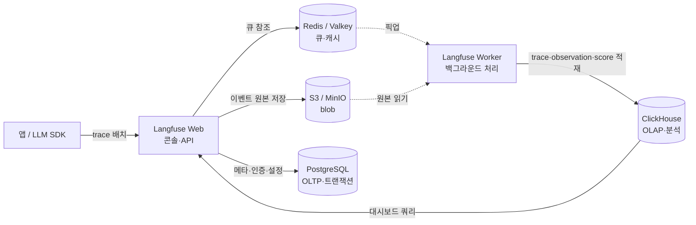

# 12. 데이터 스토어 (Data Stores)

> 실무 (CKA 외). k8s 위에서 **데이터베이스를 직접 운영**해 보며 익히는 폴더. 성격이 다른 두 DB — **OLTP(PostgreSQL)** 와 **OLAP(ClickHouse)** — 그리고 이를 들여다보는 도구(**DBeaver·Grafana**)와 활용처(**Langfuse·사내 데이터 저장**)를 다룬다.

DB는 k8s에서 **StatefulSet · PV/PVC · Headless Service** 를 손으로 다루는 가장 좋은 실습 소재다. 동시에 실무에서 **Langfuse(LLM 관측)** 셀프호스팅처럼 Postgres와 ClickHouse를 **역할 분담**해 함께 쓰는 패턴을 그대로 따라가 본다.

## 다루는 내용 (개념 문서)
- [`postgres.md`](./postgres.md) — **PostgreSQL**: 범용 OLTP 관계형 DB, k8s StatefulSet 운영, 트랜잭션
- [`clickhouse.md`](./clickhouse.md) — **ClickHouse**: 컬럼 기반 OLAP DB, 대량 집계, MergeTree
- 실습: [`practice-clickhouse.md`](./practice-clickhouse.md) — kind에 ClickHouse 배포 → DBeaver·Grafana 연결
- (PostgreSQL 직접 배포 실습은 GitOps 관점으로 [`10_ecosystem-gitops/practice.md`](../10_ecosystem-gitops/practice.md)에 이미 있음 — 아래 참고)

## OLTP vs OLAP — 왜 둘 다 쓰나

두 DB는 경쟁 관계가 아니라 **목적이 다르다**. (약어: OLTP = **O**n**L**ine **T**ransaction **P**rocessing 온라인 트랜잭션 처리, OLAP = **O**n**L**ine **A**nalytical **P**rocessing 온라인 분석 처리)

| | **OLTP** — PostgreSQL | **OLAP** — ClickHouse |
|---|---|---|
| 목적 | 건건의 트랜잭션 (주문 1건 INSERT/UPDATE) | 대량 데이터 집계·분석 (수억 행 GROUP BY) |
| 접근 패턴 | 한 행의 여러 컬럼을 읽고 씀 | 여러 행의 **몇몇 컬럼만** 스캔 |
| 저장 방식 | **행 기반**(row) | **컬럼 기반**(columnar) |
| 강점 | ACID 트랜잭션, 정합성, 빈번한 갱신 | 압축, 빠른 스캔·집계, 대량 INSERT |
| 약점 | 대량 분석 스캔은 상대적으로 느림 | 단건 UPDATE/DELETE·강한 트랜잭션 |
| 대표 질의 | `SELECT * FROM orders WHERE id=42` | `SELECT day, sum(cost) FROM events GROUP BY day` |

→ 그래서 Langfuse도 **트랜잭션·메타데이터는 Postgres, 관측 데이터 분석은 ClickHouse** 로 나눠 쓴다(아래).

## 공통 도구: DBeaver · Grafana

- **DBeaver** — 범용 SQL GUI 클라이언트. Postgres·ClickHouse **둘 다 JDBC로 정식 지원**. 테이블 탐색·임시 쿼리용. kind에 띄운 DB엔 `kubectl port-forward` 로 붙는다.
- **Grafana** — 대시보드. ClickHouse는 공식 데이터소스 플러그인으로, Postgres는 기본 내장 데이터소스로 연결해 시계열·집계를 시각화한다.

## Langfuse 데이터 스택에서의 위치

Langfuse(셀프호스팅 LLM 관측 플랫폼) **v3** 는 데이터를 4종 스토어로 나눠 쓴다 — 이 폴더의 Postgres·ClickHouse가 둘 다 등장한다:

| 컴포넌트 | 역할 | 이 폴더 |
|---|---|---|
| **PostgreSQL** | 사용자·프로젝트·API 키 등 **트랜잭션/메타데이터** | [`postgres.md`](./postgres.md) |
| **ClickHouse** | trace·observation·score **관측 데이터의 OLAP 저장소** | [`clickhouse.md`](./clickhouse.md) |
| Redis / Valkey | 인입 큐 + API 키 인메모리 캐시 | — |
| S3 / MinIO | 이벤트 원본·멀티모달·익스포트 **blob** | [`05_storage/minio.md`](../05_storage/minio.md) |

→ ClickHouse 단독 실습이 익숙해지면 **Langfuse 풀스택**(이 4종을 한 번에)으로 확장한다.

## 실습 매니페스트
- `manifests/clickhouse-secret.yaml` — ClickHouse default 사용자 비밀번호 (실습 전용 평문 Secret)
- `manifests/clickhouse-statefulset.yaml` — ClickHouse 단일 노드 StatefulSet + `volumeClaimTemplates`(PVC 자동 생성)
- `manifests/clickhouse-service.yaml` — ClickHouse Headless Service (안정적 DNS)
- PostgreSQL 매니페스트는 [`10_ecosystem-gitops/manifests/postgres/`](../10_ecosystem-gitops/manifests/postgres/)에 있다(ArgoCD GitOps 데모용). [`postgres.md`](./postgres.md)에서 연결.

## 참고
- [PostgreSQL 공식 문서](https://www.postgresql.org/docs/) · [ClickHouse 공식 문서](https://clickhouse.com/docs)
- [Langfuse 셀프호스팅](https://langfuse.com/self-hosting) · [Langfuse & ClickHouse 데이터 스택(블로그)](https://clickhouse.com/blog/langfuse-and-clickhouse-a-new-data-stack-for-modern-llm-applications)
- 관련 폴더: [`05_storage`](../05_storage/)(PV/PVC·StatefulSet 스토리지) · [`10_ecosystem-gitops`](../10_ecosystem-gitops/)(Postgres GitOps 배포)
